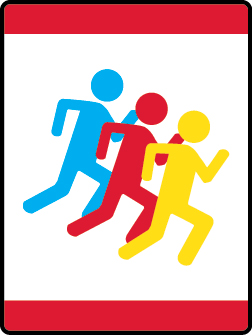

# Running With the Pack Wolf Adventure

- **Adventure name:** Running With the Pack
- **Rank:** Wolf
- **Type:** Required
- **Category:** Personal Fitness

## Overview

A Cub Scout knows how to stay healthy . Eating foods that give you proper nutrition, exercising regularly, and getting proper rest are the best ways for you to always be at your best. Prior to any activity, use Scouting America SAFE Checklist to ensure the safety of all those involved. All participants in official Scouting America activities should become familiar with the Guide to Safe Scouting and applicable program literature or manuals.

## Requirements

### Requirement 1

Sample 3 different foods that are naturally 3 different colors . The food must be a protein, vegetable, fruit, dairy, or a grain .

**Activities:**

- **[Tasting Colors](https://www.scouting.org/cub-scout-activities/tasting-colors/)** (Indoor, energy 2, supplies 3, prep 2)
  Experience a burst of deliciousness with natural-colored foods.

### Requirement 2

Demonstrate the proper way to brush your teeth.

**Activities:**

- **[A Giant’s Toothbrush](https://www.scouting.org/cub-scout-activities/a-giants-toothbrush/)** (Outdoor, energy 4, supplies 3, prep 2)
  Draw a giant a mouth and use a broom to practice brushing teeth.
- **[Clean Chompers](https://www.scouting.org/cub-scout-activities/clean-chompers/)** (Indoor, energy 2, supplies 2, prep 1)
  Turn daily teeth-brushing routine into a fun and exciting activity.
- **[Tooth Experts](https://www.scouting.org/cub-scout-activities/tooth-experts/)** (Indoor, energy 1, supplies 2, prep 5)
  ​Invite a dental care professional to a Cub Scout den meeting to discuss the importance of oral hygiene.

### Requirement 3

Be active for 30 minutes with your den or at least 1 other person that includes both stretching and moving.

**Activities:**

- **[Kickball](https://www.scouting.org/cub-scout-activities/kickball/)** (Outdoor, energy 5, supplies 3, prep 2)
  Play a game of kickball. ​ ​
- **[Ride a Bike](https://www.scouting.org/cub-scout-activities/ride-a-bike/)** (Outdoor, energy 5, supplies 5, prep 2)
  Take a bike ride.
- **[Toss and Catch](https://www.scouting.org/cub-scout-activities/toss-and-catch/)** (Outdoor, energy 5, supplies 3, prep 2)
  ​ ​ Find a ball and play a game of catch. ​ ​

### Requirement 4

Be active for 10 minutes doing personal exercises.

**Activities:**

- **[Chat with a Personal Trainer](https://www.scouting.org/cub-scout-activities/chat-with-a-personal-trainer/)** (Indoor, energy 1, supplies 1, prep 5)
  Invite a fitness professional to  ​ your  ​ Cub Scout den meeting to discuss the importance of exercise.
- **[Circuit Exercises](https://www.scouting.org/cub-scout-activities/circuit-exercises/)** (Indoor, energy 5, supplies 2, prep 3)
  Create a short workout to explore different exercises.
- **[Go for a Walk](https://www.scouting.org/cub-scout-activities/go-for-a-walk/)** (Outdoor, energy 4, supplies 1, prep 1)
  Take a walk outside.

### Requirement 5

Do a relaxing activity for 10 minutes.

**Activities:**

- **[Listen to Music](https://www.scouting.org/cub-scout-activities/listen-to-music/)** (Indoor, energy 1, supplies 2, prep 2)
  Some music can relax us by engaging our senses and creating a calming effect.
- **[Story Time](https://www.scouting.org/cub-scout-activities/story-time/)** (Indoor, energy 1, supplies 2, prep 1)
  Read an article from Scout Life magazine to the Cub Scouts.

### Requirement 6

Review your Scouting America Annual Health and Medical record with your parent or guardian. Discuss your ability to participate in den and pack activities.

**Activities:**

- **[Scouting America Annual Health and Medical Record Wolf](https://www.scouting.org/cub-scout-activities/scouting-america-annual-health-and-medical-record-wolf/)** (Indoor, energy 1, supplies 2, prep 2)
  Cub Scouts review their Scouting America Annual Health and Medical Records with their parent or legal guardian.

## Resources

- [Running With the Pack Wolf adventure page](https://www.scouting.org/cub-scout-adventures/running-with-the-pack/)

Note: This is an unofficial archive of Cub Scout Adventures that was automatically extracted from the Scouting America website and may contain errors.