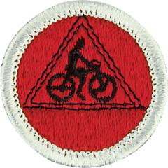

# Cycling Merit Badge

## Overview

**Eagle required**

Since 1911, hundreds of thousands of Scouts have made the most of their two-wheel adventures by earning the Cycling merit badge. Whether you just got your first bicycle or have been cycling for years, you will learn more about your bike and what it can do by working on the requirements for this badge.

## Requirements

* (1) Do the following:
    * (a) Explain to your counselor the most likely hazards you may encounter while participating in cycling activities and what you should do to anticipate, help prevent, mitigate, and respond to these hazards. Explain to your counselor how to ride predictably, be conspicuous, think ahead, and ride ready.
    * (b) Show that you know first aid for injuries or illnesses that could occur while cycling, including cuts, scratches, concussions, blisters, sunburn, heat exhaustion, heatstroke, hypothermia, frostbite, dehydration, insect stings, tick bites, and snakebite. Explain to your counselor why you should be able to identify the poisonous plants and poisonous animals that are found in your area.
    * (c) Explain the importance of wearing the right clothing and gear while cycling, including a properly sized and fitted helmet. Know the Scouting America Bike Safety Guidelines.

* (2) Describe your state and local laws concerning bicycles. Discuss what is the  same and what is different from laws applying to motor vehicles. Explain  where and how you should ride on roads and streets to include lane position,  changing lanes, making left and right turns, and riding through intersections.
* (3) Explain the importance of wearing a properly sized and fitted helmet while cycling and of wearing the right clothing for the weather. Know the Scouting America Bike Safety Guidelines.
* (4) Using a bicycle safety checklist, clean and adjust a bicycle and present it to  your counselor for inspection. Do the following:
    * (a) Show points that should be checked regularly to make sure the bicycle is safe to ride.
    * (b) Show how to adjust the saddle and handlebars for a proper fit.
    * (c) Show how to adjust brakes and gear shifting (derailleurs).
    * (d) Show all points that need regular lubrication.
    * (e) Show how to repair a flat by removing the tire, replacing or patching the tube, and remounting the tire.
    * (f) Show that the bicycle meets local laws.

* (5) Demonstrate basic bicycle handling skills to your counselor, to include how to  properly mount your bicycle, starting and stopping (to include emergency  stops), riding in a straight line, turning, shifting gears, scanning, and signaling.
* (6) Using the Scouting America buddy system, complete all of the requirements for ONE of the following options: Road Biking OR Trail or Mixed Surface Biking. These requirements may be completed using a road bike, mountain bike or other properly equipped, manually-powered cycle such as a gravel bike, tandem bike, hand-powered bike, recumbent bike, adult tricycle, or adaptive cycle. If a tandem bike is used, the Scout must actively power the cycle in concert with the other rider.
    * A  Do the following:
        * (a) Take a road safety test with your counselor and demonstrate the following:
            * (1) On an urban street with light traffic, properly execute a left turn from the center of the street; also demonstrate an alternate left-turn technique used during periods of heavy traffic.
            * (2) Properly execute a right turn.
            * (3) Demonstrate appropriate actions at a right-turn-only lane when you are continuing straight.
            * (4) Show proper curbside and road-edge riding. Show how to ride safely along a row of parked cars.
            * (5) Cross railroad tracks properly.

        * (b) Avoiding main highways, take two rides of 10 miles each, two rides of 15 miles each, and two rides of 25 miles each. You must make a report of the rides taken. List dates for the routes traveled, and interesting things seen on the ride.
        * (c) After completing requirement b for the road biking option, do ONE of the following:
            * (1) Lay out on a road map a 50-mile trip. Stay away from main highways. Using your map, make this ride in eight hours or less.
            * (2) Participate in an organized bike tour of at least 50 miles. Make this ride in eight hours or less. Afterward, use the tour's cue sheet to make a map of the ride.

    * B  Do the following:  These requirements may be completed using a mountain bike or other properly equipped, manually-powered cycle such as a gravel bike, tandem bike, hand-powered bike, recumbent bike, adult tricycle, or adaptive cycle. If a tandem bike is used, the Scout must actively power the cycle in concert with the other rider.
        * (a) Demonstrate the following mountain bike handling skills to your counselor:
            * (1) Neutral position, ready position, bike body separation (side to side, and forward and back), and body positioning for cornering
            * (2) Show shifting skills as applicable to climbs and obstacles.
            * (3) Show proper technique for riding up (seated, crouched, and standing) and down hills.

        * (b) Take a trail safety test with your counselor and demonstrate the following:
            * (1) Show proper trail etiquette to hikers and other cyclists, including when to yield the right-of-way.
            * (2) Demonstrate how to correctly cross an obstacle by either going over the obstacle on your bike or dismounting your bike and crossing over or around the obstacle
            * (3) Cross rocks, gravel, and roots properly

        * (c) Describe the rules of trail riding, including how to know when a trail is unsuitable for riding.
        * (d) On mountain biking or multi-use trails approved by your counselor, take two rides of 2 miles each, two rides of 5 miles each, and two rides of 8 miles each. You must make a report of the rides taken. List dates for the routes traveled, and interesting things seen.
        * (e) After fulfilling the previous requirement, lay out on a trail map a 22-mile trip. You may include multiple trail systems, if needed. Stay away from main highways. Using your map, complete this ride in one day.

## Resources

- [Cycling merit badge page](https://www.scouting.org/merit-badges/cycling/)
- [Cycling merit badge PDF](https://filestore.scouting.org/filestore/Merit_Badge_ReqandRes/Pamphlets/Cycling_2025.pdf) ([local copy](files/cycling-merit-badge.pdf))
- [Cycling merit badge pamphlet](https://www.scoutshop.org/cycling-merit-badge-pamphlet-655187.html)

Note: This is an unofficial archive of Scouts BSA Merit Badges that was automatically extracted from the Scouting America website and may contain errors.