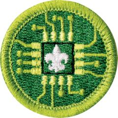

# Digital Technology Merit Badge

## Overview

Comprehend how electronic devices work and how to use them effectively with the Digital Technology Merit Badge. Scouts will give a brief history of the changes in digital technology and discuss how technology today compares with the technology available to previous generations—all while imagining what kinds of devices might be available to them in the future.

## Requirements

* (1) View the [Personal Safety Awareness "Digital Safety" video ](https://www.scouting.org/training/youth-protection/scouts-bsa/)(with your parent or guardian's permission).
* (2) Do the following:
    * (a) Give a brief history of the changes in digital technology over time. Discuss with your counselor how digital technology in your lifetime compares with that of your parent's, grandparent's, or other adult's lifetime. Resources: [Technology Evolution - 100,000 BCE to 2020 (video)](https://youtu.be/IJM3yuIDDPQ?si=7uQQJs6mbXI7sRHF) [Past & Present Technology, Then & Now (video)](https://youtu.be/IKLVSxhkZeg?si=jzzto-HMQ-Xzl-MT) [Past and Present | Technology Then and Now (video)](https://youtu.be/DENG7Q7VRgo?si=giprDI8VZC04gldJ)
    * (b) Describe what kinds of computers or devices you imagine might be available when you are an adult. Resource: [Technologies of the Future (video)](https://youtu.be/v942xxcJWlA?si=61vZc5bgAiTD_7Oa)

* (3) Do the following:
    * (a) Explain to your counselor how text, sound, and pictures are digitized for storage. Resources: [What Is ASCII? (video)](https://youtu.be/zB85kTs-sEw?si=zbhOXnxeEGM-vhAs) [How Images and Sound are Represented in a Computer (video)](https://youtu.be/pmY7pOQCOr8?si=RcB32mhzHzjhNHtM)
    * (b) Describe the difference between lossy and lossless data compression, and give an example where each might be used. Resource: [Lossy vs Lossless Data Compression (video)](https://www.youtube.com/watch?v=X88vxU2o4f0)
    * (c) Describe two digital devices and how they are made more useful by their programming. Resource: [Types of Digital Devices (video)](https://youtu.be/2NpRkV1qLDY?si=ivYUBEzE_xQYi6Ka)
    * (d) Discuss the similarities and differences between computers, mobile devices, and gaming consoles. Resources: [Comparing PC to Gaming Consoles. (video)](https://www.youtube.com/shorts/UdkG0NZTJak) [Mobile vs Pc vs Console Gaming (website)](https://techousegames.com/mobile-vs-pc-vs-console-gaming/)
    * (e) Explain what a computer network is and the difference between a local area network (LAN) versus a wide area network (WAN). Resource: [Difference Between LAN and WAN (video)](https://youtu.be/aHJElrgj6UA)

* (4) Do the following:
    * (a) Explain what a program or software application or "app" is and how a computer uses a CPU and memory to execute it. Resources: [How Computers Work (video)](https://www.youtube.com/watch?v=DKGZlaPlVLY) [What Is an App? (video)](https://youtu.be/3gMOYZoMtEs?si=bVq_MqhT-LMeDH1E) [How Computer Memory Works (video)](https://youtu.be/p3q5zWCw8J4?si=6qaC9vmHQDuMQjWW)
    * (b) Name four software programs or mobile apps you or your family use, and explain how each one helps you. Resource: [Understandng Software Applications (video)](https://www.youtube.com/watch?v=3gMOYZoMtEs)
    * (c) Describe what malware is, and explain how to protect your digital devices and the information stored on them. Resource: [What Is Malware? (video)](https://www.youtube.com/watch?v=NMYbkzjI5EY)

* (5) Do the following:
    * (a) Describe at least two different ways data can be transferred through the internet. Resources: [How the Internet ACTUALLY Works ? (video)](https://youtu.be/ge05p3GV3SI?si=ZnZmRf_R6RICJ4Ed) [This Is How Data Is Transferred in the Internet (video)](https://youtube.com/shorts/lylaitbZB70?si=Jq_-Z0aSSn6gvok4) [Data Transfer Via the Internet Explained (video)](https://youtu.be/kZTF7wIykk4?si=u-zUEl43v9dBXRwr)
    * (b) Using an internet search engine (with a parent or guardian's permission), find ideas from at least three different websites about how to conduct a troop court of honor or campfire program. Present the ideas to your counselor and explain how you used a search engine to find this information.
    * (c) Use a web browser to connect to an HTTPS (secure) website (with your parent or guardian's permission). Explain to your counselor how to tell whether the site's security certificate can be trusted, and what it means to use this kind of connection. Resource: [What Is HTTPS? (video)](https://www.youtube.com/watch?v=3j64UNXALHo)

* (6) Do THREE of the following. For each project you complete, copy the files to a backup device and share the finished projects with your counselor.
    * (a) Using a spreadsheet or database program, develop a food budget for a patrol weekend campout OR create a troop roster that includes the name, rank, patrol, and telephone number of each Scout. Show your counselor that you can sort the roster by each of the following categories: rank, patrol, and alphabetically by name. Resource: [Introduction to Spreadsheets (video)](https://www.youtube.com/watch?v=VFp6Yufsg-Q)
    * (b) Using a word processor, write a draft letter to the parents of your troop's Scouts, inviting them to a troop event. Resource: [Word Processing Tutorial (video)](https://www.youtube.com/watch?v=lrw5t7-Tzb8)
    * (c) Using a graphics program, design and draw a campsite plan for your troop OR create a flyer for an upcoming troop event, incorporating text and some type of visual such as a photograph or an illustration. Resource: [Google Drawing Basics (video)](https://youtu.be/eSU0JbxWpoc?si=Ry7E0T6yO3djUivs)
    * (d) Using a presentation software program, develop a report about a topic approved by your counselor. For your presentation, create at least five slides, with each one incorporating text and some type of visual such as a photograph or an illustration. Resource: [Google Slides for Presentations (video)](https://www.youtube.com/watch?v=7vSnesQDLBE)
    * (e) Using a digital device, take a picture of a troop activity. Send or transfer this image to a device where it can be shared with your counselor. Resource: [Sending Photos on a Smartphone (video)](https://www.youtube.com/watch?v=0Tc5Jmx5O1g)
    * (f) Make a digital recording of your voice, transfer the file to a different device, and have your counselor play back the recording. Resource: [How to Make an Audio File With a Smartphone (video)](https://www.youtube.com/watch?v=9x4ZtNuB1ik)
    * (g) Create a blog and use it as an online journal of your Scouting activities, including group discussions and meetings, campouts, and other events. Include at least five entries and two photographs or illustrations. Share your blog with your counselor. You need not post the blog to the internet; however, if you choose to go live with your blog, you must first share it with your parent or guardian AND counselor AND get their approval. Resource: [How to Write a Blog Post for Beginners: From Start to End (video)](https://youtu.be/KkKp56E6UVo?si=KC9FQG9OrMaLMRys)
    * (h) Create a webpage for your troop, patrol, school, or place of worship. Include at least three articles and two photographs or illustrations. Include at least one link to a website of interest to your audience. You need not post the page to the internet; however, if you decide to do so, you must first share the webpage with your parent or guardian AND counselor AND get their approval. Resource: [How to Create a Simple Webpage (video)](https://www.youtube.com/watch?v=BBcq9abR9Es)

* (7) Do the following:
    * (a) Explain to your counselor each of these protections and why they exist: copyright, patents, trademarks, trade secrets. Resource: [Explanations of Copyrights, Patents, Trademarks, Trade Secrets (video)](https://www.youtube.com/watch?v=LyQOf5bqdzo)
    * (b) Explain when it is permissible to accept a free copy of a program from a friend. Resource: [Digital Etiquette for Teenagers (video)](https://youtu.be/DzsgYoc-qNc?si=kO8fIsXs2p7Fa7GP)
    * (c) Discuss with your counselor an article or (with your parent or guardian's permission) a report on the internet about a recent legal case involving an intellectual property dispute. Resource: [Intellectual Property (website)](https://www.reuters.com/legal/intellectual-property/)

* (8) Do TWO of the following:
    * (a) Describe why it is important to properly dispose of digital technology. List at least three hazardous chemicals that could be used to create digital devices or used inside a digital device. Resources: [What Are the Risks of Not Properly Disposing of Technology? (video)](https://youtu.be/9ZW0AZZ_0Wg?si=xZXCX_jNjp0RTn2i) [3 Simple Tips for Recycling Old Electronics (video)](https://youtu.be/HmEhTIMfZiI?si=gG-ytCg1jxlaC3q_)
    * (b) Explain to your counselor why it is important to use a certified recycler of digital technology hardware or devices. Resource: [How to (Properly) Get Rid of Your E-Waste (video)](https://youtu.be/IIM9-kBRh1A?si=WMptMoGNeXFlZHpI)
    * (c) Do an internet search for an organization that collects discarded digital technology hardware or devices for repurposing or recycling. Find out what happens to that waste. Share with your counselor what you found. Resource: [How E-Wastes Are Recycled (video)](https://www.youtube.com/watch?v=w0ikFMTuS9c)
    * (d) Visit a recycling center that disposes of digital technology hardware or devices. Find out what happens to that waste. Share what you learned with your counselor. Resource: [Finding an E-Waste Recycler (website)](https://e-stewards.org/find-a-recycler/)
    * (e) Find a battery recycling center near you and find out what it does to recycle batteries. Share what you have learned with your counselor about the proper methods for recycling batteries. Resource: [Finding a Battery Recycler (website)](https://www.recyclerfinder.com/)

* (9) Do ONE of the following:
    * (a) Identify three career opportunities that involve digital technology. Pick one and investigate the education, training, and experience required for this profession. Discuss this with your counselor, and explain why this profession might interest you. Resource: [Digital Technology Careers (video)](https://career.albany.edu/videos/digital-technology/)
    * (b) Visit a business or an industrial facility that uses digital technology. Describe four ways digital technology is being used there. Share what you learned with your counselor.

## Resources

- [Digital Technology merit badge page](https://www.scouting.org/merit-badges/digital-technology/)
- [Digital Technology merit badge PDF](https://filestore.scouting.org/filestore/Merit_Badge_ReqandRes/Pamphlets/Digital%20Technology_2024.pdf) ([local copy](files/digital-technology-merit-badge.pdf))
- [Digital Technology merit badge pamphlet](https://www.scoutshop.org/bsa-digital-technology-merit-badge-pamphlet-661587.html)

Note: This is an unofficial archive of Scouts BSA Merit Badges that was automatically extracted from the Scouting America website and may contain errors.