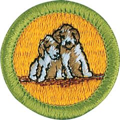

# Dog Care Merit Badge

## Overview

The love and interdependence between humans and dogs has endured for thousands of years. Evidence suggests that dogs and humans started relying on each other thousands of years ago. Today, dogs are our coworkers and companions. They assist search-and-rescue teams, law enforcement officers, hunters, farmers, and people with disabilities. They also play with us and keep us company.

## Requirements

* 
* (1) Do the following:
    * (a) Briefly discuss the historical origin and domestication of the dog.
    * (b) Describe some common characteristics of the dogs that make up each of the seven major dog groups.
    * (c) Tell some specific characteristics of seven breeds of dogs (one from each major group), OR give a short history of one breed.

* (2) Point out on a dog or a sketch at least 10 body parts. Give the correct name of each one.
* (3) Do the following:
    * (a) Explain the importance of house-training, obedience training, and socialization training for your dog.
    * (b) Explain what "responsible pet ownership" means.
    * (c) Explain what issues (including temperament) must be considered when deciding on what breed of dog to get as a family pet.

* (4) For two months, keep and care for your dog. Maintain a log of your activities during this period that includes these items: feeding schedule, types of food used, amount fed, exercise periods, training schedule, a weekly body weight record, grooming and bathing schedules, veterinary care, if necessary, and costs. Also include a brief description of the type of housing/shelter arrangements you have for your dog.
* (5) Explain the correct way to obedience train a dog and what equipment you would need. Show with your dog any three of these commands: "come," "sit," "down," "heel," "stay," "fetch," "get it," "drop it."
* (6) Do the following.
    * (a) Discuss the proper vaccination schedule for a dog in your area from puppyhood through adulthood.
    * (b) Discuss the control methods for preventing fleas, ticks, heartworms, and intestinal parasites (worms) for a dog in your area from puppyhood through adulthood.
    * (c) Explain the importance of dental care and tooth brushing to your pet's health.
    * (d) Discuss the benefits of grooming your dog's coat and nails on a regular basis.
    * (e) Discuss with your counselor any seasonal conditions (like hot summers, cold winters, or extreme humidity) where you live that need to be considered for your dog.
    * (f) Discuss with your counselor the considerations and advantages of spaying or neutering your dog.

* (7) Do the following:
    * (a) Explain precautions to take in handling a hurt dog.
    * (b) Show how to put on an emergency muzzle.
    * (c) Explain how to treat wounds. Explain first aid for a dog bite.
    * (d) Show how to put on a simple dressing and bandage the foot, body, or head of your dog.
    * (e) Explain what to do if a dog is hit by a car.
    * (f) List the things needed in every dog owner's first-aid kit.
    * (g) Tell the dangers of home treatment of a serious ailment.
    * (h) Briefly discuss the cause and method of spread, the signs and symptoms and the methods of prevention of rabies, parvovirus, distemper, and heartworms in dogs.

* (8) Visit a veterinary hospital or an animal shelter and give a report about your visit to your counselor.
* (9) Know the laws and ordinances involving dogs that are in force in your community.
* (10) Do ONE of the following:
    * (a) Identify three career opportunities that would use skills and knowledge in working with dogs. Pick one and research the training, education, certification requirements, experience, and expenses associated with entering the field. Research the prospects for employment, starting salary, advancement opportunities and career goals associated with this career. Discuss what you learned with your counselor and whether you might be interested in this career.
    * (b) Identify how you might use the skills and knowledge in working with dogs to pursue a personal hobby and/or healthy lifestyle. Research the additional training required, expenses, and affiliation with organizations that would help you maximize the enjoyment and benefit you might gain from it. Discuss what you learned with your counselor and share what short-term and long-term goals you might have if you pursued this.

## Resources

- [Dog Care merit badge page](https://www.scouting.org/merit-badges/dog-care/)
- [Dog Care merit badge PDF](https://filestore.scouting.org/filestore/Merit_Badge_ReqandRes/Pamphlets/Dog%20Care_2024.pdf) ([local copy](files/dog-care-merit-badge.pdf))
- [Dog Care merit badge pamphlet](https://www.scoutshop.org/bsa-dog-care-merit-badge-pamphlet-661048.html)

Note: This is an unofficial archive of Scouts BSA Merit Badges that was automatically extracted from the Scouting America website and may contain errors.