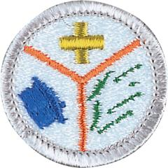

# Emergency Preparedness Merit Badge

## Overview

**Eagle required**

Scouts are often called upon to help because they know first aid and they know about the discipline and planning needed to react to an emergency situation. Earning this merit badge helps a Scout to be prepared by learning the actions that can be helpful and needed before, during, and after an emergency.

## Requirements

* (1) Earn the First Aid merit badge.
* (2) Do the following:
    * (a) Discuss with your counselor the aspects of emergency preparedness and include in your discussion the kinds of questions that are important to ask yourself as you consider each of these:
    * (b) Using a chart, spreadsheet, or another method approved by your counselor, demonstrate your understanding of each aspect of emergency preparedness listed in requirement 2(a) (prevention, protection, mitigation, response, and recovery) for 10 emergency situations from the list below. Discuss your findings with your counselor.
        * (1) Home stovetop or oven fire
        * (2) Home flammable liquid fire
        * (3) Gas leak in or near a home or with outside cooking
        * (4) Food poisoning
        * (5) Automobile crash
        * (6) Vehicle stalled in the desert
        * (7) Vehicle trapped in a blizzard
        * (8) Backcountry injury
        * (9) Boating or water accident
        * (10) Toxic chemical spills and releases
        * (11) Nuclear power plant emergency
        * (12) Fire or explosion in a public place
        * (13) Violence in a public place
        * (14) Wildland fire
        * (15) Avalanche (snowslide or rockslide)
        * (16) Earthquake
        * (17) Tsunami
        * (18) Major flooding or a flash flood with water outage
        * (19) Hurricane with power outage
        * (20) Tornado
        * (21) Lightning storm.

* (3) Do the following:
    * (a) At a family meeting, discuss the situations on the chart you created for requirement 2(b) and make emergency plans for sheltering-in-place and for evacuation of your home. Discuss your family meeting and plans with your counselor.
    * (b) Develop and practice a plan of escape for your family in case of fire in your home. Draw a floor plan with escape routes and a map with a safe meeting place. Discuss your family's home escape plan with your counselor.
    * (c) Using a checklist in the Emergency Preparedness Merit Badge pamphlet or one approved by your counselor, prepare or inspect a family disaster kit for sheltering-in-place and for evacuation of your home. Review the needs and uses of the items in a kit with your counselor.

* (4) Do ONE of the following:
    * (a) Using a home safety checklist included in the Emergency Preparedness Merit Badge pamphlet or one approved by your counselor, inspect a home (or a similar building near where you live or at a camp) for safety hazards with the help of an adult. Present your completed checklist to and discuss your findings with your counselor.
    * (b) Develop emergency prevention plans for five family activities outside the home, as approved by your counselor. (Examples are taking a picnic to a park, seeing a movie, attending a worship service, an outing at a beach, traveling to visit a relative, or attending a ball game or concert.) Each plan should include an analysis of possible hazards, proposals to prevent, protect from, mitigate, respond to, and recover from emergencies, and the reasons for the actions that you propose.

* (5) Show how you could save a person from the following dangerous situations without putting yourself in danger:
    * (a) Live household electric wire
    * (b) A structure filled with carbon monoxide
    * (c) Clothes on fire
    * (d) Drowning, using nonswimming rescues (including accidents on ice).

* (6) Do the following:
    * (a) Show three ways of attracting and communicating with rescue aircraft or drones.
    * (b) Show ways to attract attention of searchers on the ground if you are lost in the wilderness.
    * (c) Show ways to attract attention of searchers on the water if you are stranded with a capsized or disabled motorboat or sailboat.

* (7) With another person, show two good ways to transport an injured person out of a remote area using improvised stretchers to conserve the energy of rescuers while ensuring the well-being and protection of the injured person.
* (8) Do the following:
    * (a) Describe the National Incident Management System (NIMS) and the local Incident Command System (ICS).
    * (b) Find out how your community and its leaders work to manage and to train for disasters. Discuss this information with your counselor.
    * (c) Discuss how a Scout troop can help in an emergency situation using ICS.

* (9) Do the following:
    * (a) Discuss with your counselor the duties that a Scout troop should be prepared to do, the training they need, and the safety precautions they should take for the following emergency services:
        * (1) Crowd and traffic control
        * (2) Messenger service during an incident
        * (3) Collection and distribution services
        * (4) Group feeding, shelter, and sanitation.

    * (b) Prepare a written plan for mobilizing your troop when needed to do emergency service. If your troop already has a mobilization plan, present the plan to your counselor and tell your part in making the plan work.
    * (c) Using a checklist in this pamphlet or one approved by your counselor, prepare or inspect a personal emergency service pack for a mobilization call. Explain the needs and uses of the contents to your counselor.
    * (d) Take part in an emergency service project, either a real one or a practice exercise, with a Scouting troop or a community agency or at Scout camp or at a school. Review what you learned and practiced with your counselor.

* (10) Do ONE of the following:
    * (a) Interview an emergency services coordinator or a civil servant about their work in disaster management. Learn about how they chose this career and about their duties. Discuss what you learned with your counselor and whether you might be interested in this career.
    * (b) Identify three career opportunities that would use skills and knowledge in emergency services. Pick one and research the training, education, certification requirements, experience, and expenses associated with entering the field. Research the prospects for employment, starting salary, advancement opportunities, and career goals associated with this career. Discuss what you learned with your counselor and whether you might be interested in this career.
    * (c) Identify how you might use the skills and knowledge in the field of emergency preparedness to pursue a personal hobby and/or healthy lifestyle. Research the additional training required, expenses, and affiliation with organizations that would help you maximize the enjoyment and benefit you might gain from it. Discuss what you learned with your counselor and share what short-term and long-term goals you might have if you pursued this.

## Resources

- [Emergency Preparedness merit badge page](https://www.scouting.org/merit-badges/emergency-preparedness/)
- [Emergency Preparedness merit badge PDF](https://filestore.scouting.org/filestore/Merit_Badge_ReqandRes/Pamphlets/Emergency%20Preparedness_2025.pdf) ([local copy](files/emergency-preparedness-merit-badge.pdf))
- [Emergency Preparedness merit badge pamphlet](https://www.scoutshop.org/emergency-preparedness-merit-badge-pamphlet-657337.html)

Note: This is an unofficial archive of Scouts BSA Merit Badges that was automatically extracted from the Scouting America website and may contain errors.