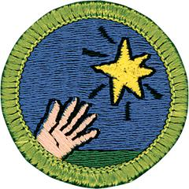

# Entrepreneurship Merit Badge

## Overview

By earning the Entrepreneurship merit badge, Scouts will learn about identifying opportunities, creating and evaluating business ideas, and exploring the feasibility (how doable it is) of an idea for a new business. They will also have the chance to fit everything together as they start and run their own business ventures.

## Requirements

* (1) In your own words, define. Explain to your counselor how entrepreneurs impact the U.S. economy.
* (2) Explain to your counselor why having good skills in the following areas is important for an entrepreneur: communication, planning, organization, problem solving, decision making, basic math, adaptability, technical and social skills, teamwork, and leadership.
* (3) Identify and interview an individual who has started a business. Learn about this person's educational background, early work experiences, where the idea for the business came from, and what was involved in starting the business. Find out how the entrepreneur raised the capital (money) to start the business, examples of successes and challenges faced, and how the business is currently doing (if applicable). Discuss with your counselor what you have learned.
* (4) Think of as many ideas for a business as you can, and write them down. From your list, select three ideas you believe represent the best opportunities. Choose one of these and explain to your counselor why you selected it and why you feel it can be successful.
* (5) Create a written business plan for your idea that includes all of the following:
    * (a) 
        * (1) Describe the product or service to be offered.
        * (2) Identify goals for your business.
        * (3) Explain how you can make enough of the product or perform the service to meet your goals.
        * (4) Identify and describe the potential liability risks for your product or service.
        * (5) Determine what type of license, if any, you might need in order to sell or make your product or service.

    * (b) 
        * (1) Identify the types of people who would buy your product or service.
        * (2) Identify your business's competitors, and describe their strengths and weaknesses.
        * (3) Describe what makes your product or service unique.

    * (c) 
        * (1) Determine how much money you will need to start your business, and identify how you will obtain the money.
        * (2) Determine the cost of offering your product or service and the price you will charge in order to make a profit.
        * (3) Describe what will happen with the money you make from the sales of your product or service.

    * (d) 
        * (1) Determine what parts of the business you will handle yourself, and describe your qualifications.
        * (2) Determine whether you will need additional help to operate your business. If you will need help, describe the responsibilities and qualifications needed for the personnel who will fill each role.

    * (e) 
        * (1) Describe the methods you will use to promote your business to potential customers.
        * (2) Explain how you will utilize the Internet and social media to increase awareness of your product or service.
        * (3) Design a promotional flier or poster for your product or service.

* (6) When you believe your business idea is feasible, imagine your business idea is now up and running. What successes and problems might you experience? How would you overcome any failures? Discuss with your counselor any ethical questions you might face and how you would deal with them.

## Resources

- [Entrepreneurship merit badge page](https://www.scouting.org/merit-badges/entrepreneurship/)
- [Entrepreneurship merit badge PDF](https://filestore.scouting.org/filestore/Merit_Badge_ReqandRes/Entrepreneurship.pdf) ([local copy](files/entrepreneurship-merit-badge.pdf))
- [Entrepreneurship merit badge pamphlet](https://www.scoutshop.org/entrepreneurship-merit-badge-pamphlet-657341.html)

Note: This is an unofficial archive of Scouts BSA Merit Badges that was automatically extracted from the Scouting America website and may contain errors.