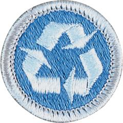

# Environmental Science Merit Badge

## Overview

While earning the Environmental Science merit badge, Scouts will get a taste of what it is like to be an environmental scientist, making observations and carrying out experiments to investigate the natural world.

## Requirements

* (1) Describe the meaning of environmental science in your own words. Explain how you think we can use science to understand, conserve, and improve our environment.
* (2) Do the following and discuss with your counselor:
    * (a) Choose an area approved by your counselor and observe (sight, sound, and smell) its ecosystem over a two-day period.
    * (b) Make notes about the living, nonliving (e.g. rocks) and formerly living components. Include information about interactions among the components, including the food chain, predators, native species, and invasive species) and identify how human activities have affected the ecosystem.

* (3) Do ONE of the following and discuss with your counselor:
    * (a) Learn what Particulate Matter (PM) is, how PM gets into the air, what the harmful effects of PM are, and what is being done to reduce PM in the air. Then, perform an experiment to test for particulates that contribute to air pollution.
    * (b) Discuss how air pollution and transportation affect each other by giving at least three examples. Then, compare two modes of transportation (e.g., gasoline-powered v. electric vehicles, gasoline-powered car v. bicycle, etc.).
    * (c) Learn about the Clean Air Act. Make notes on when it was passed, its environmental goals, what progress has been made and what remains to be done to achieve the law's goals. Describe the impact, benefits, and costs of the law as well as what is required to implement and enforce the law.

* (4) Do ONE of the following and discuss with your counselor:
    * (a) Identify where your community sources water, how it is treated, and disposed. Obtain and review a water quality report from your area.
    * (b) Identify a local or regional area that experiences periodic flooding and/or drought. Collect facts on prior event(s) and investigate the environmental impacts of these extreme events.
    * (c) Learn about the Clean Water Act. Make notes on when it was passed, its environmental goals, what progress has been made and what remains to be done to achieve the law's goals. Describe the impact, benefits, and costs of the law as well as what is required to implement and enforce the law.

* (5) Do ONE of the following and discuss with your counselor:
    * (a) In an area (yard, park, golf course, farm, etc.) approved by your counselor, make a list of the pesticides, herbicides, and fertilizers used and how often they are applied. Identify the benefits of their use and the environmental impact, including effects on non-target species (including humans), what happens if the chemicals infiltrate into the groundwater, and what happens to any runoff of the chemicals.
    * (b) Learn about the erosion process and identify an example of where erosion occurs. Determine where the eroded material ends up and how erosion can be minimized.
    * (c) Learn about a land pollution incident that led to a site being listed on Environmental Protection Agency's Superfund National Priority List. Identify what caused the incident, what the effects were on the environment, what remediation has been done, and the current condition of the site.

* (6) Do ONE of the following and discuss with your counselor:
    * (a) Do research on one endangered species found in your state. Learn about its natural habitat, why it is endangered, what is being done to preserve it, and how many individual species are left in the wild. Prepare a 100-word report about the species and include a drawing or photo. Present your report to your patrol or troop.
    * (b) Do research on one species that was endangered or threatened but that has now recovered. Learn about how the species recovered, and what its new status is. Prepare a 100-word report on the species and include a drawing or photo. Present your report to your patrol or troop.
    * (c) With your parent or guardian and counselor's approval, work with a natural resource professional to identify a completed project that has been designed to improve the habitat for a threatened or endangered species in your area. Visit the site and report on what you saw to your patrol or troop.

* (7) Do ONE of the following and discuss with your counselor:
    * (a) Determine five ways to conserve resources or use resources more efficiently in your home, school, or camp. Practice at least two of these methods for at least one week.
    * (b) Explain Resource Recovery and why it is important to reduce pollution. Collect samples or take photos of ten items that can demonstrate the principle of Reduce, Reuse, Recycle. Explain your collection, how these materials are currently handled, and potential improvements.
    * (c) Identify five items in your household that will become hazardous waste. Explain how they should be properly stored, what special care is needed for disposal, and proper disposal options available in your area.

* (8) Do ONE of the following and discuss with your counselor:
    * (a) Investigate pollination and its importance to our environment and ecosystems. Make a list of five pollinators and the plants that attract them in your region. Explain the importance of pollinators and what Scouts can do to support pollinators in their area.
    * (b) Visit an area with flowering plants during pollination season for an hour to observe pollination. Record which pollinators are attracted to which plant. Explain the importance of pollinators and what Scouts can do to support pollinators in their area.
    * (c) Learn about the importance of pollination to agriculture, including the economic costs and benefits. Identify four crop-pollinator pairs. Explain the relationship of pollinators to agriculture.

* (9) In your community or camp, investigate two invasive plant or animal species. Learn where the species originated, how they were transported to this ecosystem, their life history, how they are spread, how they impact the native ecosystem, and the recommended means to eradicate or control their spread.  Discuss what you learned with your counselor.
* (10) Identify the environmental impact topics that would need to be addressed for a construction project such as building a house, adding a new building to your Scout camp, or one you create on your own that is approved by your counselor. Evaluate the purpose and benefit of the proposed project, alternatives (including a no-action alternative), and any environmental consequences. Discuss with your counselor.
* (11) Identify three career opportunities that would use skills and knowledge in the environmental science field. Pick one and research the training, education, certification requirements, experience, and expenses associated with entering the field. Research the prospects for employment, starting salary, advancement opportunities and career goals associated with this career. Discuss what you learned with your counselor and whether you might be interested in this career.

## Resources

- [Environmental Science merit badge page](https://www.scouting.org/merit-badges/environmental-science/)
- [Environmental Science merit badge PDF](https://filestore.scouting.org/filestore/Merit_Badge_ReqandRes/Pamphlets/Environmental%20Science_2025.pdf) ([local copy](files/environmental-science-merit-badge.pdf))
- [Environmental Science merit badge pamphlet](https://www.scoutshop.org/bsa-enviromental-science-merit-badge-pamphlet-es-boy-scouts-of-america-660375.html)

Note: This is an unofficial archive of Scouts BSA Merit Badges that was automatically extracted from the Scouting America website and may contain errors.