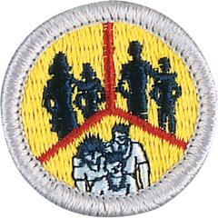

# Family Life Merit Badge

## Overview

**Eagle required**

The family is the basic unit of society and is important to both individuals and communities. The world is rapidly changing, making today’s society much more complex than ever before. As Scouts earn this merit badge, they will realize why it is important to know more about family life and how to strengthen their families.

## Requirements

* (1) Prepare an outline on what a family is and discuss this with your counselor. Tell why families are important to individuals and to society. Discuss how the actions of one member can affect other members.
* (2) List several reasons why you are important to your family and discuss this with your parent or guardian and with your counselor.
* (3) Prepare a list of your regular home duties or chores (at least five) and do them for 90 days. Keep a record of how often you do each of them. Discuss with your counselor the effect your chores had on your family.
* (4) With the approval of your parent or guardian and your counselor, decide on and carry out an individual project that you would do around the home that would benefit your family. After completion, discuss the objective or goal and the results of the project with your family and then your counselor.
* (5) Plan and carry out a project that involves the participation of your family. After completing the project, discuss the following with your  counselor:
    * (a) The objective or goal of the project
    * (b) How individual members of your family participated
    * (c) The results of the project.

* (6) Do the following (discussion of each of these subjects may carry over to more than one family meeting):
    * (a) Discuss with your counselor how to plan and carry out a family meeting.
    * (b) Prepare a meeting agenda that includes the following topics, review it with your parent or guardian, and then carry out one or more family meetings:
        * (1) How living the principles of the Scout Oath and Scout Law contributes to your family life
        * (2) The greatest dangers and addictions facing youth in today's society (examples include mental health challenges, use of tobacco products, alcohol, or drugs and other items such as debts, social media, etc.)
        * (3) The growing-up process and how the body changes, and making responsible decisions dealing with sex. This conversation may take place with only one parent or guardian.
        * (4) Personal and family finances
        * (5) A crisis situation within your family and whom you can turn to for support during these situations.
        * (6) The effect of technology on your family
        * (7) Good etiquette and manners.

* (7) Discuss with your counselor your understanding of what makes an effective parent or guardian and why, and your thoughts on the parent or guardian's role and responsibilities in the family.

## Resources

- [Family Life merit badge page](https://www.scouting.org/merit-badges/family-life/)
- [Family Life merit badge PDF](https://filestore.scouting.org/filestore/Merit_Badge_ReqandRes/2023_Updates/35893(23)_Family_Life_REQ.pdf) ([local copy](files/family-life-merit-badge.pdf))
- [Family Life merit badge pamphlet](None)

Note: This is an unofficial archive of Scouts BSA Merit Badges that was automatically extracted from the Scouting America website and may contain errors.