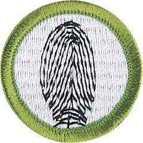

# Fingerprinting Merit Badge

## Overview

In earning the Fingerprinting merit badge, Scouts will learn about and use an important technique that is used by law enforcement officers, along with other materials like matching dental records and DNA sampling, to help identify amnesia victims, missing persons, abducted children, and others.

## Requirements

* (1) Give a short history of fingerprinting. Tell the difference between civil and criminal identification.
* (2) Do the following:
    * (a) Explain the difference between the automated fingerprint identification systems (AFIS) now used by law enforcement agencies and the biometric fingerprint systems used to control access to computers and places like buildings and airports.
    * (b) Discuss how our society uses identification systems based on tokens, passwords, and biometrics.

* (3) Do the following:
    * (a) Name the surfaces of the body where friction or papillary ridges are found.
    * (b) Name the two basic principles supporting the science of fingerprints and give a brief explanation of each principle.
    * (c) Explain what it takes to positively identify a person using fingerprints.

* (4) Take a clear set of prints using ONE of the following methods:
    * (a) Make both rolled and plain impressions. Make these on an 8-by-8-inch fingerprint identification card, available from your local police department or your counselor.
    * (b) Using clear adhesive tape, a pencil, and plain paper, record your own fingerprints or those of another person.

* (5) Show your counselor you can identify the three basic types of fingerprint patterns and their subcategories. Using your own hand, identify the types of patterns you see.
* (6) Identify three career opportunities that would use skills and knowledge in the areas of biometrics and/or fingerprinting. Pick one and research the training, education, certification requirements, experience, and expenses associated with entering the field. Research the prospects for employment, starting salary, advancement opportunities, and career goals associated with this career. Discuss what you learned with your counselor and whether you might be interested in this career.

## Resources

- [Fingerprinting merit badge page](https://www.scouting.org/merit-badges/fingerprinting/)
- [Fingerprinting merit badge PDF](https://filestore.scouting.org/filestore/Merit_Badge_ReqandRes/Pamphlets/Fingerprinting_2025.pdf) ([local copy](files/fingerprinting-merit-badge.pdf))
- [Fingerprinting merit badge pamphlet](https://www.scoutshop.org/fingerprinting-merit-badge-pamphlet-650716.html)

Note: This is an unofficial archive of Scouts BSA Merit Badges that was automatically extracted from the Scouting America website and may contain errors.