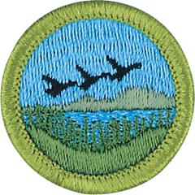

# Fish & Wildlife Management Merit Badge

## Overview

Learn how animal diversity impacts the planet and the longevity of communities across the globe with the Fish and Wildlife Management Merit Badge. The Fish and Wildlife Merit Badge is a conservation-based merit badge recognizing our ecological impact and responsibility to preserve and protect animal life. Scouts will learn the purpose of fish and wildlife conservation while listing at least three significant problems threatening fish and wildlife resources in their community.

## Requirements

* (1) Describe the meaning and purposes of fish and wildlife conservation and management.
* (2) List and discuss at least three major problems that continue to threaten your state's fish and wildlife resources.
* (3) Describe some ways in which everyone can help with fish and wildlife conservation.
* (4) List and describe five major fish and wildlife management practices used by managers in your state.
* (5) Do ONE of the following:
    * (a) Construct, erect, and check regularly at least two artificial nest boxes (wood duck, bluebird, squirrel, etc.) and keep written records for one nesting season.
    * (b) Construct, erect, and check regularly bird feeders and keep written records daily over a two-week period of the kinds of birds visiting the feeders.
    * (c) Develop and implement a fishery improvement project or a backyard wildlife habitat improvement project. Share the results with your counselor.
    * (d) Design and construct a wildlife blind near a game trail, water hole, salt lick, bird feeder, or birdbath and take good photographs or make sketches from the blind of any combination of 10 wild birds, mammals, reptiles, or amphibians.

* (6) Do ONE of the following:
    * (a) Observe and record 25 species of wildlife. Your list may include mammals, birds, reptiles, amphibians, and fish. Write down when and where each animal was seen.
    * (b) List the wildlife species in your state that are classified as endangered, threatened, exotic, non-native, game species, furbearers, or migratory game birds. Discuss with your counselor management practices in place or being developed for at least three of these species.
    * (c) Start a scrapbook of North American fish and wildlife. Insert markers to divide the book into separate parts for mammals, birds, reptiles, amphibians, and fish. Collect articles on such subjects as life histories, habitat, behavior, and feeding habits on all of the five categories and place them in your notebook accordingly. Articles and pictures may be taken from newspapers or science, nature, and outdoor magazines, or from other sources including the internet (with your parent or guardian's permission). Enter at least five articles on mammals, five on birds, five on reptiles, five on amphibians, and five on fish. Put each animal on a separate sheet in alphabetical order. Include pictures whenever possible.

* (7) Do ONE of the following:
    * (a) Determine the age of five species of fish from scale samples or identify various age classes of one species in a lake and report the results.
    * (b) Conduct a creel census on a small lake to estimate catch per unit effort and report the results to your counselor.
    * (c) Examine the stomach contents of three fish and record the findings. It is not necessary to catch any fish for this option.
    * (d) Make a freshwater aquarium. Include at least four species of native plants and four species of animal life, such as whirligig beetles, freshwater shrimp, tadpoles, water snails, and golden shiners. After 60 days of observation, discuss with your counselor the life cycles, food chains, and management needs you have recognized. Before completing this requirement, check local laws on releasing these organisms back into the wild, and follow your counselor's direction in disposing of these organisms humanly and safely.

* (8) Identify three career opportunities that would use skills and knowledge by fish and wildlife professionals. Pick one and research the training, education, certification requirements, experience, and expenses associated with entering the field. Research the prospects for employment, starting salary, advancement opportunities and career goals associated with this career. Discuss what you learned with your counselor and whether you might be interested in this career.

## Resources

- [Fish & Wildlife Management merit badge page](https://www.scouting.org/merit-badges/fish-wildlife-management/)
- [Fish & Wildlife Management merit badge PDF](https://filestore.scouting.org/filestore/Merit_Badge_ReqandRes/Pamphlets/Fish%20and%20Wildlife_2024.pdf) ([local copy](files/fish-wildlife-management-merit-badge.pdf))
- [Fish & Wildlife Management merit badge pamphlet](https://www.scoutshop.org/fish-and-wildlife-management-merit-badge-pamphlet-655190.html)

Note: This is an unofficial archive of Scouts BSA Merit Badges that was automatically extracted from the Scouting America website and may contain errors.