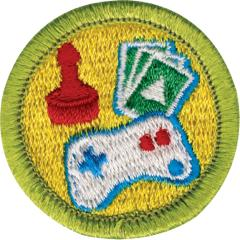

# Game Design Merit Badge

## Overview

Games come in almost every shape, size, format, and flavor imaginable. Games can be fast-paced, slow, or anything in between. Some are competitive. Some are cooperative. They may be for individuals, small groups, or thousands of players at a time. They might take seconds to complete or last for years. However you slice it, everyone has played games, and games help make us who we are.

## Requirements

* (1) Do the following:
    * (a) Analyze four games you have played, each from a different medium. Identify the medium, player format, objectives, rules, resources, and theme (if relevant). Discuss with your counselor the play experience, what you enjoy in each game, and what you dislike. Make a chart to compare and contrast the games.
    * (b) Describe four types of play value and provide an example of a game built around each concept. Discuss with your counselor other reasons people play games.

* (2) Discuss with your counselor FIVE of the following 17 game design terms. For each term that you pick, describe how it relates to a specific game: story, setting, characters, play sequence, level design, interface design, difficulty, balance, depth, pace, replay value, age appropriateness, single-player vs. multiplayer, cooperative vs. competitive, turn-based vs. real-time, strategy vs. reflex vs. chance, abstract vs. thematic.
* (3) Define the term intellectual property. Describe the types ofassociated with the game design industry. Describe how intellectual property is protected and why protection is necessary. Define and give an example of a licensed property.
* (4) Do the following:
    * (a) Pick a game where the players can change the rules or objectives (examples: basketball, hearts, chess, kickball). Briefly summarize the standard rules and objectives and play through the game normally.
    * (b) Propose changes to several rules or objectives. Predict how each change will affect gameplay.
    * (c) Play the game with one rule or objective change, observing how the players' actions and emotional experiences are affected by the rule change. Repeat this process with two other changes.
    * (d) Explain to your counselor how the changes affected the actions and experience of the players. Discuss the accuracy of your predictions.

* (5) Design a new game. Any game medium or combination of mediums is acceptable. Record your work in a game design notebook.
    * (a) Write a vision statement for your game. Identify the medium, player format, objectives, and theme of the game. If suitable, describe the setting, story, and characters.
    * (b) Describe the reason that someone would want to play your game.
    * (c) Make a preliminary list of the rules of the game. Define the resources.
    * (d) Draw the game elements.

* (6) Do the following:You must have your counselor's approval of your concept before you begin creating the prototype.
    * (a) Prototype your game from requirement 5. If applicable, demonstrate to your counselor that you have addressed player safety through the rules and equipment. Record your work in your game design notebook.
    * (b) Test your prototype with as many other people as you need to meet the player format. Compare the play experience to your descriptions from requirement 5(b). Correct unclear rules, holes in the rules, dead ends, and obvious rule exploits. Change at least one rule, mechanic, or objective from your first version of the game, and describe why you are making the change. Play the game again. Record in your game design notebook whether or not your change had the expected effect.
    * (c) Repeat 6(b) at least two more times and record the results in your game design notebook.

* (7) Blind test your game. Do the following:
    * (a) Write an instruction sheet that includes all of the information needed to play the game. Clearly describe how to set up the game, play the game, and end the game. List the game objectives.
    * (b) Share your prototype from requirement 6 with a group of players that has not played it or witnessed a previous playtest. Provide them with your instruction sheet(s) and any physical components. Watch them play the game, but do not provide them with instruction. Record their feedback in your game design notebook.
    * (c) Share your game design notebook with your counselor. Discuss the player reactions to your project and what you learned about the game design process. Based on your testing, determine what you like most about your game and suggest one or more changes.

* (8) Do ONE of the following:
    * (a) With your parent or guardian's permission and your counselor's approval, visit with a professional in the game development industry and ask them about their job and how it fits into the overall development process.
    * (b) Meet with a professional in game development education and discuss the skills they emphasize in the classroom.

## Resources

- [Game Design merit badge page](https://www.scouting.org/merit-badges/game-design/)
- [Game Design merit badge PDF](https://filestore.scouting.org/filestore/Merit_Badge_ReqandRes/Pamphlets/Game%20Design_2025.pdf) ([local copy](files/game-design-merit-badge.pdf))
- [Game Design merit badge pamphlet](https://www.scoutshop.org/game-design-merit-badge-pamphlet-660199.html)

Note: This is an unofficial archive of Scouts BSA Merit Badges that was automatically extracted from the Scouting America website and may contain errors.