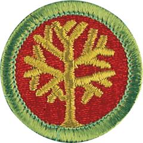

# Genealogy Merit Badge

## Overview

Exploring your roots—where your family name came from, why your family lives where it does, what your parents and grandparents did for fun when they were your age—can be fascinating. Discovering your ancestors back through history is what genealogy is all about.

## Requirements

* (1) Do the following:
    * (a) Explain to your counselor what the words genealogy, ancestor, and descendant mean.
    * (b) Explain what a family tree is and what information would be kept there.
    * (c) Explain what a family group record is and what information would be kept there.

* (2) Do ONE of the following:
    * (a) Create a time line for yourself or for a relative. Then write a short biography based on that time line.
    * (b) Keep a journal for six weeks. You must write in it at least once a week.

* (3) With your parent or guardian's help, choose a relative or a family acquaintance you can interview in person, by telephone, or by email or letter. Record the information you collect so you do not forget it.
* (4) Do the following:
    * (a) Name three types of physical genealogical resources and where you can find them, and explain how these resources can help you chart your family tree.
    * (b) Name three types of digital genealogical resources and where you can find them, and explain how these resources can help you chart your family tree.
    * (c) Obtain at least one genealogical document that supports an event that is or can be recorded on your pedigree chart or family group record.
    * (d) Tell how you found it and how you would evaluate the genealogical information you found for requirement 4c.
    * (e) Tell a likely place to find these type of genealogical records: marriage record, census record, birth record, and burial information.

* (5) Contact ONE of the following individuals or institutions. Ask what genealogical services, records, or activities this individual or institution provides, and report the results:
    * (a) A genealogical or lineage society
    * (b) A professional genealogist (someone who gets paid for doing genealogical research)
    * (c) A surname organization, such as your family's organization
    * (d) A genealogical educational facility or institution.
    * (e) A genealogical record repository of any type (courthouse, genealogical library, state or national archive, state library, etc.).

* (6) Begin your family tree by listing yourself and include at least two additional generations. You may complete this requirement by using the chart provided in themerit badge pamphlet or the genealogy software program of your choice.
* (7) Complete a family group record form, listing yourself and your brothers and sisters as the children. On another family group record form, show one of your parents and his or her brothers and sisters as the children. This requirement may be completed using the chart provided or the genealogy software program of your choice.
* (8) Do the following:
    * (a) Explain the effect computers and the Internet are having on the world of genealogy.
    * (b) Explain how photography (including microfilming) has influenced genealogy.
    * (c) Explain how record indexing works and how that has influenced genealogy.

* (9) Discuss what you have learned about your family and your family members through your genealogical research.

## Resources

- [Genealogy merit badge page](https://www.scouting.org/merit-badges/genealogy/)
- [Genealogy merit badge PDF](https://filestore.scouting.org/filestore/Merit_Badge_ReqandRes/2023_Updates/35903(23)_Genealogy_REQ.pdf) ([local copy](files/genealogy-merit-badge.pdf))
- [Genealogy merit badge pamphlet](None)

Note: This is an unofficial archive of Scouts BSA Merit Badges that was automatically extracted from the Scouting America website and may contain errors.