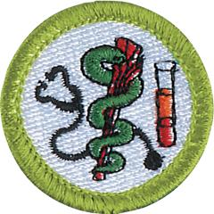

# Health Care Professions Merit Badge

## Overview

Explore the different types of the healthcare fields and professions with the Health Care Professions Merit Badge. Scouts will learn how professionals in different health care fields work together to keep people healthy. The Health Care Professions Merit Badge generates excitement for a possible career in the healthcare industry.

## Requirements

* (1) Select three of the professions from Group 1 listed below which interest you, then complete the following:
    * a Briefly describe to your counselor the roles these professionals play in the delivery of health care.
    * b Describe to your counselor the educational and licensing requirements for the professionals you selected.

* (2) Select three of the professions from Group 2 listed below which interest you, then complete the following:
    * a Briefly describe to your counselor the roles these professionals play in the delivery of health care.
    * b Describe to your counselor the educational and licensing requirements for the professionals you selected.

* (3) Select three of the professions from Group 3 listed below which interest you, then complete the following:
    * a Briefly describe to your counselor the roles these professionals play in the delivery of health care.
    * b Describe to your counselor the educational and licensing requirements for the professionals you selected.

* (4) Select three of the professions from Group 4 listed below which interest you, then complete the following:
    * a Briefly describe to your counselor the roles these professionals play in the delivery of health care.
    * b Describe to your counselor the educational and licensing requirements for the professionals you selected.

* (5) Select one career from any of the lists in Requirements 1, 2, 3, or 4 and arrange to visit that professional at theirworkplace. Discuss with your counselor the following:a. Why did they choose their particular career?b. What do they most like about their job?c. What are their biggest challenges in doing their job?d. Identify the tools/instruments that may be used in their jobs.e. What has been the most surprising aspect of their career?f. What continuing education requirements are required to maintain certification?
* (6) Discuss with your counselor your understanding of the meaning of the Physician's Oath.
* (7) Describe the role of confidentiality between a patient and the health care provider. What is HIPAA?
* (8) Identify a medical advancement or discovery that has been in the news recently. Discuss with your counselor how this can affect patient care.
* (9) With approval of your counselor and parents/ guardian, serve as a volunteer at a health related event or facility in your community (e.g. blood drive, health fair, blood pressure screening event). Report to your counselor what you did and learned from the experience.

## Resources

- [Health Care Professions merit badge page](https://www.scouting.org/merit-badges/health-care-professions/)
- [Health Care Professions merit badge PDF](https://filestore.scouting.org/filestore/Merit_Badge_ReqandRes/35975(21)-HealthCare-WEB-Requirements.pdf) ([local copy](files/health-care-professions-merit-badge.pdf))
- [Health Care Professions merit badge pamphlet](https://www.scoutshop.org/healthcare-professions-merit-badge-pamphlet-656838.html)

Note: This is an unofficial archive of Scouts BSA Merit Badges that was automatically extracted from the Scouting America website and may contain errors.