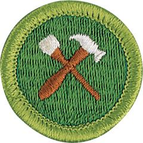

# Home Repairs Merit Badge

## Overview

Successfully completing this badge’s requirements can lead to a lifetime of personal and financial rewards: Doing basic home repairs provides a sense of personal pride in one’s achievements and increased self-confidence. In addition, safe and successful do-it-yourselfers can easily save a family thousands of dollars in repair bills over the years.

## Requirements

* 
* (1) Do the following:
    * (a) Explain to your counselor the most likely hazards you may encounter while working on home repairs and what you should do to anticipate, mitigate and prevent, and respond to these hazards. Describe the appropriate safety gear and clothing that should be used when working on home repairs. Resources:
    * (b) Discuss general precautions related to home repairs. Name at least 10 safe practices that every home repairer should exercise. Resource:

* (2) Under the supervision of your parent, guardian, or counselor, do FOUR of the following:
    * (a) Maintain or recondition a yard tool and show that you know how to clean up and properly store this equipment. Resource:
    * (b) Weather strip a window or door. Resource:
    * (c) Caulk cracks or joints open to the weather. Resource:
    * (d) Waterproof a basement.
    * (e) Repair a break in a concrete or asphalt surface. Resources:
    * (f) Repair the screen in a window or door. Resource:
    * (g) Replace a pane of glass. Resource:
    * (h) Solder a broken wire or metal object.

* (3) Under the supervision of your parent, guardian, or counselor, do THREE of the following:
    * (a) Install or build equipment for storing tools. Resources:
    * (b) Build a workbench. Resource:
    * (c) Repair a piece of furniture. Resources:
    * (d) Paint or varnish a piece of furniture, a door, or trim on a house. Resources:
    * (e) Repair a sagging door or gate. Resource:
    * (f) Repair a loose step or railing. Resources:
    * (g) Repair a fence. Resource:

* (4) Under the supervision of your parent, guardian, or counselor, do TWO of the following:
    * (a) Locate a main electrical switch box and know how to replace a fuse or reset a circuit breaker. Resources:
    * (b) Replace an electrical cord or repair a plug or lamp socket. Resource:
    * (c) Install a single-pole light switch. Resource:
    * (d) Replace an electrical wall outlet. Resources:

* (5) Under the supervision of your parent, guardian, or counselor, do TWO of the following:
    * (a) Clear a clogged drain or trap. Resource:
    * (b) Repair a leaky water faucet. Resource:
    * (c) Repair a flush toilet. Resources:
    * (d) Repair a leaky hose or connector. Resource:
    * (e) Clean or replace a sprinkler head. Resources:

* (6) Under the supervision of your parent, guardian, or counselor, do THREE of the following:
    * (a) Paint a wall or ceiling. Resource:
    * (b) Repair or replace damaged tile, linoleum, or vinyl flooring. Resource:
    * (c) Install drapery or curtain rods and then hang drapes or curtains. Resource:
    * (d) Replace window blind cords.
    * (e) Repair or replace a window sash cord.
    * (f) Reinforce a picture frame. Resources:
    * (g) Mend an object made of china, glass, or pottery. Resources:

## Resources

- [Home Repairs merit badge page](https://www.scouting.org/merit-badges/home-repairs/)
- [Home Repairs merit badge PDF](https://filestore.scouting.org/filestore/Merit_Badge_ReqandRes/Pamphlets/Home%20Repairs_2024.pdf) ([local copy](files/home-repairs-merit-badge.pdf))
- [Home Repairs merit badge pamphlet](https://www.scoutshop.org/home-repairs-merit-badge-pamphlet-656899.html)

Note: This is an unofficial archive of Scouts BSA Merit Badges that was automatically extracted from the Scouting America website and may contain errors.