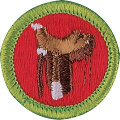

# Horsemanship Merit Badge

## Overview

In addition to learning how to safely ride and care for horses, Scouts who earn this merit badge will gain an understanding of the instincts and behaviors of horses and humane and effective methods for training horses.

## Requirements

* (1) Do the following:
    * (a) Describe the safety precautions you should take when handling and caring for a horse.
    * (b) Describe the fire safety precautions you should take in a barn and around horses.

* (2) Name 15 parts of a horse and discuss the function of each with your counselor.
* (3) Name four breeds of horses. Explain the special features for which each breed is known.
* (4) Describe the symptoms of colic. Name and describe four other horse health problems.
* (5) Explain what conformation is and why it is important. Explain the difference between lameness and unsoundness.
* (6) Explain the importance of hoof care and why a horse might need to wear shoes.
* (7) Demonstrate how to groom a horse, including picking hooves and caring for a horse after a ride.
* (8) Explain how to determine what and how much to feed a horse and why the amount and kind of feed are changed according to the activity level and the breed of horse.
* (9) Do the following:
    * (a) Name 10 parts of the saddle and bridle that you will use, and explain how to care for this equipment.
    * (b) Show how to properly saddle and bridle a horse.
    * (c) Demonstrate how to safely mount and dismount a horse.

* (10) Explain and demonstrate how to approach and lead a horse safely from a stall, corral, or field and how to tie the horse securely.
* (11) On level ground, continuously do the following movements after safely mounting the horse. Do them correctly, at ease, and in harmony with the horse.
    * (a) Walk the horse in a straight line for 60 feet.
    * (b) Walk the horse in a half-circle of not more than 16 feet in radius.
    * (c) Trot or jog the horse in a straight line for 60 feet.
    * (d) Trot or jog the horse in a half-circle of not more than 30 feet in radius.
    * (e) Halt straight.
    * (f) Back up straight four paces.
    * (g) Halt and dismount.

## Resources

- [Horsemanship merit badge page](https://www.scouting.org/merit-badges/horsemanship/)
- [Horsemanship merit badge PDF](https://filestore.scouting.org/filestore/Merit_Badge_ReqandRes/Pamphlets/Horsemanship_2024.pdf) ([local copy](files/horsemanship-merit-badge.pdf))
- [Horsemanship merit badge pamphlet](https://www.scoutshop.org/scouts-bsa-horesemanship-merit-badge-pamphlet-662399.html)

Note: This is an unofficial archive of Scouts BSA Merit Badges that was automatically extracted from the Scouting America website and may contain errors.