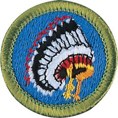

# Indian Lore Merit Badge

## Overview

Far different from the stereotypes or common images that are portrayed on film, on television, and in many books and stories, American Indians have many different cultures, languages, religions, styles of dress, and ways of life. To learn about these different groups is to take an exciting journey of discovery in which you will meet some of America’s most fascinating peoples.

## Requirements

* (1) Identify the different American Indian cultural areas. Explain what makes them each unique.
* (2) Research an American Indian tribe, group, or nation. Tell your counselor about traditional dwellings, way of life, tribal government, religious beliefs, family and clan relationships, language, clothing styles, arts and crafts, food cultivation, foraging and preparation, means of getting around, games, customs in warfare, and where and how they live today.
* (3) Do the following:
    * (a) Learn 10 common terms in an American Indian language and their meanings.
    * (b) Identify the meaning of 10 place names of American Indian origin in the United States.
    * (c) Name five well-known American Indian leaders, either from the past or people of today. Give their tribes or nations. Describe what they did or do now that makes them notable.

* (4) Do the following:
    * (a) Describe how life might have been different for the European settlers if there had been no Native Americans to meet them when they came to this continent.
    * (b) Describe eight things adopted by others from American Indians.
    * (c) Learn a game played by a group or tribe. Teach and lead it with a Scout group.

* (5) Do ONE of the following:
    * (a) Visit a museum either in-person or virtually to see American Indian exhibitions and collections. Discuss with your counselor what you observed or learned from two exhibitions and identify 10 artifacts by tribe or nation, their shape, size, and use.
    * (b) Attend a contemporary American Indian gathering. Discuss with your counselor proper etiquette for attending as well as what you learned and observed during your visit.

## Resources

- [Indian Lore merit badge page](https://www.scouting.org/merit-badges/indian-lore/)
- [Indian Lore merit badge PDF](https://filestore.scouting.org/filestore/Merit_Badge_ReqandRes/Indian_Lore.pdf) ([local copy](files/indian-lore-merit-badge.pdf))
- [Indian Lore merit badge pamphlet](https://www.scoutshop.org/indian-lore-merit-badge-pamphlet-655636.html)

Note: This is an unofficial archive of Scouts BSA Merit Badges that was automatically extracted from the Scouting America website and may contain errors.