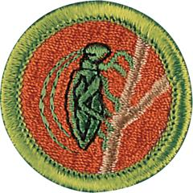

# Insect Study Merit Badge

## Overview

In earning the Insect Study merit badge, Scouts will glance into the strange and fascinating world of the insect. There, they will meet tiny creatures with tremendous strength and speed, see insects that undergo startling changes in habits and form as they grow, and learn how insects see, hear, taste, smell, and feel the world around them.

## Requirements

* (1) Do the following:
    * (a) Explain to your counselor the most likely hazards associated with exposure to ants and bees and what you should do to anticipate, help prevent, mitigate, and respond to these hazards. Resources:
    * (b) Discuss the prevention of and treatment for health concerns that could occur while working with ants and bees, including insect bites and anaphylactic shock. Resources:

* (2) Do the following:
    * (a) Tell how insects are different from other animals. Resources:
    * (b) Show how insects are different from millipedes and spiders. Resource:
    * (c) Point out and name the main parts of an insect. Resource:
    * (d) Describe the characteristics that distinguish the major orders of insects. Resource:

* (3) Do the following:
    * (a) Compare the life histories of a butterfly and a grasshopper. Tell how they are different. Resources:
    * (b) Raise an insect through complete metamorphosis from its larval stage to its adult stage (e.g., raise a butterfly or moth from a caterpillar). (Some insects are endangered species and are protected by federal or state law. Every species is found only in its own special type of habitat. Be sure to check natural resources authorities in advance to be sure that you will not be collecting any species that is known to be protected or endangered, or in any habitat where collecting is prohibite(d) In most cases, all specimens should be returned at the location of capture after the requirement has been met. Check with your counselor for those instances where the return of these specimens would not be appropriate.)

* (4) Do the following:
    * (a) Discuss the importance of the Leave No Trace Seven Principles and the Outdoor Code as they relate to insect study. Explain how you have followed the Leave No Trace Seven Principles and the Outdoor Code during field observation, specimen collection, and identification. Resources:
    * (b) Observe 20 different live species of insects in their habitat. In your observations, include at least four orders of insects. Resources:
    * (c) Make a scrapbook of the 20 insects you observe in 5(b) Include photographs, sketches, illustrations, and articles. Label each insect with its common and scientific names, where possible. Share your scrapbook with your counselor. Resources:
    * (d) From your scrapbook collection, select eight species of insects and identify what role they play in the ecosystem. Resources:

* (5) Do the following:
    * (a) Tell things that make social insects different from solitary insects. Resources:
    * (b) Do ONE of the following:
        * (1) Observe an ant colony in a formicarium (ant farm). Find the queen and worker ants. Explain to your counselor the different chambers found within an ant colony. Resource:
        * (2) Study a hive of bees. Remove the combs and find the queen. Estimate the amount of brood and count the number of queen cells. Explain how to determine the amount of honey in the hive. (If you are allergic to bee stings, pick option 1 above.) Resource:

* (6) Do the following:
    * (a) Tell how insects fit in the food web of other insects, fish, birds, and mammals. Resource:
    * (b) Explain the role insects serve as pollinators for plants. Resource:

* (7) Do the following:
    * (a) Explain the symbiotic relationship between bees and humankin(d) Explain what colony collapse disorder (CCD) is and some of the possible causes. Discuss how CCD affects our food supply. Resources:
    * (b) Describe three alternatives to insecticides as a way of preventing crop injury and subsequent yield loss. Explain the advantages and disadvantages of these alternatives. Resources:

* (8) Do the following:
    * (a) Tell the migration route of an insect (e.g., monarch butterfly). Discuss the challenges they face and how Scouts can contribute to their success. Resource:
    * (b) Find out about an insect that is a threatened or endangered species. Discuss the challenges they face and how Scouts can contribute to their success. Resource:

* (9) Do ONE of the following:
    * (a) Identify three career opportunities that would use skills and knowledge in Insect Study. Pick one and research the training, education, certification requirements, experience, and expenses associated with entering the field. Research the prospects for employment, starting salary, advancement opportunities and career goals associated with this career. Discuss what you learned with your counselor and whether you might be interested in this career. Resources:
    * (b) Identify how you might use the skills and knowledge in Insect Study to pursue a personal hobby. Research the additional training required, expenses, and affiliation with organizations that would help you maximize the enjoyment and benefit you might gain from it. Discuss what you learned with your counselor and share what short-term and long-term goals you might have if you pursued this. Resource:

## Resources

- [Insect Study merit badge page](https://www.scouting.org/merit-badges/insect-study/)
- [Insect Study merit badge PDF](https://filestore.scouting.org/filestore/Merit_Badge_ReqandRes/Pamphlets/Insect%20Study_2025.pdf) ([local copy](files/insect-study-merit-badge.pdf))
- [Insect Study merit badge pamphlet](https://www.scoutshop.org/bsa-insect-study-merit-badge-pamphlet-boy-scouts-of-america-660197.html)

Note: This is an unofficial archive of Scouts BSA Merit Badges that was automatically extracted from the Scouting America website and may contain errors.