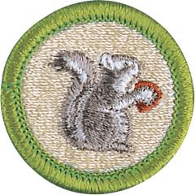

# Mammal Study Merit Badge

## Overview

A mammal may weigh as little as 1/12 ounce, as do some shrews, or as much as 150 tons, like the blue whale. It may spring, waddle, swim, or even fly. But if it has milk for its young, has hair of some kind, is relatively intelligent, and has warm blood, then it is a mammal.

## Requirements

* (1) Explain the following terms: animal, invertebrate, vertebrate, mammal. Name three characteristics that distinguish mammals from all other animals.
* (2) Explain how the animal kingdom is classified. Explain where mammals fit in the classification of animals. Classify three mammals from phylum through species.
* (3) Do ONE of the following:
    * (a) Spend three hours in two different kinds of natural habitats or at different elevations for a total of 6 hours. List the different mammal species and how many of each you identified by sight or sign. Tell why all mammals do not live in the same kind of habitat.
    * (b) Spend three hours on five different days in at least a 25-acre area (about the size of 31/2 football fields) for a total of 15 hours. List the mammal species you identified by sight or sign.
    * (c) From study and reading, write a simple life history of one nongame mammal that lives in your area. Tell how this mammal lived before its habitat was affected in any way by humans. Tell how it reproduces, what it eats, and its natural habitat. Describe its dependency upon plants and other animals (including humans), and how they depend upon it. Describe how humans have benefited from the mammal you have chosen and whether the mammal has benefited from association with humankind.

* (4) Do ONE of the following:
    * (a) Under the guidance of a nature center or natural history museum, make two study skins of rats or mice. Tell the uses of study skins and mounted specimens respectively.
    * (b) Take good pictures of two kinds of mammals in the wild. Record the date(s), time of day, weather conditions, approximate distance from the animal, habitat conditions, and any other factors you feel may have influence the animal's activity and behavior.
    * (c) Write a life history of a native game mammal that lives in your area, covering the points outlined in requirement 3c. List sources for this information.
    * (d) Make and bait a tracking pit. Report what mammals and other animals came to the bait.
    * (e) Visit a natural history museum. Report on how specimens are prepared and cataloged. Explain the purposes of museums.
    * (f) Write a report of 500 words on a book about a mammal species.
    * (g) Trace two possible food chains of carnivorous mammals from the soil through four stages to the mammal.

* (5) Working with your counselor, select and carry out one project that will influence the numbers of one or more mammals.

## Resources

- [Mammal Study merit badge page](https://www.scouting.org/merit-badges/mammal-study/)
- [Mammal Study merit badge PDF](https://filestore.scouting.org/filestore/Merit_Badge_ReqandRes/2023_Updates/35916(23)_Mammal_Study_REQ.pdf) ([local copy](files/mammal-study-merit-badge.pdf))
- [Mammal Study merit badge pamphlet](https://www.scoutshop.org/bsa-mammal-study-merit-badge-pamphlet-y-scouts-of-america-660058.html)

Note: This is an unofficial archive of Scouts BSA Merit Badges that was automatically extracted from the Scouting America website and may contain errors.