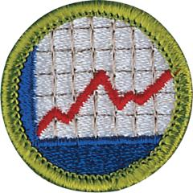

# American Business Merit Badge

## Overview

Earning the American Business Merit Badge can help Scouts learn practical business matters that will be useful throughout life. Learning how businesses function will help you understand society and uncover a number of career options.

## Requirements

- (1) Do the following:
  - (a) Explain four features of the free enterprise system in the United States. Describe the difference between freedom and license. Tell how the Scout Oath and Scout Law apply to business and free enterprise.
  - (b) Describe the Industrial Revolution and tell about the major developments that marked the start of the modern industrial era in the United States. Discuss three people who had a great influence on business or industry in the United States and describe what each did.
  - (c) Identify and describe to your counselor the five primary areas of business.
  - (d) Explain the history of labor unions in the United States and the importance of labor unions and employers working together. Identify two major labor unions currently in existence.
  - (e) Discuss with your counselor how business impacts the local, national, and global economy.

- (2) Do the following:
  - (a) Explain the three basic types of financial statements (income statement, balance sheet, and statement of cash flows). Discuss with your counselor how each statement can help business leaders make better decisions.
  - (b) Explain how changes in interest rates, taxes, and government spending affect the flow of money into or out of business and industry.
  - (c) Explain how a sole proprietorship, partnership, or limited liability company gets its capital. Discuss and explain four ways a corporation obtains capital.
  - (d) Name five kinds of insurance useful to business. Describe their purposes.

- (3) Do the following:
  - (a) Explain the place of profit in business.
  - (b) Describe to your counselor green marketing and sustainable business practices.
  - (c) Explain how ethics plays a role in business decision making.
  - (d) Discuss the differences between operating a brick-and-mortar business versus an online business.

- (4) Describe the role of the U.S. Department of Labor. Discuss TWO of the following topics with your counselor: Fair Labor Standards Act (FLSA), Occupational Safety and Health Act (OSHA), Family and Medical Leave Act (FMLA), or Employee Retirement Income Security Act (ERISA).

- (5) Choose a business and research how it applies to each of the primary areas of business (accounting, finance, economics, marketing, and management). Share what you have learned with your counselor.

- (6) Do ONE of the following:
  - (a) Choose one of the primary areas of business and identify three career opportunities. Select one and research the education, training, and experience required for this career. Discuss this with your counselor and explain why this interests you.
  - (b) Select a business leader and interview this individual to learn more about his or her company and career path. Discuss the role ethics plays in making business decisions. Share what you have learned with your counselor.

## Resources

- [American Business merit badge page](https://www.scouting.org/merit-badges/american-business/)
- [American Business merit badge PDF](https://filestore.scouting.org/filestore/Merit_Badge_ReqandRes/Pamphlets/American%20Business.pdf) ([local copy](files/american-business-merit-badge.pdf))
- [American Business merit badge pamphlet](https://www.scoutshop.org/american-business-merit-badge-pamphlet-660202.html)
- [American Business merit badge workbook PDF](http://usscouts.org/mb/worksheets/American-Business.pdf)
- [American Business merit badge workbook DOCX](http://usscouts.org/mb/worksheets/American-Business.docx)

Note: This is an unofficial archive of Scouts BSA Merit Badges that was automatically extracted from the Scouting America website and may contain errors.