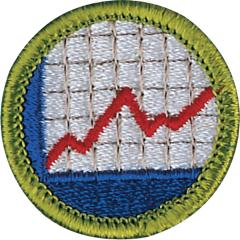

# American Business Merit Badge

## Overview

Earning the American Business Merit Badge can help Scouts learn practical business matters that will be useful throughout life. Learning how businesses function will help you understand society and uncover a number of career options.

## Requirements

- (1) Do the following:
  - (a) Explain four features of the free enterprise system in the United States. Describe the difference between freedom and license. Tell how the Scout Oath and Scout Law apply to business and free enterprise.

    **Resources:** [What Is the Free Enterprise System? (video)](https://youtu.be/AvvPKwTpGqE), [What Is the Difference Between Freedom and Liberty (video)](https://youtu.be/nKLUfmIcO5c)
  - (b) Describe the Industrial Revolution and tell about the major developments that marked the start of the modern industrial era in the United States. Discuss three people who had a great influence on business or industry in the United States and describe what each did.

    **Resources:** [The Industrial Revolution: Crash Course History of Science #21 (video)](https://youtu.be/FCpqN7GmLYk), [Ford, Cars, and a New Revolution: Crash Course History of Science #28 (video)](https://youtu.be/UPvwpYeOJnI), [Man of Steel: Andrew Carnegie \| The Gilded Age (video)](https://youtu.be/vmbRtjN0gAk), [Who Was: Henry Ford \| Encyclopaedia Britannica (video)](https://youtu.be/wupQUvrmQjA), [How JP Morgan Built It's Empire (video)](https://youtu.be/M9LnW09fvHE), [Steve Jobs—Apple CEO (video)](https://youtu.be/tvXUHY4z0As)
  - (c) Identify and describe to your counselor the five primary areas of business.

    **Resources:** [Functional Areas of a Business (video)](https://youtu.be/_UaSu07bqNQ)
  - (d) Explain the history of labor unions in the United States and the importance of labor unions and employers working together. Identify two major labor unions currently in existence.

    **Resources:** [The Labor Movement in the United States \| History (video)](https://youtu.be/ewu-v36szlE), [List of US Labor Unions (website)](https://www.findlaw.com/employment/wages-and-benefits/list-of-us-labor-unions.html)
  - (e) Discuss with your counselor how business impacts the local, national, and global economy.

    **Resources:** [Small Businesses: Their Importance to the Global Economy (video)](https://youtu.be/SY3Z1WgqaYQ)

- (2) Do the following:
  - (a) Explain the three basic types of financial statements (income statement, balance sheet, and statement of cash flows). Discuss with your counselor how each statement can help business leaders make better decisions.

    **Resources:** [4 Types of Financial Statements (video)](https://youtu.be/Fw14qE_9B-A)
  - (b) Explain how changes in interest rates, taxes, and government spending affect the flow of money into or out of business and industry.

    **Resources:** [How Interest Rates Affect Interest Rates, Financial Flows, and Exchange Rates (video)](https://youtu.be/_etdZ9G8D4A)
  - (c) Explain how a sole proprietorship, partnership, or limited liability company gets its capital. Discuss and explain four ways a corporation obtains capital.

    **Resources:** [How To Choose the Right Business Structure: LLC vs Corporation vs Sole Proprietorship (video)](https://youtu.be/4-yE5JduTIo)
  - (d) Name five kinds of insurance useful to business. Describe their purposes.

    **Resources:** [5 Types of Insurance Your Business Needs (video)](https://youtu.be/O4AziG_UKl4)

- (3) Do the following:
  - (a) Explain the place of profit in business.

    **Resources:** [What Is Profit? (Gross Profit, Operating Profit, Net Income) \| From a Business Professor (video)](https://youtu.be/R8voRf5BjdA)
  - (b) Describe to your counselor green marketing and sustainable business practices.

    **Resources:** [What Is Eco Marketing or Green Marketing? \| Needs and Significance of Eco Marketing (video)](https://youtu.be/J9wzu_JeGyI)
  - (c) Explain how ethics plays a role in business decision making.

    **Resources:** [Top 5 Business Ethics Lessons for Making the Right Decisions at Work (video)](https://youtu.be/_zYVOnjLCR0)
  - (d) Discuss the differences between operating a brick-and-mortar business versus an online business.

    **Resources:** [eCommerce vs Brick and Mortar Business (video)](https://youtu.be/PmIUu4a-N-I)

- (4) Describe the role of the U.S. Department of Labor. Discuss TWO of the following topics with your counselor: Fair Labor Standards Act (FLSA), Occupational Safety and Health Act (OSHA), Family and Medical Leave Act (FMLA), or Employee Retirement Income Security Act (ERISA).

  **Resources:** [Summary of the Major Laws of the Department of Labor (website)](https://www.dol.gov/general/aboutdol/majorlaws), [What Is the Fair Labor Standards Act? (video)](https://youtu.be/v9BhAWc-gWU), [Intro to OSHA (video)](https://youtu.be/3JoXP3Gh9C8), [What's FMLA? FMLA Explained + What You Need To Know About FMLA (video)](https://youtu.be/K1KDFnCOLDY), [What Is ERISA? Part 1 (video)](https://youtu.be/z8nq9iPIMk0), [What Is ERISA? Part 2 (video)](https://youtu.be/f6QRobJIpWw)

- (5) Choose a business and research how it applies to each of the primary areas of business (accounting, finance, economics, marketing, and management). Share what you have learned with your counselor.

- (6) Do ONE of the following:
  - (a) Choose one of the primary areas of business and identify three career opportunities. Select one and research the education, training, and experience required for this career. Discuss this with your counselor and explain why this interests you.

    **Resources:** [Careers in Business (video)](https://youtu.be/wVfhXYdTcdQ), [Business Administration: A Complete Guide and Career Insight (video)](https://youtu.be/jMIa9SJiFb8)
  - (b) Select a business leader and interview this individual to learn more about his or her company and career path. Discuss the role ethics plays in making business decisions. Share what you have learned with your counselor.

## Resources

- [American Business merit badge page](https://www.scouting.org/merit-badges/american-business/)
- [American Business merit badge PDF](https://filestore.scouting.org/filestore/Merit_Badge_ReqandRes/Pamphlets/American%20Business.pdf) ([local copy](files/american-business-merit-badge.pdf))
- [American Business merit badge pamphlet](https://www.scoutshop.org/american-business-merit-badge-pamphlet-660202.html)
- [American Business merit badge workbook PDF](http://usscouts.org/mb/worksheets/American-Business.pdf)
- [American Business merit badge workbook DOCX](http://usscouts.org/mb/worksheets/American-Business.docx)

Note: This is an unofficial archive of Scouts BSA Merit Badges that was automatically extracted from the Scouting America website and may contain errors.