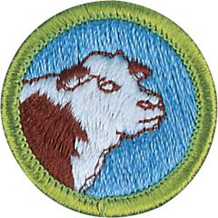

# Animal Science Merit Badge

## Overview

Cattle, horses, sheep, goats, hogs, poultry, and other domesticated animals are important to people for many reasons. They supply us with food and clothing, we use them for recreational purposes, they work with and for us.

## Requirements

- (1) Name two breeds of livestock in each of the following classifications: horses, dairy cattle, beef cattle, sheep, hogs, poultry, and goats. Tell their principal uses and merits. Tell where the breeds originated.

- (2) List two diseases that afflict the animals in each of the classifications in requirement 1. Describe the symptoms of each disease and explain how each is contracted and how it could be prevented.

- (3) Draw models of the digestive tracts of ruminants, horses, pigs, and poultry. Explain how the differences in structure and function among these types of digestive tracts affect the nutritional management of these species.

- (4) Select one type of animal: beef, cow, dairy cow, horse, sheep, goat, or hog, or a poultry flock, and tell how you would properly manage it. Include in your discussion nutritional (feeding) concerns, housing, disease prevention, waste control/removal, breeding programs, and biosecurity as appropriate.

- (5) Do the following:
  - (a) Explain how agricultural producers make desired improvements to their stock through breeding practices and programs.
  - (b) Explain the terms pure breeding and cross breeding.
  - (c) List two modern technologies used in the production of horses, dairy cattle, beef cattle, sheep, hogs, poultry, or goats, and tell what the advantages are of using the technology.

- (6) Complete ONE of the following options:
  - **Option A—Beef Cattle.** Do ALL of the following:
  - (1) Visit a farm or ranch where beef cattle are produced under any of these systems: feeding market cattle for harvest, cow/calf operation (producing cattle for sale to commercial feeders), or producing purebred cattle for sale as breeding stock to others.
    Talk with the operator to learn how the cattle were handled, fed, weighed, and shipped. Describe what you saw and explain what you learned. If you cannot visit a cattle ranch or farm, view a video from a breed association, or research the internet (with your parent or guardian's permission) for information on beef cattle production. Tell about your findings.
  - (2) Sketch a plan of a feedlot to include its forage and grain storage facilities, and loading chute for 30 or more fattening steers; or sketch a corral plan with cutting and loading chutes for handling 50 or more beef cows and their calves at one time.
  - (3) Make a sketch showing the principal wholesale and retail cuts of beef. Tell about the U.S. Department of Agriculture (USDA) dual grading system of beef. Tell the basis of each grade in each system.
  - (4) Define the following terms: bull, steer, bullock, cow, heifer, freemartin, heiferette, and calf.
  - **Option B—Dairy.** Do ALL of the following:
  - (1) Tell how a cow or a goat converts forage and grain into milk. Explain the differences in feeds typically used for dairy cows versus those fed to beef cows.
  - (2) Make a chart showing the components in cow's milk or goat's milk. Chart the amount of each component.
  - (3) Explain the requirements for producing grade A milk. Tell how and why milk is pasteurized.
  - (4) Tell about the kinds of equipment used for milking and the sanitation standards that must be met on dairy farms.
  - (5) Define the following terms: bull, cow, steer, heifer, springer, buck, doe, and kid.
  - (6) Visit a dairy farm or a milk processing plant. Describe what you saw and explain what you learned. If you cannot visit a dairy farm or processing plant, view a video from a breed or dairy association, or research the internet (with your parent or guardian's permission) for information on dairying. Tell about your findings.
  - **Option C—Horse.** Do ALL of the following:
  - (1) Make a sketch of a useful saddle horse barn and exercise yard.
  - (2) Tell about the history of the horse and the benefits it has brought to people. Using the four breeds of horses you chose in requirement 1, discuss the different special uses of each breed.
  - (3) Define the following terms: mare, stallion, gelding, foal, colt, filly; mustang, quarter horse, draft horse, pacer, trotter; pinto, calico, palomino, roan, overo, and tobiano.
  - (4) Visit a horse farm. Describe what you saw and explain what you learned. If you cannot visit a horse farm, view a video from a breed association, or research the internet (with your parent or guardian's permission) for information on horses. Tell about your findings.
  - (5) Outline the proper feeding of a horse doing light work. Explain why the amount and kind of feed will change according to the kind of horse and the work it does. Describe what colic is, what can cause it, and its symptoms.
  - **Option D—Sheep or Goat.** Choose one and do ALL of the following based upon the choice:
  - (1) Make a sketch of a live lamb or goat. Show the location of the various wholesale and retail cuts.
  - (2) Discuss how wools are sorted and graded.
  - (3) List products that can be made from the milk.
  - (4) Based on your choice, do ONE of the following:
  - (a) Raise a lamb or goat from weaning to market weight. Keep records of feed intake, weight gains, medication, vaccination, and mortality. Present your records to your counselor for review.
  - (b) Visit a farm or ranch where sheep or goats are raised. Describe what you saw and explain what you learned. If you cannot visit a sheep or goat farm or ranch, view a video from a breed association, or research the internet (with your parent or guardian's permission) for information on sheep or goats. Tell about your findings.
  - (5) Define the following terms for a sheep (wether, ewe, ram, and lamb) OR a goat (doe, nanny, kid, buck, and billy).
  - **Option E—Hog.** Do ALL of the following:
  - (1) Make a sketch showing the principal wholesale and retail cuts of pork. Tell about the recommended USDA grades of pork. Tell the basis for each grade.
  - (2) Outline in writing the proper feeding programs used from the breeding of a gilt or sow through the weaning of the litter. Discuss the feeding programs for the growth and finishing periods.
  - (3) Do ONE of the following:
  - (a) Raise a feeder pig from weaning to market weight. Keep records of feed intake, weight gains, medication, vaccination, and mortality. Present your records to your counselor for review.
  - (b) Visit a farm where hogs are produced, or visit a packing plant handling hogs. Describe what you saw and explain what you learned. If you cannot visit a hog production unit or packing plant, view a video from a packer or processor, or research the internet (with your parent or guardian's permission) for information on hogs. Tell about your findings.
  - (4) Define the following terms: gilt, sow, barrow, and boar.
  - **Option F—Avian.** Do ALL of the following:
  - (1) Make a sketch of a layer house or broiler house showing nests, roosts, feeders, waterers, and means of ventilation. Explain how insulation, ventilation, temperature controls, automatic lights, and other environmental controls are used to protect birds from heat, cold, and bad weather. Explain the importance of light for egg production.
  - (2) Explain why overcrowding is dangerous for poultry flocks.
  - (3) Tell about the grading of eggs. Describe the classes of chicken meat.
  - (4) Do ONE of the following:
  - (a) Manage an egg-producing flock for five months. Keep records of feed purchased, eggs sold, medication, vaccination, and mortality. Present your records to your counselor for review.
  - (b) Raise five chickens from hatching. Keep records of feed intake, weight gains, medication, vaccination, and mortality. Present your records to your counselor for review.
  - (c) Visit a commercial avian production facility. Describe what you saw and explain what you learned. If you cannot visit a commercial facility, view a video from a poultry association, or research the internet (with your parent or guardian's permission) for information on poultry production. Tell about your findings.
  - (5) Define the following terms: chick, pullet, hen, cockerel, cock, and capon.

- (7) Find out about three career opportunities in animal science. Pick one and find out the education, training, and experience required for this profession. Discuss this with your counselor, and explain why this profession might interest you.

## Resources

- [Animal Science merit badge page](https://www.scouting.org/merit-badges/animal-science/)
- [Animal Science merit badge PDF](https://filestore.scouting.org/filestore/Merit_Badge_ReqandRes/Pamphlets/Animal%20Science.pdf) ([local copy](files/animal-science-merit-badge.pdf))
- [Animal Science merit badge pamphlet](https://www.scoutshop.org/bsa-animal-science-merit-badge-pamphlet-boy-scouts-of-america-660194.html)
- [Animal Science merit badge workbook PDF](http://usscouts.org/mb/worksheets/Animal-Science.pdf)
- [Animal Science merit badge workbook DOCX](http://usscouts.org/mb/worksheets/Animal-Science.docx)

Note: This is an unofficial archive of Scouts BSA Merit Badges that was automatically extracted from the Scouting America website and may contain errors.