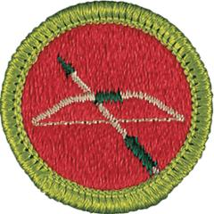

# Archery Merit Badge

## Overview

Archery is a fun way for Scouts to exercise minds as well as bodies, developing a steady hand, a good eye, and a disciplined mind. This merit badge can provide a thorough introduction to those who are new to the bow and arrow—but even for the experienced archer, earning the badge can help to increase the understanding and appreciation of archery.

## Requirements

- (1) Do the following:
  - (a) Explain what a projectile is, and why any device that shoots a projectile at high speed must be handled with care and respect, and used only in approved locations.
  - (b) Explain the five range safety rules.
  - (c) Explain the four whistle commands used on the range.
  - (d) Explain how to safely remove arrows from the target and return them to your quiver.
  - (e) Tell your counselor about your local and state laws for owning and using archery equipment.

- (2) Do the following:
  - (a) Name and point to the parts of an arrow.
  - (b) Describe three or more different types of arrows.
  - (c) Name the four principal materials for making arrow shafts.
  - (d) Do ONE of the following:
  - (1) Make a complete arrow from a bare shaft using appropriate equipment available to you.
  - (2) To demonstrate arrow repair, inspect the shafts and prepare and replace at least three vanes, one point, and one nock. You may use as many arrows as necessary to accomplish this. The repairs can be done on wood, fiberglass, or aluminum arrows.
  - (e) Explain how to properly care for and store arrows.

- (3) Do the following:
  - (a) Explain the proper use, care, and storage of, as well as the reasons for using tabs, arm guards, shooting gloves, and quivers.
  - (b) Explain the following terms: draw length, draw weight, mechanical release, and barebow.

- (4) Explain the following:
  - (a) The difference between an end and a round
  - (b) The differences among field, target, and 3-D archery
  - (c) How the five-color World Archery Federation target is scored
  - (d) How the National Field Archery Association (NFAA) black-and-white field targets and blue indoor targets are scored.

- (5) Working under the supervision of a certified USA Archery Level 1 Instructor or a certified long-term camp staff member (i.e., a National Camping School [NCS] Range Activities Director; or a Rangemaster over age 18 who is trained by a NCS Range Activities Director or by a USA Archery Level 1 Instructor), do ONE of the following options:

  **Note:** When using a Genesis bow, apply the requirements in Option A.
  - **Option A—Recurve Bow or Longbow.** Do ALL of the following:
  - (1) Name and point to the parts of the recurve or longbow you are shooting.
  - (2) Explain how to properly care for and store recurve bows and longbows.
  - (3) Demonstrate and explain USA Archery's 11 Steps of Shooting for the bow you are shooting.
  - (4) Demonstrate the proper way to string a recurve bow or longbow.
  - (5) Using a bow square, locate and mark with dental floss, crimp-on, or other method, the nocking point on the bowstring of the bow you are using.
  - (6) Do ONE of the following:
  - (a) Using a recurve bow or longbow and arrows with a finger release, shoot a single round of ONE of the following:
  - (1) An NFAA field round of 14 targets and make a score of 60 points
  - (2) A Scouting America field round of 14 targets and make a score of 80 points
  - (3) A World Archery/USA Archery indoor round and make a score of 80 points (indoor rounds may be shot outdoors if this is more convenient)
  - (4) An NFAA indoor round and make a score of 50 points (indoor rounds may be shot outdoors if this is more convenient).
  - (b) Shooting 30 arrows in five-arrow ends at an 80-centimeter (32-inch) five-color target at 10 yards and using the 10 scoring regions, make a score of 150 points.
  - **Option B—Compound Bow** Do ALL of the following:
  - (1) Name and point to the parts of the compound bow you are shooting.
  - (2) Explain how to properly care for and store compound bows.
  - (3) Demonstrate and explain USA Archery's 11 Steps of Shooting for the bow you are shooting.
  - (4) Explain why it is necessary to have the string or cable on a compound bow replaced at an archery shop.
  - (5) Locate and mark with dental floss, crimp-on, or other method, the nocking point on the bowstring of the bow you are using.
  - (6) Do ONE of the following:
  - (a) Using a compound bow and arrows with a finger release, shoot a single round of ONE of the following:
  - (1) An NFAA field round of 14 targets and make a score of 70 points
  - (2) A Scouting America field round of 14 targets and make a score of 90 points
  - (3) A World Archery/USA Archery indoor round and make a score of 90 points (indoor rounds may be shot outdoors if this is more convenient)
  - (4) An NFAA indoor round and make a score of 60 points (indoor rounds may be shot outdoors if this is more convenient)
  - (b) Shooting at an 80-centimeter (32-inch) five-color target using the 10 scoring regions, make a minimum score of 160 points. Accomplish this in the following manner:
    Shoot 15 arrows in five-arrow ends, at a distance of 10 yards
    AND
    Shoot 15 arrows in five-arrow ends, at a distance of 15 yards.

## Resources

- [Archery merit badge page](https://www.scouting.org/merit-badges/archery/)
- [Archery merit badge PDF](https://filestore.scouting.org/filestore/Merit_Badge_ReqandRes/Pamphlets/Archery.pdf) ([local copy](files/archery-merit-badge.pdf))
- [Archery merit badge pamphlet](https://www.scoutshop.org/search/?q=Archery+Merit+Badge+Pamphlet)
- [Archery merit badge workbook PDF](http://usscouts.org/mb/worksheets/Archery.pdf)
- [Archery merit badge workbook DOCX](http://usscouts.org/mb/worksheets/Archery.docx)

Note: This is an unofficial archive of Scouts BSA Merit Badges that was automatically extracted from the Scouting America website and may contain errors.