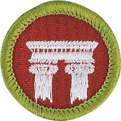

# Architecture Merit Badge

## Overview

Architecture is not just the special buildings like cathedrals, museums, or sports stadiums we read about or see on television; it is as normal as the homes, places of worship, schools, and shopping malls where we live, worship, work, learn, and play every day. However, architecture is more than just common shelter; building has always satisfied the human need to create something of meaning. Even the simplest form of architecture is a work of art that requires thought and planning.

## Requirements

* NOTE:  The official merit badge pamphlets are now free and downloadable  [HERE](https://filestore.scouting.org/filestore/Merit_Badge_ReqandRes/Pamphlets/Architecture_Landscape.pdf) or can be purchased at the [Scout Shop.](https://www.scoutshop.org/)
* (1) Do the following:
    * (a) Tour your community and list the types of buildings you see. Try to identify buildings that can be associated with a specific period of history or style of architecture. Make a sketch of the building you most admire.
    * (b) Select a historical architectural achievement that has had a major impact on society. Using resources such as the internet (with your parent or guardian's permission), books, and magazines, find out how this achievement has influenced the world today. Tell your counselor what you learned.

* (2) In following the Leave No Trace Seven Principles and the Outdoor Code, Scouts pledge to "Travel and camp on durable surfaces" and to "Leave what you find" and to "Be conservation-minded." Discuss the following with your counselor:
    * (a) The term sustainable architecture. Identify three features typical of green buildings.
    * (b) The difference between renewable building materials and recycled building materials, and how each can be used in construction.
    * (c) The relationship of architecture with its surrounding environment and the community.
    * (d) How entire buildings can be reused rather than torn down when they no longer serve their original purpose.

* (3) Do ONE of the following:
    * (a) With your parent or guardian's and counselor's permission and approval, arrange to meet with an architect. Ask to see the scale model of a building and the drawings that a builder would use to construct this building. Discuss why the different building materials were selected. Look at the details in the drawings and the model to see how the materials and components are attached to each other during construction.
    * (b) With your parent or guardian's and counselor's permission and approval, arrange to meet with an architect at a construction site. Ask the architect to bring drawings that the builder uses to construct the building. While at the site, discuss why the different building materials being used were selected. Discuss how the different building materials and components are attached to each other during construction. Note: To visit a construction site will require advance planning. You will need permission from your parents, counselor, the architect, and the construction site manager. A construction site is a very dangerous place. While there, you will need to closely follow the site manager's directions and comply with all the safety procedures, including wearing a hard hat, protective eyewear, and proper footwear. Be aware of the changing conditions at the site, and stay with the architect or site manager.
    * (c) Interview someone who might be your client (such as a prospective homeowner or business owner) if you were an architect. Find out what your client's requirements would be for designing a new home or business building. Write a short program including a list of requirements for the project, the functions of the building and site, how the functions relate to one another, and the goals of the project.

* (4) Measure a room such as one where you live or where your troop meets. Make an accurately scaled drawing of the room's floor plan showing walls, doors, closets, windows, and any built-in furniture or cabinets. Neatly label your drawing with the following: your name, the date, what room you drew, and the scale of the drawing. (Drawing scale: 1/4 inch = 1 foot)
* (5) Find out about three career opportunities in architecture. Pick one and find out the education, training, and experience required for this profession. Discuss this with your counselor, and explain why this profession might interest you.

## Resources

- [Architecture merit badge page](https://www.scouting.org/merit-badges/architecture/)
- [Architecture merit badge PDF](https://filestore.scouting.org/filestore/Merit_Badge_ReqandRes/Pamphlets/Architecture_Landscape.pdf) ([local copy](files/landscape-architecture-merit-badge.pdf))
- [Architecture merit badge pamphlet](https://www.scoutshop.org/bsa-architecture-and-landscape-merit-badge-pamphlet-boy-scouts-of-america-659867.html)

Note: This is an unofficial archive of Scouts BSA Merit Badges that was automatically extracted from the Scouting America website and may contain errors.