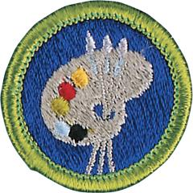

# Art Merit Badge

## Overview

This merit badge concentrates on two-dimensional art, specifically drawing and painting in various media, including an introduction to design applications in the fields of graphic arts and industrial design, history and design principles, and how these fields relate to fine art.

## Requirements

- (1) Discuss the following with your counselor:
  - (a) What art is and what some of the different forms of art are
  - (b) The importance of art to humankind
  - (c) What art means to you and how art can make you feel.

- (2) Discuss with your counselor the following terms and elements of art: line, value, shape, form, space, color, and texture. Show examples of each element.

- (3) Discuss with your counselor the six principles of design: rhythm, balance, proportion, variety, emphasis, and unity.

- (4) Render a subject of your choice in FOUR of these ways:
  - (a) Pen and ink
  - (b) Watercolors
  - (c) Pencil
  - (d) Pastels
  - (e) Oil paints
  - (f) Tempera
  - (g) Acrylics
  - (h) Charcoal
  - (i) Computer drawing or painting.

- (5) Do ONE of the following:
  - (a) Design something useful. Make a sketch or model of your design. With your counselor's approval, create a promotional piece for the item using a picture or pictures.
  - (b) Tell a story with a picture or pictures or using a 3-D rendering.
  - (c) Design a logo. Share your design with your counselor and explain the significance of your logo. Then, with your parent or guardian's permission and your counselor's approval, put your logo on Scout equipment, furniture, ceramics, or fabric.

- (6) With your parent or guardian's permission and your counselor's approval, visit a museum, art exhibit, art gallery, artists' co-op, or artist's workshop. Find out about the art displayed or created there. Discuss what you learn with your counselor.

- (7) Find out about three career opportunities in art. Pick one and find out the education, training, and experience required for this profession. Discuss this with your counselor, and explain why this profession might interest you.

## Resources

- [Art merit badge page](https://www.scouting.org/merit-badges/art/)
- [Art merit badge PDF](https://filestore.scouting.org/filestore/Merit_Badge_ReqandRes/Pamphlets/Art.pdf) ([local copy](files/art-merit-badge.pdf))
- [Art merit badge pamphlet](https://www.scoutshop.org/art-merit-badge-pamphlet-655138.html)
- [Art merit badge workbook PDF](http://usscouts.org/mb/worksheets/Art.pdf)
- [Art merit badge workbook DOCX](http://usscouts.org/mb/worksheets/Art.docx)

Note: This is an unofficial archive of Scouts BSA Merit Badges that was automatically extracted from the Scouting America website and may contain errors.