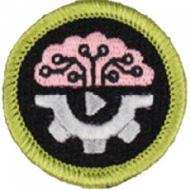

# Artificial Intelligence Merit Badge

## Overview

The Artificial Intelligence (AI) Merit Badge introduces Scouts to the fundamentals of AI and automation through hands-on activities and real-world examples. Scouts learn key terms, explore how AI and automation are used in daily life, school, and work, and examine ethical concerns like bias and privacy. They also investigate deepfakes, practice communicating effectively with AI, and apply their knowledge through a project or teaching activity. Finally, Scouts explore career paths in AI by researching or interviewing professionals in the field.

## Requirements

* NOTE TO SCOUTS:  The Artificial Intelligence (AI) merit badge has been designed for you to interact with the [Scoutly](https://blog.scoutingmagazine.org/2025/08/21/everything-you-need-to-know-about-scoutly-scouting-americas-new-ai-tool/) chat bot on your learning journey as you work through the requirements.  [Scoutly](https://blog.scoutingmagazine.org/2025/08/21/everything-you-need-to-know-about-scoutly-scouting-americas-new-ai-tool/) can be found on the bottom right of your browser at [https://scouting.org.](https://scouting.org)  If you have a question about a requirement, ask [Scoutly](https://blog.scoutingmagazine.org/2025/08/21/everything-you-need-to-know-about-scoutly-scouting-americas-new-ai-tool/)!  This does not replace the requirement to identify and work with a counselor to complete the badge.
* (1) Key Concepts.  Define the following terms and share the meaning of each with your counselor: artificial intelligence (AI), artificial intelligence agents, automation, basic programming, bots, data, databases, digital workers, general AI, machine learning (ML), narrow AI, superintelligent AI, tasks, triggers, workflows, and variables.
* (2) Artificial Intelligence (AI) Basics.  Do the following and share what you learned with your counselor:
    * (a) Identify 10 examples of how AI is currently used in everyday life.
    * (b) Identify 5 examples of how AI is currently used in the workplace.
    * (c) Identify 5 examples of how AI can be used at school or in support of your education.
    * (d) Play 10 rounds of the "AI or Not?" game to determine if the presented scenario utilizes AI.
    * (e) Create a timeline with five key milestones in the development of artificial intelligence.

* (3) Automation Basics. Do the following and share what you learned with your counselor:
    * (a) Identify 10 examples of how automation is currently used in everyday life.
    * (b) Identify 5 examples of how automation is currently used in the workplace.
    * (c) Identify 5 examples of how automation can be used at school or in support of your education.
    * (d) Explain how automation performs repetitive tasks without human intervention and how it reduces human error and optimizes resources.
    * (e) Create a timeline with five significant milestones in automation development.

* (4) Ethics in AI.  Do the following and share what you learned with your counselor:
    * (a) Research ethical concerns and responsible use in AI, including bias, privacy, and AI decision-making.
    * (b) Work through 5 rounds of the "What Would You Do?" ethical decision-making scenarios.
    * (c) Develop your own ethical guidelines for the use of AI.
    * (d) What is the Turing test?

* (5) Deepfakes. Do the following and share what you learned with your counselor:
    * (a) Explain what a deepfake is and how it can affect an individual.
    * (b) Describe what actions to take if you or someone you know is impacted by a deepfake.

* (6) Developing AI Skills. Do the following and share what you learned with your counselor:
    * (a) Discuss the learning process for AI and its limitations.
    * (b) Identify 5 methods of how to effectively communicate with AI.
    * (c) Explain the importance of prompt engineering when using AI to create better output.
    * (d) Demonstrate 3 examples of writing clear instructions for a school-related task.
    * (e) Complete the "Clear Communication Challenge" activity.
    * (f) Teach the AI a skill or something that you know well.

* (7) Practical Application.  Do ONE of the following:
    * (a) With your counselor's approval, choose an artificial intelligence project based on your personal interest or a community need. Develop a plan outlining the project's objectives, data requirements, and potential ethical considerations. Implement the project utilizing appropriate artificial intelligence tools, languages, or platforms. Share your project with your counselor. Discuss the steps you followed to create the project and your experience during the process.
    * (b) With your counselor's approval, design a short lesson plan on AI and teach it to your patrol of a group of Scouts. The lesson should include an AI-generated age-appropriate explanation of AI, examples of how AI is used in both everyday life as well as in the workplace, and an interactive demonstration of how Scouts could utilize AI to assist them with a school assignment, Scouting activity, or rank advancement. Share information on the development process and teaching experience with your counselor.

* (8) Career Exploration.  Do ONE of the following:
    * (a) Identify three career opportunities that would use skills and knowledge in artificial intelligence or automation. Pick one and research the training, education, certification requirements, experience, and expenses associated with entering the field. Research the prospects for employment, starting salary, advancement opportunities, and career goals associated with this career. Discuss what you learned with your counselor and whether you might be interested in this career.
    * (b) Interview an artificial intelligence or automation professional. Learn about their day-to-day work, the challenges they face, and their vision for the future of artificial intelligence or automation. Inquire about training, education, certification requirements, experience, and expenses associated with entering the field. Share what you learned with your counselor.

## Resources

- [Artificial Intelligence merit badge page](https://www.scouting.org/merit-badges/artificial-intelligence/)
- [Artificial Intelligence merit badge pamphlet](None)

Note: This is an unofficial archive of Scouts BSA Merit Badges that was automatically extracted from the Scouting America website and may contain errors.