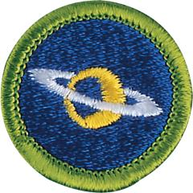

# Astronomy Merit Badge

## Overview

In learning about astronomy, Scouts study how activities in space affect our own planet and bear witness to the wonders of the night sky: the nebulae, or giant clouds of gas and dust where new stars are born; old stars dying and exploding; meteor showers and shooting stars; the moon, planets, and a dazzling array of stars.

## Requirements

* (1) Do the following:
    * (a) Explain to your counselor the most likely hazards you may encounter while participating in astronomy activities, and what you should do to anticipate, help prevent, mitigate, and respond to these hazards. Resource: [Preparing for Stargazing (video)](https://www.youtube.com/watch?v=bo6QjszhPiw)
    * (b) Explain first aid for injuries or illnesses such as heat and cold reactions, dehydration, bites and stings, and damage to your eyes that could occur during observations. Resources: [Dehydration (video)](https://www.youtube.com/watch?v=KahsIEbFROI) [Insect Bite and Sting Safety (video)](https://youtu.be/EcyVZEFd7fo?si=YUOc08o6JD1VjWz2) [Heat and Cold Related First Aid (video)](https://youtu.be/UjurqmDOAJA?si=U4MDlYWviSuiwv0X)
    * (c) Describe the proper clothing and other precautions for safely making observations at night and in cold weather. Resource: [WINTER! Astronomy..How to Keep Warm & Stay Out Longer (video)](https://youtu.be/8nTJ_gpulI0?si=vJytSVx2n0gpKyME)
    * (d) Explain how to safely observe the Sun, objects near the Sun and solar eclipses. Resource: [How to View the Sun Safely-Eclipses, Sunspots (video)](https://youtu.be/avxnK7MGYIA?si=hnW7se_YfpY2lxGv)

* (2) Explain what light pollution is and how it and air pollution affect astronomy. Resources:  [Where Are the Stars? (video)](https://youtu.be/0FXJUP6_O1w)  [Why No One Can See the Stars Anymore (video)](https://youtu.be/XJXsIeqOKT0?si=r976d27A6gCaAKbL)  [How Dark Is Your Sky? The Bortle Scale Can Tell You (video)](https://youtu.be/qFjEbm1h4S8?si=5IXlRZUP5tz6OAeE)  [Protecting the Night Sky From Light Pollution: Why Does It Matter? (video)](https://youtu.be/K9TFgghIJSs)
* (3) With the aid of diagrams (or real telescopes if available), do the following:
    * (a) Explain why binoculars and telescopes are important astronomical tools. Demonstrate or explain how these tools are used. Resources: [How to Use a Telescope - A Beginner's Guide (video)](https://www.youtube.com/shorts/GGRTwsp0tm4?feature=share) [Telescopes and Binoculars (video)](https://youtu.be/vz3yD9VxWoY?si=rCb5NCft79HdzwbL)
    * (b) Describe the similarities and differences of several types of astronomical telescopes, including at least one that observes light beyond the visible part of the spectrum (i.e., radio, X-ray, ultraviolet, or infrared). Resources: [Telescopes: Crash Course in Astronomy (video)](https://youtu.be/mYhy7eaazIk) [Exploring the Universe: Non-Optical Telescopes Unveiled! (video)](https://youtu.be/-acMlVE9u60?si=eWMfU1ICMelBaKEa) [The Basic Telescope Types (video)](https://youtu.be/_v1RWyzQAng?si=YUR2jhjGpQwmznyw) [10 Types of Space Telescopes (video)](https://youtu.be/PA15nmA4zbI)
    * (c) Explain the purposes of three instruments used with astronomical telescopes. Resources: [10 Types of Space Telescopes (video)](https://youtu.be/PA15nmA4zbI) [Hubble Instruments (website)](https://science.nasa.gov/mission/hubble/observatory/design/instruments/) [The Hubble Space Telescope: Revolutionizing Our View of the Universe (video)](https://youtu.be/W6JB9stip_o?si=RAUic_y3ifcHcWHe) [What Astronomers Use to Explore the Universe (video)](https://youtube.com/shorts/Y5lAHoiWGBc?si=o5t6cgN-LmUHOKEr)
    * (d) Describe the proper care and storage of telescopes and binoculars both at home and in the field. Resources: [How to Care for Your Telescope (website)](https://www.astronomy.com/observing/how-to-care-for-your-telescope/) [How to Care for Your Telescope Optics the Right Way. (website)](https://skyandtelescope.org/astronomy-resources/caring-for-your-optics/) [How to Care for Your Telescope (video)](https://youtu.be/8W-7NkNUJas?si=xjoAbP4s3RQjKYIn) [Caring for Your Celestron Telescope: How to Maintain, Store, and Ship Your Telescope (website)](https://www.celestron.com/blogs/knowledgebase/caring-for-your-celestron-telescope-how-to-maintain-store-and-ship-your-telescope?srsltid=AfmBOopGO5xdG8YN2b93_gRGY1SlvJtNBCyKEo9Y6fDXu9u54MLNLwZ4)

* (4) Do the following (if instruction is done in a planetarium, Scouts must still identify the required stars and constellations outside under the natural night sky):
    * (a) Identify in the sky 10 constellations, at least four of which are in the zodiac.  Resources: [Naked Eye Observations (video)](https://www.youtube.com/watch?v=L-Wtlev6suc) [88 Officially Recognized Constellations (website)](https://starchild.gsfc.nasa.gov/docs/StarChild/questions/88constellations.html) [10 FREE Stargazing Apps (Video)](https://youtu.be/WRnOKDBHfrQ?si=2QzYjMQ817U2vB6C)
    * (b) Identify in the sky eight conspicuous stars, five of which are of magnitude 1 or brighter. Resources: [Naked Eye Observations (video)](https://www.youtube.com/watch?v=L-Wtlev6suc) [Star Magnitude (Brightness) Explained (video)](https://youtu.be/JIXFXGiDa4Y?si=5HjKlDF8xRcEJPtL)
    * (c) Make two sketches of the Big Dipper or Cassiopeia from direct observation. In one sketch, show the Big Dipper's or Cassiopeia's orientation in the early evening sky. Make another sketch, showing its position several hours later. In both sketches, show the North Star and the horizon. Record the date and time each sketch was made. Resources: [How to Use the Big Dipper and Cassiopeia to Find the North Star (website)](https://www.noozhawk.com/dennis_mammana_use_the_big_dipper_cassiopeia_to_find_north_star_20190303/) [How to Find Ursa Major (Big Dipper) Constellation (video)](https://youtu.be/grAOh38clHI?si=ROyvngrW4KPn1Y60) [Find Cassiopeia the Queen Constellation by Looking North for the "W" Shape (video)](https://youtu.be/XTa5NlUKqH8?si=RyQA_fAQw0Su4vVE)
    * (d) Explain what we see when we look at the Milky Way. Resources: [The Milky Way: Crash Course Astronomy (video)](https://youtu.be/tj_QPnO8vpQ) [How Do We Study Stars? (video)](https://www.youtube.com/watch?v=i7930fj3T54) [Imagine the Universe! The Milky Way Galaxy (website)](https://imagine.gsfc.nasa.gov/science/objects/milkyway1.html)

* (5) Do the following:
    * (a) List the names of the five most visible planets. Explain which ones can appear in phases similar to lunar phases and which ones cannot, and explain why.Resources: [WOLFRAM Demonstrations Project (website)](https://demonstrations.wolfram.com/PhasesOfPlanets/) [Which Planets Appear in Phases Similar to Lunar Phases? (website)](https://education.seattlepi.com/planets-appear-phases-similar-lunar-phases-5897.html) [Which Planets Appear in Phases Similar to Lunar Phases? (video)](https://www.youtube.com/watch?v=S9d4SBxB9e0)
    * (b) Using the internet (with your parent or guardian's permission) and other resources, find out when each of the five most visible planets that you identified in requirement 5(a) will be observable in the evening sky during the next 12 months, then compile this information in the form of a chart or table.Resources: [Visible Planets Tonite (website)](https://earthsky.org/astronomy-essentials/visible-planets-tonight-mars-jupiter-venus-saturn-mercury/) [Skywatching (website)](https://science.nasa.gov/skywatching/)
    * (c) Describe the motion of the planets across the sky. Resources: [Apparent Retrograde Motion (video)](https://youtu.be/sBzGGoBQVDA) [Understanding Planetary Motions and Retrograde Motion (video)](https://youtu.be/oydxR0Kjsjc)
    * (d) Observe a planet and describe what you saw. Resources: [Planets Visible Tonight (website)](https://theskylive.com/planets-visible-tonight) [Night Sky Tonight (website)](https://www.timeanddate.com/astronomy/night/) [Skywatching (website)](https://science.nasa.gov/skywatching/)

* (6) Do the following:
    * (a) Sketch the face of the Moon and indicate five seas and five craters. Label these landmarks. Resources: [Moon Craters Explained (video)](https://www.youtube.com/shorts/3TvnmKBPyow?feature=share) [Easy Moon Sketching Step by Step (video)](https://youtube.com/shorts/CEmHs_s9CwE?si=9GlgNNRok3MDmLHT) [The Craters on the Moon with Neil deGrasse Tyson (video)](https://www.youtube.com/shorts/hp6Mm-ypup0?feature=share) [Why Does the Moon Have Craters? (website)](https://spaceplace.nasa.gov/craters/en/)
    * (b) Sketch the phase and position of the Moon, at the same hour and place, for four nights (or days) within a one-week period by direct observation. Include landmarks on the horizon such as hills, trees, and buildings. Explain the changes you observe.  Resources: [The Phases of the Moon Explained (video)](https://youtu.be/mQwvHn_qkBA?si=EI5mtx_S8DCIGA2t) [Moon Phase Animation (video)](https://youtu.be/LHD4Pk0D8_g?si=hqx3QddiynV0uG7U) [Why Does the Moon Have Phases, but Planets Like Venus Also Show Phases? (video)](https://www.youtube.com/shorts/pq9SGd8bR4I?feature=share)
    * (c) List the factors that keep the Moon in orbit around Earth.Resources: [Why Doesn't the Moon Fall Down? (video)](https://youtu.be/OnONWCVXO5o?si=LSzURg_cSrP5zDMC) [Why Doesn't the Moon Fall Into the Earth? (website)](https://www.vedantu.com/physics/why-doesnt-the-moon-fall-into-the-earth) [Why Does the Moon Stay With the Earth? (website)](https://physics.stackexchange.com/questions/141898/why-does-the-moon-stay-with-the-earth)
    * (d) With the aid of diagrams, explain the relative positions of the Sun, Earth, and the Moon at the times of lunar and solar eclipses, and at the times of new, first-quarter, full, and last-quarter phases of the Moon. Resources: [Lunar Eclipses Explained (video)](https://scetv.pbslearningmedia.org/resource/buac19-68-sci-ess-luneclipseexplain/lunar-eclipses-explained/) [The Phases of the Moon Explained (website)](https://www.planetary.org/articles/the-phases-of-the-moon-explained#:~:text=These%20different%20shapes%20are%20called,are%20illuminated%20by%20the%20Sun.) [Why Do Eclipses Happen? (website)](https://science.nasa.gov/eclipses/geometry/) [Solar Eclipses Explained (video)](https://kcts9.pbslearningmedia.org/resource/buac18-sci-ess-eclipsesexplain/eclipses-explained/?student=true)

* (7) Do the following:
    * (a) Describe the composition of the Sun, its relationship to other stars, and some effects of its radiation on Earth's weather and communications. Resources: [What Is the Sun Made of? (video)](https://youtu.be/LuT7RF8gWFA) [Our Sun's Path Through the Milky Way Galaxy (video)](https://youtube.com/shorts/8DrBB8h3j5s?si=39QOsQirhKfdGwTp)
    * (b) Define sunspots and describe some of the effects they may have on solar radiation. Resources: [What Are Sunspots? (video)](https://youtu.be/ZC2dfDS8g0Q) [Sunspots (video)](https://www.youtube.com/shorts/2bMZyKL9rqw?feature=share) [Sunspots - NASA (website)](https://science.nasa.gov/sun/sunspots/)
    * (c) Identify at least one red star, one blue star, and one yellow star (other than the Sun). Explain the meaning of these colors. Resources: [Why Are the Stars Different Colors? (video)](https://youtu.be/LCZPZfc8nHE?si=tYaIruw7NwHR1ya7) [Naked Eye Observations (video)](https://www.youtube.com/watch?v=L-Wtlev6suc)

* (8) With your counselor's approval and guidance, do ONE of the following:
    * (a) Visit a planetarium or astronomical observatory. Submit a written report, a scrapbook, OR a video presentation afterward to your counselor that includes the following information:  - Activities occurring there - Exhibits and displays you saw - Telescopes and other instruments being used - Celestial objects you observedResources: [The 10 Best Observatories in the U.S. to Visit This Year (website)](https://spacetourismguide.com/best-observatories-united-states/) [U.S. Planetariums (website)](https://www.go-astronomy.com/planetariums.htm)
    * (b) Plan and participate in an observation session that includes using binoculars or a telescope and includes at least 10 celestial objects beyond those observed in requirement 4. These might be lunar features, Messier objects, additional constellations or planets, or artificial satellites including the International Space Station. List the celestial objects you want to observe and find each in a star chart, guidebook or by using an app. Prepare a log or notebook. Discuss with your counselor what you hope to observe prior to your observation session. Review your log or notebook with your counselor afterward.
    * (c) Plan and host a star party for your Scout troop or other group such as your class at school. Use binoculars or a telescope to show and explain celestial objects to the group. Resources: [Transform your Astronomy Knowledge at a Star Party! (video)](https://youtu.be/oNNMZGnVnb8?si=qp_Z7_7SmbFjHzMD) [I Went to a STAR PARTY! (video)](https://youtu.be/E8_YZQ35Gyc?si=DMeOa_WDq8rs9nMI) [What It's Like to Attend a Star Party (video)](https://youtu.be/Hd-U-oOjkts?si=Eusc1i1Cj13ypkja)
    * (d) Help an astronomy club in your community hold a star party that is open to the public. Resources: [Transform your Astronomy Knowledge at a Star Party! (video)](https://youtu.be/oNNMZGnVnb8?si=qp_Z7_7SmbFjHzMD) [I Went to a STAR PARTY! (video)](https://youtu.be/E8_YZQ35Gyc?si=DMeOa_WDq8rs9nMI) [What It's Like to Attend A Star Party (video)](https://youtu.be/Hd-U-oOjkts?si=Eusc1i1Cj13ypkja)
    * (e) Personally take a series of photographs or digital images of the movement of the Moon, a planet, an asteroid, meteor, or a comet. In your visual display, label each image and include the date and time it was taken. Show all positions on a star chart or map. Show your display at school or at a troop meeting. Explain the changes you observed. Resource: [Smartphone Astrophotography: A Beginner's Guide (website)](https://astrobackyard.com/smartphone-astrophotography/)
    * (f) With your parent or guardian's and counselor's approval, use online observing opportunities such as SkyNet to observe planets, comets, galaxies, and/or the sun. Describe your experience to your counselor. Resource: [The Skynet Robotic Telescope Network (website)](https://skynet.unc.edu/)

* (9) Do ONE of the following:
    * (a) Identify three career opportunities that would use skills and knowledge in astronomy. Pick one and research the training, education, certification requirements, experience, and expenses associated with entering the field. Research the prospects for employment, starting salary, advancement opportunities and career goals associated with this career. Discuss what you learned with your counselor and whether you might be interested in this career.  Resources: [What You Should Know About Getting a Career in Astronomy/Astrophysics (video)](https://youtu.be/vGw0l8qLlOA) [Explore a Career in Astronomy (website)](https://moshmemphis.com/explore-a-career-in-astronomy/)
    * (b) Identify how you might use the skills and knowledge in astronomy to pursue a personal hobby. Research the additional training required, expenses, and affiliation with organizations that would help you maximize the enjoyment and benefit you might gain from it. Discuss what you learned with your counselor and share what short-term and long-term goals you might have if you pursued this. Resources: [Getting Started in Astronomy (video)](https://www.youtube.com/watch?v=wgI5loupJHA) [Astronomy: A Great Hobby (video)](https://www.youtube.com/shorts/sqSQCplNjyw?feature=share) [Getting Started in Astronomy (website)](https://ras.ac.uk/education-and-careers/for-everyone/92-getting-started-in-astronomy)

## Resources

- [Astronomy merit badge page](https://www.scouting.org/merit-badges/astronomy/)
- [Astronomy merit badge PDF](https://filestore.scouting.org/filestore/Merit_Badge_ReqandRes/Pamphlets/Astronomy.pdf) ([local copy](files/astronomy-merit-badge.pdf))
- [Astronomy merit badge pamphlet](https://www.scoutshop.org/bsa-astronomy-merit-badge-pamphlet-661050.html)

Note: This is an unofficial archive of Scouts BSA Merit Badges that was automatically extracted from the Scouting America website and may contain errors.