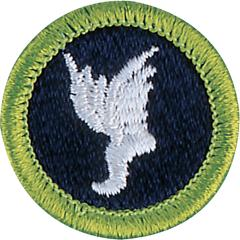

# Athletics Merit Badge

## Overview

Being involved in an athletic endeavor is not only a way to have fun, but it also is one of the best ways for a person to maintain a healthy and strong body, living up to the promise each Scout makes “to keep myself physically strong.”

## Requirements

* Note: If meeting any of the requirements for this merit badge is against the Scout's religious convictions, the requirement does not have to be done if the Scout's parent or guardian and the proper religious advisors state in writing that to do so would be against religious convictions. The Scout's parent or guardian must also accept full responsibility for anything that might happen because of this exemption.
* (1) Do the following:
    * (a) Explain to your counselor the most likely hazards you may encounter during athletics activities, and what you should do to anticipate, help prevent, mitigate, and respond to these hazards.
    * (b) Show that you know first aid for injuries or illnesses that could occur while participating in athletics events, including sprains, strains, contusions, abrasions, blisters, dehydration, heat reactions, and concussions.

* (2) Do the following:
    * (a) Before completing requirements 3 and 5, have your health-care practitioner give you a physical examination, using the Scout Annual Health and Medical Record form.
    * (b) Explain the importance of a physical exam.
    * (c) Explain the importance of maintaining good health habits, especially during training—and how the use of tobacco products, alcohol, and other harmful substances can negatively affect your health and your performance in athletic activities.
    * (d) Explain the importance of maintaining a healthy diet.

* (3) Select an athletic activity that interests you, then do the following:
    * (a) With guidance from your counselor, establish a personal training program suited to the activity you have chosen. Follow this training program for three months.
    * (b) Create a chart to monitor your progress during this time.
    * (c) Explain to your counselor the equipment necessary to participate in this activity and the appropriate clothing for the time of year.
    * (d) At the end of three months, review the chart you created for requirement 3(b), and discuss with your counselor what progress you have made during training. Tell how your development has affected you mentally and physically.

* (4) Do the following:
    * (a) Give the rules for two athletic activities, one of which is the activity you chose for requirement 3.
    * (b) Discuss the importance of warming up and cooling down.
    * (c) Explain to your counselor what an amateur athlete is and the differences between an amateur and a professional athlete.
    * (d) Discuss the traits and importance of good sportsmanship. Tell what role sportsmanship plays in both individual and group athletic activities.

* (5) Complete the activities in FOUR of the following options and show improvement over a three-month period:
    * Option 1: Sprinting
        * (a) 100-meter dash
        * (b) 200-meter dash

    * Option 2: Long-Distance Running
        * (a) 3k run
        * (b) 5k run

    * Option 3: Long Jump OR High Jump
        * (a) Running long jump OR running high jump (best of three tries)
        * (b) Standing long jump OR standing high jump (best of three tries)

    * Option 4: Swimming
        * (a) 100-meter swim
        * (b) 200-meter swim

    * Option 5: Pull-Ups AND Push-Ups
        * (a) Pull-ups in two minutes
        * (b) Push-ups in two minutes

    * Option 6: Baseball Throw
        * (a) Baseball throw for accuracy, 10 throws at a target (distance to be determined by age): ages 11 to 12, 20 feet; ages 13 to 15, 30 feet; ages 16 to 17, 40 feet
        * (b) Baseball throw for distance, five throws (total distance)

    * Option 7: Basketball Shooting
        * (a) Basketball shot for accuracy, 10 free-throw shots
        * (b) Basketball throw for skill and agility, the following shots as shown on the diagram:  - Left-side layup - Right-side layup - Left side of hoop, along the key line - Right side of hoop, along the key line - Where key line and free-throw line meet, left side - Where key line and free-throw line meet, right side - Top of the key - Anywhere along the three-point line

    * Option 8: Football Kick OR Soccer Kick
        * (a) Goals from the 10-yard line, eight kicks
        * (b) Football kick or soccer kick for distance, five kicks (total distance)

    * Option 9: Weight Training
        * (a) Chest/bench press, two sets of 15 repetitions each
        * (b) Leg curls, two sets of 15 repetitions each

* (6) Do the following:
    * (a) Prepare plans for conducting a sports meet or field day that includes 10 activities, at least five of which must come from the groups mentioned in requirement 5. Outline the duties of each official needed and list the equipment the meet will require.
    * (b) With your parent or guardian's and counselor's approval, serve as an official or volunteer at a sports meet to observe officials in action. Tell your counselor about your responsibilities at the meet and discuss what you learned.

## Resources

- [Athletics merit badge page](https://www.scouting.org/merit-badges/athletics/)
- [Athletics merit badge PDF](https://filestore.scouting.org/filestore/Merit_Badge_ReqandRes/Pamphlets/Athletics%20text%202-2025.pdf) ([local copy](files/athletics-merit-badge.pdf))
- [Athletics merit badge pamphlet](https://www.scoutshop.org/athletics-merit-badge-pamphlet-655702.html)

Note: This is an unofficial archive of Scouts BSA Merit Badges that was automatically extracted from the Scouting America website and may contain errors.