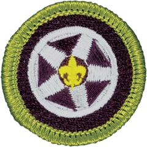

# Automotive Maintenance Merit Badge

## Overview

Modern automobiles are important to many aspects of American life. Those who service automobiles must understand each principle, and how these principles interact to provide smooth, efficient performance. Owners of cars also benefit by understanding how their vehicles operate. This enables them to understand why certain periodic maintenance is required to keep their vehicles in tip-top shape.

## Requirements

* NOTE: You will need access to a car or truck and its owner's manual to meet some requirements for this merit badge. If you do not have your own vehicle, you should work with your counselor or other trusted adult to obtain access to a vehicle and the owner's manual for that vehicle.
* NOTE:  The official merit badge pamphlets are now free and downloadable  [HERE](https://filestore.scouting.org/filestore/Merit_Badge_ReqandRes/Pamphlets/Automotive%20Maintenance.pdf) or can be purchased at the [Scout Shop.](https://www.scoutshop.org/)
* (1) Safety and Registration. Do the following:
    * (a) Explain to your counselor the hazards you are most likely to encounter during automotive maintenance activities, and what you should do to anticipate, help prevent, mitigate, or lessen these hazards. Resource: [Automotive Repair Safety Observations (video)](https://youtu.be/g52rQbJd43w?si=5YRRnfneJqWspPMb)
    * (b) Discuss with your counselor the safety equipment, tools, and clothing used while checking or repairing a motor vehicle. Use this equipment, tools, and/or clothing (when needed or called for) in meeting the requirements for this merit badge. Resource: [Garage and Shop Safety Basics (video)](https://youtu.be/lT_42grmnUk?si=9Ov1c-5CUwWuXg5m)
    * (c) Explain the different types of motors you may encounter. Resources: [Difference Between Diesel and Gas Engines (video)](https://youtu.be/rlK7JIAz9WY?si=zlHbl7TXVzW_9W0K) [Different Types of Motors in Electric Vehicles (video)](https://youtu.be/Bu3p2uf74r8?si=ibB5aVbgyz2uhjp5) [Different Types of Hybrid Engines (video)](https://youtu.be/H1DvkVKegJY?si=WYSrupa06aH52qsD) [How Do Hydrogen Cars Work (video)](https://youtu.be/wWOVzSmc72E?si=pqjF6dj1ADp72Hpf)
    * (d) Explain the safety considerations when performing maintenance on a vehicle equipped with a high-voltage electrical system. Resource: [Working on High Voltage Vehicles (video)](https://youtu.be/t_jDdsC5UBc?si=X3i6HvfGoSnFMV05)
    * (e) Review the maintenance chart in the vehicle owner's manual. Explain the requirements and time limits. Resource: [Should I Follow the Manufacturer's Maintenance Schedule (video)](https://youtu.be/vPHd0EHVU1U?si=gKlqtHGZvzRBwG0B)
    * (f) Explain the purpose, importance, and limitations of safety belts and passive restraints. Resources: [Seatbelt | How Does it Work? (video)](https://youtu.be/uRaU1HMJyCo?si=35wRwtjnIBBaBQk3) [Seatbelts (website)](https://www.nhtsa.gov/vehicle-safety/seat-belts) [On Air Bags (website)](https://www.nhtsa.gov/vehicle-safety/air-bags)
    * (g) Find out the requirements for your state's emissions and safety inspections (as applicable), including how often a vehicle needs to be inspected. Resource: [Tips on How to Pass State Inspection (video)](https://youtu.be/Ek-WN2dgjLQ)
    * (h) Explain the importance of registering a vehicle and find out the annual registration fee for renewing your family car's registration. Resource: [Vehicle Registration Near Me (video)](https://youtu.be/QBC9o1imZO8?si=iT_DBHrKqiDjAMtL)

* (2) General Maintenance. Do the following: Resource: [Your Car's Fluids (video)](https://youtu.be/RaxZUGP1Zr0?si=_Z1CMmzpR5nAPJkp)
    * (a) Demonstrate how to check the following:      - (1) Brake fluid - (2) Engine oil - (3) Coolant - (4) Power steering fluid - (5) Windshield washer fluid - (6) Transmission fluid - (7) Battery fluid (if possible) and condition of the battery terminalsResources: [How to Care for Your Automotive Battery (video)](https://youtu.be/-dWtk08fMfw?si=AfrX0oKSRi6fCKoe&t=14) [How to Check & Properly Fill Water Levels in a Car Batter (video)](https://youtu.be/ytg2TCC6IKw?si=XBSt8SXU0YENVL7J)
    * (b) Locate the fuse boxes; determine the type and size of fuses. Demonstrate the proper replacement of burned-out fuses. Resource: [How to Check Car Fuses (video)](https://youtu.be/PF5G4llnvQs?si=TTLfI1ev6g2UtMw-)
    * (c) Demonstrate how to check the condition and tension of belts and hoses. Resources: [How to Inspect Belts (video)](https://youtu.be/XlUK0XDpCSY?si=mPiotbFHaGk0grht&t=20) [How to Check Serpentine Belt (video)](https://youtu.be/Clv2ZlS3hB0?feature=shared) [How to Inspect Hoses (video)](https://youtu.be/apoc2ZUU51k?feature=shared)
    * (d) Check the vehicle for proper operation of its lights, including the interior overhead lights, instrument lights, warning lights, and exterior bulbs. Resources: [How to Check Car Lights (video)](https://youtu.be/WLDE5-QVEi8?si=xxbnuJv2QtXKRNuf) [Basics of Automotive Lighting Systems (video)](https://youtu.be/k3ckC8FCwsU?si=qRWssPgqKCuAH055)
    * (e) Locate and check the air filter(s). Resource: [Check and Change Air Filter (video)](https://youtu.be/noid4J2TbpU?si=skrUm5VlKpkcKADO)

* (3) Dashboard/Driver Information Center. Do the following:
    * (a) Explain the function of the fuel gauge, speedometer, tachometer, oil pressure, and engine temperature gauge. Point each one out on the instrument cluster. Resource: [Understanding the Car Gauges (video)](https://youtu.be/EDZbQdvM-dI?feature=shared)
    * (b) Explain the symbols that light up on the dashboard and the difference between the yellow and red symbols. Explain each of the indicators on the dashboard, using the owner's manual if necessary. Resource: [Dashboard Warning Lights Explained (video)](https://youtu.be/DswOF-reMRo?si=N020Ga39csW2d_28)
    * (c) Explain the messages and alerts that may be displayed on the dashboard/ driver information center including maintenance-related reminders.

* (4) Tires. Do the following:
    * (a) Explain the difference between tire manufacturer's and vehicle manufacturer's specifications and show where to find them. Resource: [How to Read aTire (video)](https://youtu.be/bW5XKi8RvR0?si=bUxYodfbQYrUuRzq)
    * (b) Demonstrate how to check tire pressure and properly inflate a tire. Check the spare tire and make sure it is ready for use. Resource: [How to Properly Check and Fill Tires (video)](https://youtu.be/0Q-Eb7aUyt4?si=aIug5NNg5ISPI_RW)
    * (c) Explain why wheel alignment is important to the life of a tire. Explain caster, camber, and toe-in adjustments on wheel alignment. Resource: [Understanding Wheel Alignment Process (video) (video)](https://youtu.be/Zs2-mdUFnrs?si=k39aCmmH8CFBnW2f)
    * (d) Explain the purpose of the lateral-wear bar indicator. Resources: [What is a TIre Wear Indicator Bar? (video)](https://youtu.be/juwEdAk8fQU?si=tKT9gEm5OWE_sR_V) [Knowing When to Replace Your Tires (video)](https://youtu.be/eX1yNinA14k?si=qF8EliaSn4wuUnrN)
    * (e) Explain how to dispose of old tires in accordance with local laws and regulations. Resource: [Tires: How Do I Get Rid Of Them? (video)](https://youtu.be/eYbHXvVlPo4?si=RpKB3qZAjN3ZUXCG)

* (5) Engine. Do the following:
    * (a) Explain how an internal combustion engine operates. Tell the differences between gasoline and diesel engines. Explain how a gasoline-electric hybrid vehicle is powered. Resources: [Engines 101: Basics of How Engines Work (video)](https://youtu.be/gqK3dCpwzxE?si=UPmmasiMdCvH9Z18) [Engines 101: How Does a Diesel Engine Work (video)](https://youtu.be/PFKppLZNVuU?si=IXxylkf44UZj8UOt) [How Hybrid Cars Work (video)](https://youtu.be/hRYWqdiUlbA?feature=shared)
    * (b) Discuss the purpose of engine oil. Explain the API service code, the SAE number, and the viscosity rating. Resources: [API Motor Oil Ratings Explained (video)](https://youtu.be/zOm_qlge9sE?si=Cmjw88X-dBXCAZC-) [What Do SAE Grades Mean (video)](https://youtu.be/I09djHVZbaw?si=iAYgnRyx2mwjtNF2)
    * (c) Explain where to find the recommended oil type and the amount of oil to be used in the vehicle engine. Resource: [Choosing the Correct Engine Oil (video)](https://youtu.be/UdzbRMy0sYU?si=K1C5G09GxYyQ3Q-m)

* (6) Cooling System. Do the following:
    * (a) Explain the need for coolant in the cooling system, and the importance of selecting the correct coolant type for a given vehicle. Resource: [Role of Antifreeze/Coolant (video)](https://youtu.be/E6UieoMzvxM?si=5IYkQMMWHf8N-LIf)
    * (b) Explain how to flush and change the engine coolant in the vehicle, and how to properly dispose of the used coolant. Resource: [Flushing and Filling Your Coolant System (video)](https://youtu.be/XdyZDw7jOP0?si=erJ4Yd2RGSk2-DGB)

* (7) Fuel System. Do the following:
    * (a) Explain how the air and fuel systems work together and why it is necessary to have an air filter and fuel filter. Resources: [How Air Filter Works (video)](https://www.youtube.com/shorts/3RRpjRclwwY) [Animation Fuel Filter (video)](https://youtu.be/sZLtnnAgs60?si=JOyTzGI4rwRVabWI)
    * (b) Explain how a how a fuel injection system works and how an onboard computer works with the fuel injection system. Resource: [How a Car Fuel Injection System Works Explained Step-by-Step! (video)](https://youtu.be/DI4Oci7U2lA?si=gXVRcMg3qzrhN7g9)

* (8) Ignition and Electrical Systems. Do the following:
    * (a) Diagram and explain the parts of one of the following electrical systems: Resource: [Car Electrical System Explained (video)](https://youtu.be/XO-3nCYHeFQ?si=eNmJgO9ya1a2jzJP)
        * (1) Starting/charging system Resource: [Automotive Starting and Charging System (video)](https://youtu.be/IixqxkWpT5M?si=iTXN07OTcbwFCpzB)
        * (2) Hybrid or electric vehicle inverter Resource: [The Role of Inverters for EV Propulsion Systems (video)](https://youtu.be/wbfOoQgg7Tk?si=CK1dIlvuJJDSXKlC)
        * (3) Lighting system. Resource: [Automotive Lighting Circuits (video)](https://youtu.be/ST5nz8M9Lcg?si=yIgLMjiU5VL_Gu1_)

    * (b) Explain the engine's firing order. Resource: [Explain Engine Firing Order | Automobile Engineering (video)](https://youtu.be/ss0GMKBYCks?si=jlPZT5HiIhDtQKQw)
    * (c) Explain the purpose of the spark gap. Resource: [What You Need to Know About Spark Plugs (video)](https://youtu.be/iGiTXYWmSQs?si=ks9YTt40H9lwDuDR)
    * (d) Demonstrate how to safely connect jumper cables to your car battery. Resources: [How to Properly Jump Start a Car (video)](https://youtu.be/iI1o2hNy2hE?si=t_Z0kfFFLqNt1lkQ) [How to Jump Start a Dead Battery (website)](https://scoutlife.org/features/150888/how-to-jump-start-a-dead-battery/)
    * (e) Discuss with your counselor what factors can affect range on an electrified vehicle. Explain the procedure for recharging an electric or plug-in hybrid vehicle. Resource: [Factors Affecting Range (video)](https://youtu.be/FlaskUlzdmU?si=CIjEtDAEGsjmaiP6)
    * (f) Explain what other vehicle systems are dependent on a reliable electrical system. Resource: [Fundamentals of Automotive Electrical Systems (video)](https://youtu.be/17DdpIJ6IsI?si=TsLAiKVhMLMmEeh_)

* (9) Drive Train. Do the following:
    * (a) Diagram the drive train and explain the different parts. Resource: [Ultimate Drive Train Guide (video)](https://youtu.be/-cTJqNWwmf0?si=qapozBPNfBih0PCY)
    * (b) Explain the difference between automatic and standard transmissions. Resource: [Manual vs Automatic (video)](https://youtu.be/qAdJu3cwVME?si=iBSSp4Jwxk3jhgyr)
    * (c) Explain the types of automatic transmission fluid. Resource: [The Complexities of Today's Automatic Transmission Fluid (video)](https://youtu.be/0jnewEGKAp0?si=coMA15wWraII-t2m)
    * (d) Explain the types of lubricants used in a standard transmission, and in the differential and transfer case. Resource: [Which Fluids to Use (video)](https://youtu.be/3le9ZT5HUlk?si=WmA2BT2KcmgCqFqe)
    * (e) Explain the difference between front-wheel, rear- wheel, and four-wheel drive. Resource: [Ultimate Drive Train Guide (video)](https://youtu.be/-cTJqNWwmf0?si=YscZbCqHqB_OzlKy)

* (10) Brake System. Do the following:
    * (a) Explain the brake system (including antilock systems) and how it operates. Resource: [Understanding ABS (video)](https://youtu.be/98DXe3uKwfc?si=G4NpfHoDLA1k-_qu)
    * (b) Explain the differences between disc and drum systems.Resource: [Drum vs Disc Brakes - What Are the Differences? (Which Is the Better Choice?) (video)](https://youtu.be/RAQcvP07RHE?si=ppH7voCgequLWmeo)
    * (c) Demonstrate how to check the condition of a vehicle's brake system. After checking, make recommendations for repairs (if necessary). Resource: [How to Check Pads and Rotor (video)](https://youtu.be/WzXjTrMu3lg?si=WU6olZplgEwSJXrU)

* (11) Do TWO of the following:
    * (a) Determine the value of three different vehicles you are interested in purchasing. One must be new and one must be used; the third vehicle can be new or used. For each vehicle, find out the requirements and cost of automobile insurance to include basic liability and options for collision, comprehensive, towing, and rental car. Using the three vehicles you chose and with your counselor's assistance, complete the operation/maintenance chart provided in the Automotive Maintenance merit badge pamphlet. Use this information to determine the operating cost per mile for each vehicle, and discuss what you learn with your counselor. Resource: [How to Negotiate and Buy a Used Car (video)](https://youtu.be/DW6CbYMz2uM?si=wHJGXS-PhtyOsCfK)
    * (b) Choose a car cleaner and wax product for a vehicle you want to clean. Explain clear-coat paint and the precautions necessary for care. Clean the vehicle, both inside and out, and wax the exterior. Use a vinyl and rubber protectant (on vinyl tops, rubber door seals, sidewalls, etc.) and explain the importance of this protectant. Resource: [How to Wax Your Car (video)](https://youtu.be/9vYTXat5jZc?feature=shared)
    * (c) Locate the manufacturer's jack. Use the jack to demonstrate how to engage the jack correctly on the vehicle, then change a tire correctly. Resource: [How to Change a Flat Tire (video)](https://youtu.be/owHHcbrytvU?si=NvpQkfFmzJBbYzT9)
    * (d) Perform an oil filter and oil change on a vehicle. Explain how to properly dispose of the used oil and filter. Resource: [How to Change Your Oil (website)](https://www.edmunds.com/how-to/how-to-change-your-oil-the-real-down-and-dirty.html)

* (12) Find out about three career opportunities in the automotive industry. Pick one and find out the education, training, and experience required for this profession. Discuss this with your counselor, and explain why this profession might interest you. Resources: [10 Exciting & Rewarding Jobs in the Automotive Industry (website)](https://www.wyotech.edu/automotive/jobs-in-the-automotive-industry/)  [Automotive Jobs: The Highest Paying Ones  (video)](https://youtu.be/BgN-1cQzbRM?si=gYwIG5Ea6V3-bLRy)  [Best Careers in the Automotive Industry (video)](https://youtu.be/XUmrIRsa3AE?si=fsvj6-CXOovUkJ93)

## Resources

- [Automotive Maintenance merit badge page](https://www.scouting.org/merit-badges/automotive-maintenance/)
- [Automotive Maintenance merit badge PDF](https://filestore.scouting.org/filestore/Merit_Badge_ReqandRes/Pamphlets/Automotive%20Maintenance.pdf) ([local copy](files/automotive-maintenance-merit-badge.pdf))
- [Automotive Maintenance merit badge pamphlet](https://www.scoutshop.org/bsa-automotive-maintenance-merit-badge-pamphlet-661039.html)

Note: This is an unofficial archive of Scouts BSA Merit Badges that was automatically extracted from the Scouting America website and may contain errors.