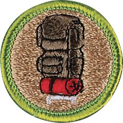

# Backpacking Merit Badge

## Overview

Earning the Backpacking merit badge will be demanding but rewarding. Scouts will learn what equipment to carry on their backs and what knowledge to have in their heads. In addition. Scouts will discover how to protect the environment by traveling and camping without leaving a trace. By mastering the basics of backpacking, Scouts will develop an even deeper respect for the outdoors.

## Requirements

* NOTE:  The official merit badge pamphlets are now free and downloadable  [HERE](https://filestore.scouting.org/filestore/Merit_Badge_ReqandRes/Pamphlets/Backpacking.pdf) or can be purchased at the [Scout Shop.](https://www.scoutshop.org/)
* (1) Discuss the prevention of and treatment for the health concerns that could occur while backpacking, including hypothermia, heat reactions, frostbite, dehydration, insect stings, tick bites, snakebite, blisters. Resources:  [Backpacking First Aid (What to Carry + Foot Care, Snakes, Poison Plants, Hypothermia, etc.) (video)](https://youtu.be/nxExCQiWa_U?si=E-FC1vbHZYI0vxhb)  [Preventing and Treating Blisters (video)](https://youtu.be/lIvLRG31MZI?si=Y7vTYYNYNzcl_MV2)  [Preventing and Treating Frostbite (video)](https://youtu.be/GHN8008brQw?si=MVUMbLRpSWLSkOZP)
* (2) Do the following:
    * (a) List 10 items that are essential to be carried on any backpacking trek and explain why each item is necessary. Resource: [What Are the 10 Essentials? (video)](https://youtu.be/J-Ae6OKjb6I?si=Ee6rn5JtoCrwtTFo)
    * (b) Describe 10 ways you can limit the weight and bulk to be carried in your pack without jeopardizing your health or safety. Resource: [ 10 FREE Ways to Reduce Base Weight Backpacking (video)](https://youtu.be/Sg8-Urd6_JY?si=jti50ZHuKFyKyxNg)

* (3) Do the following:
    * (a) Define limits on the number of backpackers appropriate for a trek crew. Resources: [Philmont Crew Requirements (website)](https://www.philmontscoutranch.org/treks/trekrequirements/crewrequirements/) [Ideal Hiking Group Size (website)](https://www.trailhiking.com.au/preparation/hiking-group-size/?srsltid=AfmBOooFYNMZTHANda2SBQWKHvaJuAW22YjziY4GhHYZ5vizsVquuu9D)
    * (b) Describe how a trek crew should be organized. Resource: [Crew Positions (website)](https://www.philmontscoutranch.org/treks/trek-resources/crew-positions/)
    * (c) Tell how you would minimize risk on a backpacking trek.
    * (d) Explain the purpose of an emergency response plan. Resource: [Backpacking Emergency Response Plan (video)](https://youtu.be/kypwGloorRk?si=EU5OPuV3A5yDbfx8)

* (4) Do the following:
    * (a) Describe the importance of following the Leave No Trace Seven Principles and the Outdoor Code while backpacking, and at least five ways you can lessen the crew's impact on the environment. Resource: [What is Leave No Trace? (video)](https://youtu.be/Rpq01rO9ZR0?si=YIELlDJ5aYqUmUi9)
    * (b) Describe proper methods of handling human and other wastes while on a backpacking trek. Describe the importance of and means to assure personal cleanliness while on a backpacking trek. Resource: [How to Poop in the Woods (video)](https://youtu.be/Dk2k1QEyY7U?si=f4XaWPIgmh29_Cm9)
    * (c) Tell what factors are important in choosing a campsite. Resource: [How to Select a Campsite (video)](https://youtu.be/dfpE0x6xTPU?si=op4Dp7UgoJk-qcNw)

* (5) Do the following:
    * (a) Demonstrate two ways to treat water and tell why water treatment is essential. Resource: [The Best Way to Filter Water While Backpacking (video)](https://youtu.be/DIZz3iiZ2TY?si=krQx2K9GtsjHx1Lh)
    * (b) Explain to your counselor the importance of staying well-hydrated during a trek. Resource: [Hydrate! (video)](https://youtu.be/zeZ--U2-Vz8?si=H86Y5a0Ac38NmuCb)

* (6) Do the following:
    * (a) Demonstrate that you can read topographic maps. Resource: [How to Read a Topographic Map (video)](https://youtu.be/CoVcRxza8nI?si=_vx1M7g51M2l_j4a)
    * (b) While on a trek, use a map and compass to establish your position on the ground at three different locations, OR use a GPS receiver to establish your position on a topographic map and on the ground at three different locations. Resource: [How to Use a Compass (video)](https://youtu.be/0cF0ovA3FtY?si=o6nQlPuwNkbBJhwu)
    * (c) Explain how to stay found, and what to do if you get lost. Resource: [What to Do If You Get Lost (video)](https://youtu.be/dq6fq-XdgUk?si=jzJ2anuQ7AwWrb3c)

* (7) Tell how to properly prepare for and deal with inclement weather. Resource:  [Backpacking in Rain, Lightning, Hail, and Wind (video)](https://youtu.be/J4atUCcf4p0?si=E5kHrCGO6P7evExq)
* (8) Do the following:
    * (a) Explain the advantages and disadvantages of the different types of backpacking stoves using at least three different types of fuel. Resource: [Trying Every Type of Backpacking Stove! (video)](https://youtu.be/DQdhvnXX8PM?si=-H_SQQdh77r70fb1)
    * (b) Demonstrate that you know how to operate a backpacking stove safely and to handle liquid fuel safely.
    * (c) Prepare three meals using a stove and fuel you can carry in a backpack.
    * (d) Demonstrate that you know how to keep cooking and eating gear clean and sanitary, and that you practice proper methods for food storage while on a backpacking trek. Resource: [Clean-Up/Washing Dishes (video)](https://youtu.be/NNcu_Ujoiv4?si=ZZtSZLYJ73an86nj)

* (9) Do the following:
    * (a) Write a plan that includes a schedule for a patrol/crew backpacking hike of at least 2 miles. Resource: [How to Plan Your First Backpacking Trip (video)](https://youtu.be/O1vtZSKr0pE?si=Uq1SBhiCqqT3OT_M)
    * (b) Conduct a prehike inspection of the patrol and its equipment. Resources: [Testing Your Backpacking Gear (video)](https://youtu.be/60iYJZoWBMA?si=uxYhraK_ZP3kNRAP) [Hiking Backpack Inspection: The Ultimate Safety Checklist for Outdoor Enthusiasts (website)](https://nomadisbeautiful.com/travel-blogs/hiking-backpack-inspection-checklist/)
    * (c) Show that you know how to properly pack your personal gear and your share of the crew's gear and food. Resource: [How to Pack Your Backpack (video)](https://youtu.be/jBDido6uX9k?si=0eooOD1d3NvRP9Bb)
    * (d) Show you can properly shoulder your pack and adjust it for proper wear. Resource: [How to Fit a Backpack (video)](https://youtu.be/0SGiGZlppMM?si=yf56DI_9Z9n7og8F)
    * (e) While using the plan you developed for requirement 9(a), carry your fully loaded pack to complete a hike of at least 2 miles.

* (10) Following the Leave No Trace Seven Principles and the Outdoor Code, participate in at least three backpacking treks of at least three days each and at least 15 miles each, and using at least two different campsites on each trek. Carry everything you will need throughout the trek. Resources:  [What is Leave No trace?  (video)](https://youtu.be/Rpq01rO9ZR0?si=hjjnThExBUjG0aIW)  [7 Principles - Leave No Trace (website)](https://lnt.org/why/7-principles/)
* (11) Do the following:
    * (a) Write a plan for a backpacking trek of at least five days using at least three different campsites and covering at least 30 miles. Your plan must include a description of and route to the trek area, a schedule (including a daily schedule), a list of food and equipment needs, a safety and emergency plan, and a budget.
    * (b) Following the Leave No Trace Seven Principles and the Outdoor Code, take the trek as planned in requirement 11(a) that is at least five full days, covering at least 30 miles and utilizing at least three different campsites. While on trek, complete at least one service project approved by your counselor. Resources: [What is Leave No trace? (video)](https://youtu.be/Rpq01rO9ZR0?si=hjjnThExBUjG0aIW) [7 Principles - Leave No Trace (website)](https://lnt.org/why/7-principles/)
    * (c) Keep a daily journal during the trek that includes a day-by-day description of your activities, including notes about what worked well and thoughts about improvements that could be made for the next trek.

## Resources

- [Backpacking merit badge page](https://www.scouting.org/merit-badges/backpacking/)
- [Backpacking merit badge PDF](https://filestore.scouting.org/filestore/Merit_Badge_ReqandRes/Pamphlets/Backpacking.pdf) ([local copy](files/backpacking-merit-badge.pdf))
- [Backpacking merit badge pamphlet](https://www.scoutshop.org/bsa-backpacking-merit-badge-pamphlet-661588.html)
- [Backpacking merit badge workbook PDF](http://usscouts.org/mb/worksheets/Backpacking.pdf)
- [Backpacking merit badge workbook DOCX](http://usscouts.org/mb/worksheets/Backpacking.docx)

Note: This is an unofficial archive of Scouts BSA Merit Badges that was automatically extracted from the Scouting America website and may contain errors.