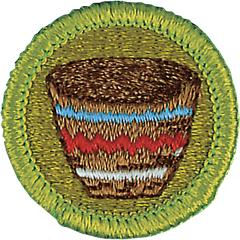

# Basketry Merit Badge

## Overview

Basketry is a handy skill for a Scout. A basket can be a sturdy companion on campouts, carrying clothes snugly and efficiently, holding potatoes and corn for roasting over a campfire, or carrying the day’s fishing catch back to camp for dinner. Baskets and basket-weaving projects also make great gifts for family and friends.

## Requirements

* NOTE:  The official merit badge pamphlets are now free and downloadable  [HERE](https://filestore.scouting.org/filestore/Merit_Badge_ReqandRes/Pamphlets/Basketry.pdf) or can be purchased at the [Scout Shop.](https://www.scoutshop.org/)
* (1) Do the following:
    * (a) Explain to your counselor the hazards you are most likely to encounter while using basketry tools and materials, and what you should do to anticipate, help prevent, mitigate, and respond to these hazards.
    * (b) Discuss the prevention of and first-aid treatment for injuries, including cuts, scratches, and scrapes, that could occur while working with basketry tools and materials.

* (2) Do the following:
    * (a) Show your counselor that you are able to identify the following types of baskets: plaited, coiled, ribbed, and wicker.
    * (b) Describe three different types of weaves to your counselor.

* (3) Plan and weave the following projects:
    * (a) Square basket
    * (b) Round basket
    * (c) Campstool seat.

## Resources

- [Basketry merit badge page](https://www.scouting.org/merit-badges/basketry/)
- [Basketry merit badge PDF](https://filestore.scouting.org/filestore/Merit_Badge_ReqandRes/Pamphlets/Basketry.pdf) ([local copy](files/basketry-merit-badge.pdf))
- [Basketry merit badge pamphlet](https://www.scoutshop.org/basketry-merit-badge-pamphlet-659873.html)
- [Basketry merit badge workbook PDF](http://usscouts.org/mb/worksheets/Basketry.pdf)
- [Basketry merit badge workbook DOCX](http://usscouts.org/mb/worksheets/Basketry.docx)

Note: This is an unofficial archive of Scouts BSA Merit Badges that was automatically extracted from the Scouting America website and may contain errors.