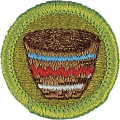

# Basketry Merit Badge

## Overview

Basketry is a handy skill for a Scout. A basket can be a sturdy companion on campouts, carrying clothes snugly and efficiently, holding potatoes and corn for roasting over a campfire, or carrying the day’s fishing catch back to camp for dinner. Baskets and basket-weaving projects also make great gifts for family and friends.

## Requirements

- (1) Do the following:
  - (a) Explain to your counselor the hazards you are most likely to encounter while using basketry tools and materials, and what you should do to anticipate, help prevent, mitigate, and respond to these hazards.

    **Resources:** [Cutting Tool Safety (video)](https://youtu.be/nhB-42oMZF8), [Hand Tool Safety (video)](https://youtu.be/jIllqEyw3rA), [Health and Safety Tips for Basket Weavers (PDF)](https://sites.google.com/basketweavers.org/missouribasketweaversguild/weaving-tips/health-and-safety)
  - (b) Discuss the prevention of and first-aid treatment for injuries, including cuts, scratches, and scrapes, that could occur while working with basketry tools and materials.

    **Resources:** [How to Treat Cuts & Scrapes | First Aid Training (video)](https://youtu.be/L77rERL64zc)

- (2) Do the following:
  - (a) Show your counselor that you are able to identify the following types of baskets: plaited, coiled, ribbed, and wicker.

    **Resources:** [What Are the Four Types of Baskets? (website)](https://www.wicker-basket.co.uk/blogs/news/what-are-the-four-types-of-baskets/), [Historical Types of Baskets (video)](https://youtu.be/Z5PttnxrB0I)
  - (b) Describe three different types of weaves to your counselor.

    **Resources:** [How to Start a Coiled Basket (video)](https://youtu.be/knbR3kgGssE), [Making a Ribbed Basket (video)](https://youtu.be/Jb0tFaZytM8), [Weaving a Plaited Bsket (video)](https://youtube.com/shorts/yqe6R4uWzQo)

- (3) Plan and weave the following projects:
  - (a) Square basket

    **Resources:** [Bamboo Basket Tokari Weaving (video)](https://youtu.be/2H0VJtOZ-Kk)
  - (b) Round basket

    **Resources:** [How to Make a Rustic Round Basket out of Wild Vines (video)](https://youtu.be/gKYft82Yobk), [Round Reed Basket (video)](https://youtu.be/jnK1kUcXqO0), [Cherokee Basket Weaving (video)](https://youtu.be/e-ZFtsLuiMo)
  - (c) Campstool seat

    **Resources:** [Weaving a Camp Stool (video)](https://youtu.be/qdtWwXhm0H8), [Learn to Rope Your Chairs (video)](https://youtu.be/k9jRWXz8HOs), [How to Weave a Wooden Chair Step by Step (video)](https://youtu.be/e_boV4f5tp4)

## Resources

- [Basketry merit badge page](https://www.scouting.org/merit-badges/basketry/)
- [Basketry merit badge PDF](https://filestore.scouting.org/filestore/Merit_Badge_ReqandRes/Pamphlets/Basketry.pdf) ([local copy](files/basketry-merit-badge.pdf))
- [Basketry merit badge pamphlet](https://www.scoutshop.org/basketry-merit-badge-pamphlet-659873.html)
- [Basketry merit badge workbook PDF](http://usscouts.org/mb/worksheets/Basketry.pdf)
- [Basketry merit badge workbook DOCX](http://usscouts.org/mb/worksheets/Basketry.docx)

Note: This is an unofficial archive of Scouts BSA Merit Badges that was automatically extracted from the Scouting America website and may contain errors.