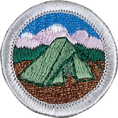

# Camping Merit Badge

## Overview

**Eagle required**

Camping is one of the best-known methods of the Scouting movement. When he founded the Scouting movement in the early 1900s, Robert Baden-Powell encouraged every Scout to learn the art of living out-of-doors. He believed a young person able to take care of himself while camping would have the confidence to meet life’s other challenges, too.

## Requirements

* NOTE:  The official merit badge pamphlets are now free and downloadable  [HERE](https://filestore.scouting.org/filestore/Merit_Badge_ReqandRes/Pamphlets/Camping.pdf) or can be purchased at the [Scout Shop.](https://www.scoutshop.org/)
* (1) Do the following:
    * (a) Explain to your counselor the most likely hazards you may encounter while participating in camping activities and what you should do to anticipate, help prevent, mitigate, and respond to these hazards. Resources: [ Camping Safety Tips (video)](https://youtu.be/JQEcfZ-jBv8?si=Vuvtm0nJmZIdfe2c) [What to Do in a Bear Encounter (and How to Avoid One) (video)](https://youtu.be/SHZ-prhA7E0?si=UqjZF_MLMMOLPlRo)
    * (b) Discuss with your counselor why it is important to be aware of weather conditions before and during your camping activities. Tell how you can prepare should the weather turn bad during your campouts. Resources: [5 Mistakes EVERY New Camper Makes in WET WEATHER (video)](https://youtu.be/HzktQBzrSQw?si=AZLAxj0KuDmWjhLl) [Cold Weather Camping Tips (video)](https://youtu.be/Ftc3t93thDw?si=I9UE43d5wRYCQi6k)
    * (c) Show that you know first aid for and how to prevent injuries or illnesses that could occur while camping, including hypothermia, frostbite, heat reactions, dehydration, altitude sickness, insect stings, tick bites, snakebite, blisters, hyperventilation. Resources: [Backpacking First Aid (What to Carry + Foot Care, Snakes, Poison Plants, Hypothermia, etc) (video)](https://youtu.be/nxExCQiWa_U?si=E-FC1vbHZYI0vxhb) [First Aid for Snakebites (video)](https://youtu.be/DFFzJIy-ak8?si=SnD_WCthjEE-Bi0W) [Types of Heat Reactions (website)](https://www.weather.gov/safety/heat-illness) [Bad Bugs and Their Bites (website)](https://www.webmd.com/allergies/ss/slideshow-bad-bugs)

* (2) Learn the Leave No Trace Seven Principles and the Outdoor Code, and explain what they mean. Write a personal and group plan for implementing these principles on your next outing. Resources: [Principles of LNT (video)](https://youtu.be/Rpq01rO9ZR0?si=hjjnThExBUjG0aIW)  [The Outdoor Code (website)](https://www.scouting.org/outdoor-programs/outdoor-ethics/outdoor-code/)  [LNT/Outdoor Code Planning (PDF)](https://filestore.scouting.org/filestore/Merit_Badge_ReqandRes/Requirement%20Resources/Camping/Leave_No_Trace_Outdoor_Code_Handout_Spaced.pdf)
* (3) Make a written plan for an overnight trek and show how to get to your  camping spot by using a topographical map and one of the following: Resources:  [How to Read a Topographic Map (video)](https://www.youtube.com/watch?v=CoVcRxza8nI&t=45s)  [Scouting America Planning Worksheet (PDF)](https://filestore.scouting.org/filestore/boyscouts/pdf/512-505-2016-Scout-Planning-Worksheet.pdf?_gl=1*1jwbf2y*_gcl_au*MjA1Nzc0ODA2My4xNzUxOTczMjY5*_ga*NjM2Nzg0MDM0LjE3NTM2NDM4MDI.*_ga_20G0JHESG4*czE3NTQ0MjQyNzckbzI5JGcxJHQxNzU0NDI4Njk0JGoxNSRsMCRoMA..&_ga=2.84744985.1230580687.1754312921-636784034.1753643802)
    * (a) Compass Resource: [How to Use a Compass (video)](https://youtu.be/0cF0ovA3FtY?si=a1zPKFxoiE68S-0a)
    * (b) GPS receiver Resource: [Using a GPS with a Map and Compass (video)](https://youtu.be/mK3pOU_x4jQ?si=PftrLmk-58ruiEZj)
    * (c) Smartphone with a GPS app. Resource: [How to Use a Smartphone as a GPS (website)](https://www.cleverhiker.com/backpacking/how-to-use-your-phone-as-a-gps-device-for-backpacking/)

* (4) Do the following:
    * (a) Make a duty roster showing how your patrol is organized for an actual overnight campout. List assignments for each member.
    * (b) Help a Scout patrol or a Webelos Scout unit in your area prepare for an actual campout, including creating the duty roster, menu planning, equipment needs, general planning, and setting up camp.

* (5) Do the following:
    * (a) Prepare a list of clothing you would need for overnight campouts in both warm and cold weather. Explain the term "layering." Resources: [Cold Weather Gear (website)](https://scoutlife.org/outdoors/outdoorarticles/6981/checklist-for-a-basic-cold-weather-outing/) [Warm Weather Gear (website)](https://scoutlife.org/outdoors/outdoorarticles/6992/checklist-for-a-basic-warm-weather-outing/)
    * (b) Discuss footwear for different kinds of weather and how the right footwear is important for protecting your feet. Resource: [The ONE Tip You Need to Choose Between Hiking Boots, Shoes, and Trail Runners (video)](https://youtu.be/liJtac-GvZw?si=ToQQv90HyVEIqwe_)
    * (c) Explain the proper care and storage of camping equipment (clothing, footwear, bedding). Resource: [How to Clean and Store Camping Gear (website)](https://www.rei.com/learn/expert-advice/end-of-summer-gear-care.html)
    * (d) List the outdoor essentials necessary for any campout, and explain why each item is needed.Resources: [10 Essentials for Scout Camping (website)](https://scoutingmagazine.org/2013/02/the-10-essentials/) [The 10 Scout Basic Outdoor Essentials (website)](https://scoutlife.org/outdoors/outdoorarticles/6976/scout-outdoor-essentials-checklist/)
    * (e) Present yourself to your Scoutmaster with your pack for inspection. Be correctly clothed and equipped for an overnight campout.

* (6) Do the following:
    * (a) Describe the features of four types of tents, when and where they could be used, and how to care for tents. Working with another Scout, pitch a tent. Resources: [Types of Tents (video)](https://youtu.be/VB7YN3s1oOg?si=eww1BsIZUTBT-Kfo) [Choosing a Tent (website)](https://blog.scoutingmagazine.org/2020/10/15/how-to-pick-your-perfect-tent/)
    * (b) Discuss the importance of camp sanitation and tell why water treatment is essential. Then demonstrate two ways to treat water. Resources: [Types of Water Purification (video)](https://youtu.be/tD-Ya2SQk3k?si=S3WLcqg72LIVK85k) [How to Wash Dishes at Camp (video)](https://youtu.be/4tNLdcjBlQc?si=stW_EkBO7EoTrniD)
    * (c) Describe the factors to be considered in deciding where to pitch your tent. Resources: [How to Pick a Campsite (video)](https://youtu.be/dfpE0x6xTPU?si=6HMKmTSPu-t1vVA3) [How to Choose a GREAT Campsite *AVOID THESE MISTAKES* (video)](https://youtu.be/WmtgLjC_9yw?si=3u34a985FeL3qqBQ)
    * (d) Tell the difference between internal- and external-frame packs. Discuss the advantages and disadvantages of each. Resource: [How to Choose a Backpack (video)](https://youtu.be/LI1va-97f4w?si=Yt51x6hhjMUuf7uV)
    * (e) Discuss the types of sleeping bags and what kind would be suitable for different conditions. Explain the proper care of your sleeping bag and how to keep it dry. Make a comfortable ground bed. Resources: [Choosing a Sleeping Bag (video)](https://youtu.be/yNaUoBUHKPg?si=Zaxv436Q71UlUO7d) [Backpacking Bags (video)](https://youtu.be/CbxAW45dUPY?si=AZL522R5ufLXN8ht) [Caring for a Sleeping Bag (video)](https://youtu.be/9qOpq5FvKR4?si=ZxVSRZPQOvIQZNUD) [Cleaning a Sleeping Bag (video)](https://youtu.be/3F-7idvPsEU?si=2rq1K7XVeulSLynk)

* (7) Prepare for an overnight campout with your patrol by doing the following:
    * (a) Make a checklist of personal and patrol gear that will be needed.
    * (b) Pack your own gear and your share of the patrol equipment and food for proper carrying. Show that your pack is right for quickly getting what is needed first, and that it has been assembled properly for comfort, weight, balance, size, and neatness. Resource: [How to Pack a Backpack for Easy Access and Comfort (video)](https://youtu.be/HB7ZOjnnFS8?si=OiOXPGCBLGNYt_b0)

* (8) Do the following:
    * (a) Explain the safety procedures for:
        * (1) Using a propane or butane/propane stove Resource: [How to Use a Propane Stove (video)](https://youtu.be/6il0aDjwSGI?si=IMrR6Ycu03lWzTtU)
        * (2) Using a liquid fuel stove Resource: [How to Use a Liquid Fuel Stove (video)](https://youtu.be/2XRqdVIqimY?si=Wj7JsttaHkIADW9a)
        * (3) Proper storage of extra fuel.

    * (b) Discuss the advantages and disadvantages of different types of lightweight cooking stoves. Resource: [Canister vs Liquid Fuel Stoves (video)](https://youtu.be/FCDURxu2L3Y?si=MB1dADsvm80GqDW9)
    * (c) Prepare a camp menu. Explain how the menu would differ from a menu for a backpacking or float trip. Give recipes and make a food list for your patrol. Plan two breakfasts, three lunches, and two suppers. Discuss how to protect your food against bad weather, animals, and contamination. Resource: [Food Storage & Protection: Techniques for Bears & Mini-Bears (video)](https://youtu.be/7YAiuAuo49Y?si=y87nPJnLJsVPZtJ9)
    * (d) While camping in the outdoors, cook at least one breakfast, one lunch, and one dinner for your patrol from the meals you have planned for requirement 8(c). At least one of those meals must be a trail meal requiring the use of a lightweight stove.

* (9) Show experience in camping by doing the following:
    * (a) Camp for at least 20 nights at designated Scouting activities or events. One long-term camping experience of up to six consecutive nights may be applied toward this requirement. Two nights may be counted toward the total for each additional long-term camping trip. Each night must be spent either under the sky, in a tent you have pitched yourself (if a tent is provided and already set up, you do not need to pitch your own), in a hammock that is safely strung outdoors, in a lean-to, or other three-sided shelter with an open front. Nights spent in indoor lock-in events, cabin camping, hotel stays, or other covered accommodations do not count toward the 20 nights.
    * (b) On any of these camping experiences, you must do TWO of the following, only with proper preparation and under qualified supervision.
        * (1) Hike up a mountain, gaining at least 1,000 vertical feet. Resource: [Training for Elevation Gain (video)](https://youtu.be/wrAzopMgriU?si=POvk4jZLbzeTos5t)
        * (2) Backpack, snowshoe, or cross-country ski for at least 4 miles. Resource: [Learn to Snowshoe (video)](https://youtu.be/bIylS8VFGcg?si=_C2XoAWrFGsx0bSa)
        * (3) Take a bike trip of at least 15 miles or at least four hours. Resource: [What I Wish I Knew Before Bikepacking (video)](https://youtu.be/eC-XDuniSco?si=ThrPiNPJvBWOimjp)
        * (4) Take a nonmotorized trip on the water of at least four hours or 5 miles. Resource: [Canoeing With LNT (video)](https://youtu.be/F8vjVVCf9YI?si=5TuRYuF6q8BjpESE)
        * (5) Plan and carry out an overnight snow camping experience. Resource: [Winter Camping Tips (video)](https://youtu.be/ReanLLCCKIc?si=hlHXtTKcefLmsVuJ)
        * (6) Rappel down a rappel route of 30 feet or more. Resource: [How to Rapel (video)](https://youtu.be/7U6tdEevJgs?si=Iq942pMfrehB7dIX)

    * (c) On any of these camping experiences, perform a conservation project approved by the landowner or land managing agency. This can be done alone or with others. Resource: [Project Planning Checklist (PDF)](https://www.scouting.org/wp-content/uploads/2019/01/Conservation-Project-Planning-Checklist.pdf)

* (10) Discuss how the things you did to earn this badge have taught you about  personal health and safety, survival, public health, conservation, and good  citizenship. In your discussion, tell how Scout spirit and the Scout Oath and Scout Law apply to camping and outdoor ethics.

## Resources

- [Camping merit badge page](https://www.scouting.org/merit-badges/camping/)
- [Camping merit badge PDF](https://filestore.scouting.org/filestore/Merit_Badge_ReqandRes/Pamphlets/Camping.pdf) ([local copy](files/camping-merit-badge.pdf))
- [Camping merit badge pamphlet](https://www.scoutshop.org/scouts-bsa-camping-merit-badge-pamphlet-662366.html)
- [Camping merit badge workbook PDF](http://usscouts.org/mb/worksheets/Camping.pdf)
- [Camping merit badge workbook DOCX](http://usscouts.org/mb/worksheets/Camping.docx)

Note: This is an unofficial archive of Scouts BSA Merit Badges that was automatically extracted from the Scouting America website and may contain errors.