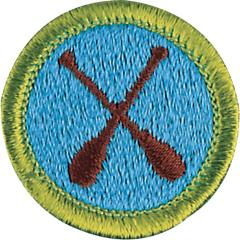

# Canoeing Merit Badge

## Overview

For several centuries, the canoe was a primary method of travel for explorers and settlers. Today, it remains an important part of the wilderness experience and an enjoyable leisure activity that teaches communication, teamwork, and physical fitness.

## Requirements

- (1) Do the following:
  - (a) Review with your counselor the most likely hazards you may encounter while participating in canoeing activities and what you should do to anticipate, help prevent, mitigate, and respond to these hazards.
  - (b) Review prevention, symptoms, and first-aid treatment for the following injuries or illnesses that could occur while canoeing: blisters, cold-water shock and hypothermia, dehydration, heat-related illnesses, sunburn, sprains, and strains.
  - (c) Discuss the Scouting America Safety Afloat policy. Tell how it applies to canoeing activities.

- (2) Before doing the following requirements, successfully complete the Scouting America swimmer test, found in the *Swimming* merit badge pamphlet.

- (3) Do the following:
  - (a) Name and point out the major parts of a canoe.
  - (b) Describe how the length and shape of a canoe affect its performance.

- (4) Do the following:
  - (a) Name and point out the parts of a paddle.
  - (b) Demonstrate how to correctly size a paddle for a paddler in a sitting position and a kneeling position.

- (5) Do the following:
  - (a) Review with your counselor the characteristics of life jackets most appropriate for canoeing and tell why a life jacket must always be worn while paddling.
  - (b) Demonstrate how to select and properly fit the correct size life jacket.
  - (c) Review the importance of safety and rescue equipment such as a sound signal device, extra paddle, sponge, bailer, bilge pump, rescue sling, ropes, throw bag.

- (6) Review with your counselor the general care and maintenance of canoes, paddles, and other canoeing equipment.

- (7) With a companion, use a properly equipped canoe to demonstrate the following:
  - (a) Safely carry and launch the canoe from a dock or shore (both, if possible).
  - (b) Safely land the canoe on a dock or shore (both, if possible) and return it to its proper storage location.
  - (c) Demonstrate kneeling and sitting positions in a canoe and explain the proper use for each position.
  - (d) Change places while afloat in the canoe.

- (8) With a companion, use a properly equipped canoe to demonstrate the following:
  - (a) Safely exit the canoe in deep water without losing contact with the canoe. Reenter the canoe with the assistance of the other paddler without capsizing the boat.
  - (b) Safely perform a controlled capsize of the canoe and demonstrate how staying with a capsized canoe will support both paddlers.
  - (c) Swim, tow, or push a swamped canoe 50 feet to shallow water. In the shallow water, empty the swamped canoe and reenter it.
  - (d) In deep water, rescue a swamped canoe and its paddlers. After checking that those in the water do not need immediate assistance, empty the swamped canoe and help the paddlers safely reenter their boat without capsizing.
  - (e) Perform a canoe rescue of a conscious swimmer.
  - (f) Using a rescue (throw) bag from shore, lay the line within 3 feet of a conscious swimmer 30 feet away. Show how to repack the bag when done.

- (9) With a companion, using a properly equipped canoe to demonstrate the following tandem maneuvers while paddling in unison on opposite sides and without changing sides. Each paddler must demonstrate these maneuvers in both the bow and stern and on both sides of the canoe while maintaining trim and balance of the canoe:
  - (a) Pivot (spin) the canoe 180° (half circle) to the right from a stationary position, stop, and return to the starting position by pivoting to the left using draw and pushaway strokes or using forward and reverse sweeps staying within 2 boat lengths of the starting position.
  - (b) Move a canoe sideways (abeam) in one direction for 10 feet and then return to the starting position using the draw and pushaway strokes.
  - (c) While in forward motion, stop the canoe within two boat lengths using the backstroke.
  - (d) While in the stern position and without assistance from the bow paddler, paddle in a straight line 15-20 boat lengths using an appropriate steering stroke, e.g., the J-stroke or thumb-down rudder stroke with or without a stern pry.
  - (e) Move the canoe in a straight line 15-20 boat lengths with the bow paddler using as necessary the forward stroke, draw stroke or forward sweep and the stern paddler using an appropriate steering stroke, e.g., the J-stroke or thumbdown rudder stroke with or without a stern pry.
  - (f) While maintaining forward motion, turn the canoe 90° in an arc to the right in 5-10 boat lengths with the bow paddler using as necessary either the draw stroke or forward sweep and the stern paddler using only the forward stroke. Repeat the maneuver turning the canoe 90° to the left.
  - (g) Move the canoe backwards in a straight line 3-4 boat lengths using as necessary the back stroke, reverse sweep or draw stroke in the bow or the stern.
  - (h) Complete a figure of 8 course around markers 3-4 boat lengths apart using appropriate strokes including the draw stroke, and the forward and reverse sweeps.

## Resources

- [Canoeing merit badge page](https://www.scouting.org/merit-badges/canoeing/)
- [Canoeing merit badge PDF](https://filestore.scouting.org/filestore/Merit_Badge_ReqandRes/Pamphlets/Canoeing.pdf) ([local copy](files/canoeing-merit-badge.pdf))
- [Canoeing merit badge pamphlet](https://www.scoutshop.org/bsa-canoeing-merit-badge-pamphlet-661589.html)
- [Canoeing merit badge workbook PDF](http://usscouts.org/mb/worksheets/Canoeing.pdf)
- [Canoeing merit badge workbook DOCX](http://usscouts.org/mb/worksheets/Canoeing.docx)

Note: This is an unofficial archive of Scouts BSA Merit Badges that was automatically extracted from the Scouting America website and may contain errors.