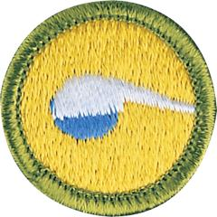

# Chemistry Merit Badge

## Overview

Chemistry explores how substances react with each other, how they change, how certain forces connect molecules, and how molecules are made are all parts of chemistry. Stretch your imagination to envision molecules that cannot be seen—but can be proven to exist—and you become a chemist.

## Requirements

* (1) Do the following and discuss with your counselor:
    * (a) Obtain safety data sheets (SDS) for sucrose (sugar), isopropyl alcohol (rubbing alcohol), and a waterproofing spray. Compare their properties and potential hazard(s), including handling and disposal guidelines and toxicity information. Resource: [Safety Data Sheets Training (video)](https://www.youtube.com/watch?v=_yWF-w3CwmU)
    * (b) What types of personal protective equipment (PPE) are recommended for each, and why? How does the recommended PPE change with toxicity and route of exposure? Resource: [How to Dress in the Lab and the Use of PPE (video)](https://youtu.be/i1D6zpSw_6Q?si=ktvcHSrfviHvAK2z)
    * (c) Review the pictograms in Section 2 of each SDS. What do they mean, and how do you see them used in your community? Resource: [Safety Pictograms in SDS (video)](https://youtube.com/shorts/x_TebXJET0Y?si=Lualg-CYIcshzBxE)
    * (d) Discuss the safe storage of chemicals. How does the safe storage of chemicals apply to your home, school, community, and the environment? Resources: [Chemical Storage Safety (video)](https://youtu.be/4GUSQj-xOBY?si=CI7Brkhm2NkXs4Wl) [Store Household Chemicals Safely (video)](https://youtube.com/shorts/9kK3sW1uu9U?si=Nc9ghap1S8ti5wgi)

* (2) Chemistry and First Aid. After successfully completing requirement 1, do the following:
    * (a) Discuss with your counselor why you think soap and alcohol are used to clean cuts and scrapes. Discuss how you could test your hypotheses with your counselor. Resource: [Soap and Hand Sanitizers vs Viruses and Bacteria (video)](https://www.youtube.com/watch?v=x7KKkElpyKQ)
    * (b) Coat your hands with a mixture of cooking oil and a nontoxic powder, such as sand or cocoa. Wash your hands with water and observe what happens. Coat your hands again, then wash with soap and water. Discuss the differences with your counselor. Resource: [How Does Soap Work? (video)](https://www.youtube.com/shorts/Jx5BgbIkXEs)
    * (c) Perform an experiment to demonstrate how rubbing alcohol affects microbial growth using baker's yeast. Discuss the results with your counselor. Resource: [Watching How Alcohol Kills Viruses and Bacteria Under a Microscope (video)](https://www.youtube.com/shorts/Jx5BgbIkXEs)

* (3) Chemistry and Cooking. After successfully completing requirement 1, do EACH of the following:
    * (a) Perform a Maillard, or browning, reaction. Discuss with your counselor whether a physical or chemical change has occurred, and what happened to molecules in the food during the cooking process. Resources: [The Maillard Reaction (video)](https://youtu.be/rs1JLYXROVU) [Why Pizza Tastes So Good (video)](https://youtu.be/tOkCgAwhh9U) [Understanding the Maillard Reaction (video)](https://www.youtube.com/watch?v=5lKzZc_OO7U)
    * (b) Prepare and use red cabbage indicator to measure the pH of five common household liquids, including water. Discuss your observations with your counselor. Resources: [Why Is Red Cabbage a pH Indicator (video)](https://youtu.be/4AElaDIhMyA?si=Xy70e7RL3auxEy8F) [pH Indicator Made From Red Cabbage (video)](https://youtu.be/hPcRylO4lQM?si=tMGhB4e9QtPvN3Xx) [Red Cabbage Indicator Infographic (website)](https://www.compoundchem.com/2017/05/18/red-cabbage/)

* (4) Chemistry and Camping. After successfully completing requirement 1, do TWO of the following:
    * (a) Design and conduct an experiment to compare at least two different types of waterproofing. Discuss with your counselor which one you would prefer to use on your tent and which one you would prefer to use on your boots, and why. Resource: [Transforming Paper into a Waterproof Marvel (video)](https://www.youtube.com/shorts/s3fDbnfolCM)
    * (b) Describe the four classes of fires, and the four classes of fire extinguishers. Discuss with your counselor how sand, baking soda, and the four classes of extinguishers work to put out fires. Resources: [Four Classes of Fires (video)](https://www.youtube.com/watch?v=B8PrA_AOa6w) [Four Types of Fires (video)](https://www.youtube.com/watch?v=Epa_2mCi4lw)
    * (c) Under your counselor's supervision and/or the supervision of a knowledgeable adult approved in advance by your counselor, conduct flame tests of at least five elements using a kitchen or propane torch. Resource: [Metal Flame Test (video)](https://www.youtube.com/watch?v=7hC-KyFraCQ)
    * (d) Under your counselor's supervision and/or the supervision of a knowledgeable adult approved in advance by your counselor, synthesize nylon (may be from a kit). Resource: [Making Nylon (video)](https://www.youtube.com/watch?v=NQpTQFGKRN8)

* (5) Describe how chemistry can be used to reduce the environmental impacts of single-use items, such as water bottles, bags, straws, or batteries. Resources:  [Upcycling Plastic Bags Into Battery Parts (video)](https://youtu.be/0maMpqRcmpc?si=UrAlTaUPdiVmzjfK)  [What Is Sustainable Development (video)](https://youtu.be/m-5UD9xpa6o?feature=shared)  [Edible, Biodegradable Food Packaging (video)](https://youtu.be/wt32GgQGTcI?si=kWEnOpNvegPFNKRg)
* (6) Identify five fields of chemistry. Briefly describe each, tell how each applies to your life and how they interact. Resource:  [Areas of Chemistry - American Chemical Society (website)](https://www.acs.org/careers/chemical-sciences/areas.html)
* (7) Identify three government agencies that oversee or provide guidance on the use of chemicals for personal, pharmaceutical, commercial, or industrial use, and discuss the agencies' history and responsibilities with your counselor. Resources:  [Why Does the FDA Exist? (video)](https://youtu.be/DmYX23j5rnQ?si=O16gv-2M6VzHE5N1)  [The EPA Was Formed | Today in History (video)](https://youtu.be/cvM54p1CQeA?si=Cn6qlMYp9NcalK5W)  [Preventing HAZMAT Accidents: DOT Safety Rules Explained 🧪 (video)](https://youtu.be/T0xn38nYSig?si=MCKBwz8JCPPjOdGt)  [Chemistry of a Killer: Inside a DEA Drug Lab (video)](https://youtu.be/MATaoXb924o?si=wi2SAv4bm-He7g2D)
* (8) Do ONE of the following:
    * (a) Visit a research laboratory, and discuss the research performed there with a chemist or chemical technician. Learn what education and training they received.
    * (b) Visit a company or plant that makes chemical products or uses chemical processes. Learn about their products or processes, and talk with someone who works there. Learn what they do, and what education and training they received.
    * (c) Identify three career opportunities that would use skills and knowledge in chemistry. Pick one and research the training, education, certification requirements, experience, and expenses associated with entering the field. Research the prospects for employment, starting salary, advancement opportunities and career goals associated with this career. Discuss what you learned with your counselor and whether you might be interested in this career. Resources: [What do Chemical Engineers Do? (video)](https://youtu.be/k-7B_YfHWXQ?si=IzIXY1zQaloFTLhM) [Interactive Site for Chemical Careers (website)](https://www.acs.org/careers/chemical-sciences.html) [Careers in Science and Engineering (video)](https://youtu.be/L7GAx9b8HAQ?si=N6v5La0u1Mp5iSER)

## Resources

- [Chemistry merit badge page](https://www.scouting.org/merit-badges/chemistry/)
- [Chemistry merit badge PDF](https://filestore.scouting.org/filestore/Merit_Badge_ReqandRes/Pamphlets/Chemistry.pdf) ([local copy](files/chemistry-merit-badge.pdf))
- [Chemistry merit badge pamphlet](https://www.scoutshop.org/bsa-chemistry-merit-badge-pamphlet-boy-scouts-of-america-660394.html)

Note: This is an unofficial archive of Scouts BSA Merit Badges that was automatically extracted from the Scouting America website and may contain errors.