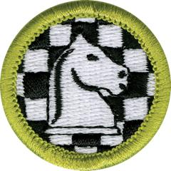

# Chess Merit Badge

## Overview

Chess is among the oldest board games in the world, and it ranks among the most popular games ever created. Chess is played worldwide—even over the Internet. Players meet for fun and in competition, everywhere from kitchen tables and park benches to formal international tournaments.

## Requirements

* (1) Discuss with your counselor the history of the game of chess. Explain why it is considered a game of planning and strategy.
* (2) Discuss with your counselor the following:
    * (a) The benefits of playing chess, including developing critical thinking skills, concentration skills, and decision-making skills, and how these skills can help you in other areas of your life
    * (b) Sportsmanship and chess etiquette.

* (3) Demonstrate to your counselor that you know each of the following. Then, using the EDGE method to teach someone (preferably another Scout) who does not know how to play chess:
    * (a) The name of each chess piece
    * (b) How to set up a chessboard
    * (c) How each chess piece moves, including castling and en passant captures.

* (4) Do the following:
    * (a) Demonstrate scorekeeping using the algebraic system of chess notation.
    * (b) Discuss the differences between the opening, the middle game, and the endgame.
    * (c) Explain four opening principles.
    * (d) Explain the four rules for castling.
    * (e) On a chessboard, demonstrate a "scholar's mate" and a "fool's mate."
    * (f) Demonstrate on a chessboard four ways a chess game can end in a draw.

* (5) Do the following:
    * (a) Explain four of the following elements of chess strategy: exploiting weaknesses, force, king safety, pawn structure, space, tempo, time.
    * (b) Explain any five of these chess tactics: clearance sacrifice, decoy, discovered attack, double attack, fork, interposing, overloading, overprotecting, pin, remove the defender, skewer, zwischenzug.
    * (c) Set up a chessboard with the white king on e1, the white rooks on a1 and h1, and the black king on e5. With White to move first, demonstrate how to force checkmate on the black king.
    * (d) Set up and solve five direct-mate problems provided by your counselor.

* (6) Do ONE of the following:
    * (a) Play at least three games of chess with other Scouts and/or your counselor. Replay the games from your score sheets and discuss with your counselor how you might have played each game differently.
    * (b) Play in a scholastic (youth) chess tournament and use your score sheets from that tournament to replay your games with your counselor. Discuss with your counselor how you might have played each game differently.
    * (c) Organize and run a chess tournament with at least four players, plus you. Have each competitor play at least two games.

## Resources

- [Chess merit badge page](https://www.scouting.org/merit-badges/chess/)
- [Chess merit badge PDF](https://filestore.scouting.org/filestore/Merit_Badge_ReqandRes/Pamphlets/Chess.pdf) ([local copy](files/chess-merit-badge.pdf))
- [Chess merit badge pamphlet](https://www.scoutshop.org/chess-merit-badge-pamphlet-660204.html)

Note: This is an unofficial archive of Scouts BSA Merit Badges that was automatically extracted from the Scouting America website and may contain errors.