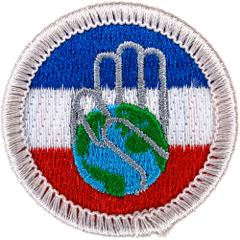

# Citizenship in Society Merit Badge

## Overview

**Eagle required**

Realize the benefits of diversity, equity, inclusion, and ethical leadership with the Citizenship in Society Merit Badge. Scouts will research any individual who has demonstrated positive leadership while making an ethical decision, explain what options the leader had when faced with a problem, why they believe they chose their final course of action, and the outcome of the leader’s decision.

## Requirements

* Note: "Discussion" requirements will be either with a counselor and another individual (in accordance with Youth Protection Guidelines [https://www.scouting.org/health-and-safety/gss/gss01/](https://www.scouting.org/health-and-safety/gss/gss01/)), or with your counselor and a small group (of Scouts), depending upon your preference.
* NOTE:  The official merit badge pamphlets are now free and downloadable  HERE or can be purchased at the [Scout Shop.](https://www.scoutshop.org/) Additional educational resources are available on our [Counselor Information Page.](https://www.scouting.org/skills/merit-badges/counselor-information/)
* (1) Before beginning work on other requirements for this merit badge, research the following terms and explain to your counselor how you feel they relate to the Scout Oath and Scout Law: identities, diversity, equality, equity, inclusion, discrimination, ethical leadership, and upstander.
* (2) Document and discuss with your counselor what leadership means to you. Share what it means to make ethical decisions.
    * (a) Research and share with your counselor an individual you feel has demonstrated positive leadership while having to make an ethical decision. (It could be someone in history, a family member, a teacher, a coach, a counselor, a clergy member, a Scoutmaster, etc.)
    * (b) Explain what decision and/or options that leader had, why you believe they chose their final course of action, and the outcome of that action

* (3) Consider ethical decision-making.
    * (a) Think about a time you faced an ethical decision.
        * Discuss the situation, what you did, and how it made you feel.
        * Share if you would do anything differently in the future and if so, what that would be.

    * (b) List three examples of ethical decisions you might have to make in the future at school, at home, in the workplace, or in your community, and what you would do.
        * Share how your actions represent alignment with the Scout Oath and Scout Law.

    * (c) Explain to your counselor how you plan to use what you have learned to assist you when that time comes, and what action(s) you can take to serve as an upstander and help other people at all times.

* (4) Repeat the Scout Oath and Scout Law for your counselor. Choose TWO of the following scenarios and discuss what you could do as a Scout to demonstrate leadership and your understanding of what it means to help others who may seem different from you:
    * (a) Scenario 1: While at camp, a youth accidentally spills food on another camper. The camper who gets spilled on gets angry and says something that is offensive to people with disabilities; their friends laugh. What could/should you do?
    * (b) Scenario 2: Your friend confides in you that some students in school are making insulting comments about one of their identities, and that those same students created a fake social media account to impersonate your friend online and post messages. What could/should you do?
    * (c) Scenario 3: A new student in your class was born in another country (or has a parent who was born in another country). Your friends make rude comments to the student about their speech or clothes and tell the student to "go back home where you came from." What could/should you do?

* (5) Document and discuss:
    * (a) Ideas on what you personally can do to create a welcoming environment in your Scouting unit.
    * (b) An experience you had in which you went out of your way to include another Scout(s) and what you did to make them feel included and welcomed.
    * (c) Things you can do to help ensure all Scouts in your unit are given an opportunity to be heard and included in decision-making and planning.

* (6) With your parent or guardian's approval, connect with another Scout or youth your own age who has an identity that's different from yours. (This means a trait, belief, or characteristic different from you.)
    * (a) Share with each other what makes the different aspect of your identity meaningful/special to you
    * (b) Share with each other ONE of the following Options:
        * (i) Option 1: A time you felt excluded from a group.
            * What was the situation?
            * How did it make you feel?
            * What did you do?
            * Did anyone stand up for you?
            * What did you learn?
            * Would you do anything differently today?

        * (ii) Option 2: This imaginary situation: You're attending a new school and don't know anyone there yet. You notice they dress very differently than you do. At lunchtime, you decide you'll try to sit with a group to get to know other students. People at two tables tell you there is someone sitting at the currently empty seat at their table, so you end up eating by yourself.
            * How would that make you feel?
            * What could the students have done?
            * If that happened at your school, what would you do?

    * c Discuss with your counselor what you learned from the discussion with the other Scout or youth.

* (7) Identify and interview an individual in your community, school, and/or Scouting who has had a significant positive impact in promoting diversity, equity, and inclusion. If you feel your community, school, or local Scouting group does not have such an individual, then research a historical figure who meets these criteria, and discuss that person with your counselor.
    * (a) Discover what inspired the individual, learn about the challenges they faced, and share what you feel attributed to their success
    * (b) Discuss with your counselor what you learned and how you can apply it in your life.

* (8) With the help of your parent or guardian, study an event that had a positive outcome on how society viewed a group of people and made them feel more welcome. Describe to your counselor the event and what you learned.
* (9) Document and discuss with your counselor three or more areas in your life outside of Scouting where you feel you can actively provide stronger leadership in.
    * (a) Making others feel included.
    * (b) Practicing active listening.
    * (c) Creating an environment where others feel comfortable to share their ideas and perspectives.
    * (d) Helping others feel valued for their input and suggestions.
    * (e) Standing up for others.

* (10) Discuss with your counselor how stereotyping people can be harmful, and how stereotypes can lead to prejudice and discrimination. Share ideas you have for challenging assumptions and celebrating individuality.
* (11) Scouting strives to develop young people to be future leaders in their workplaces, schools, and community environments. As you look at your current involvement in school, your family, Scouting, your job, and/or community, think about how you can have a positive impact in diversity, equity, and inclusion.
    * (a) Describe your ideas on how you can and will support others with different identities to feel included and heard at your school, workplace, and/or social settings in your community.
    * (b) Explain how including diverse thoughts and opinions from others with different identities can:
        * Make your interactions more positive.
        * Help everyone benefit by considering different opinions.

    * c Give three examples of how limiting diverse input can be harmful.
    * d Give three examples of how considering diverse opinions can lead to innovation and success.

## Resources

- [Citizenship in Society merit badge page](https://www.scouting.org/merit-badges/citizenship-in-society/)
- [Citizenship in Society merit badge pamphlet](None)
- [Citizenship in Society merit badge workbook PDF](http://usscouts.org/mb/worksheets/Citizenship-in-Society-Checklist.pdf)
- [Citizenship in Society merit badge workbook DOCX](http://usscouts.org/mb/worksheets/Citizenship-in-Society-Checklist.docx)

Note: This is an unofficial archive of Scouts BSA Merit Badges that was automatically extracted from the Scouting America website and may contain errors.