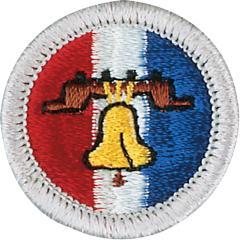

# Citizenship in the Nation Merit Badge

## Overview

**Eagle required**

As Scouts fulfill the requirements for this merit badge, they will learn how to become active citizens are aware of and grateful for their liberties and rights, to participate in their governments and protect their freedom, helping to defend their country and standing up for individual rights on behalf of all its citizens.

## Requirements

* (1) What is the Constitution of the United States? What does the Constitution do? What principles does it reflect? Why is it important to have a Constitution?
* (2) List the six purposes for creating the United States Constitution set forth in the Preamble to the Constitution. How do these purposes affect your family and community?
* (3) List the three branches of the United States government. Explain:
    * (a) The function of each branch of government
    * (b) Why it is important to divide powers among different branches
    * (c) How each branch "checks" and "balances" the others
    * (d) How citizens can be involved in each branch of government.

* (4) Discuss the importance of:
    * (a) Declaration of Independence
    * (b) Bill of Rights (the first 10 Amendments to the Constitution) and the 14th Amendment
    * (c) "E Pluribus Unum," the traditional United States motto.

* (5) Watch the national evening news for five days in a row or read the main stories in a national media organization (e.g., a newspaper or news website)  for five days in a row. Discuss the national issues that you learned about with your counselor. Choose one issue and explain how it affects you, your family, and community.
* (6) With your counselor's approval, choose a speech of national historical importance. Explain:
    * (a) Who the author was
    * (b) What the historical context was
    * (c) What difficulties the nation faced that the author wished to discuss
    * (d) What the author said
    * (e) Why the speech is important to the nation's history
    * (f) Choose a sentence or two from the speech that has significant meaning to you, and tell your counselor why.

* (7) Do TWO of the following:
    * (a) Visit a place that is listed as a National Historic Landmark or that is on the National Register of Historic Places. Tell your counselor what you learned about the landmark or site and what you found interesting about it.
    * (b) Tour your state capitol building or the U.S. Capitol. Tell your counselor what you learned about the capitol, its function, and the history.
    * (c) Tour a federal facility. Explain to your counselor what you saw and what you learned about its function in the local community and how it serves this nation.
    * (d) Choose a United States national monument that interests you. Using books, brochures, the internet (with your parent or guardian's permission), and other resources, find out more about the monument. Tell your counselor what you learned, and explain why the monument is important to this country's citizens.

* (8) Name your representatives in the United States Congress. Write a letter to your representative in Congress explaining your views on a national issue.  Show your letter, along with any response you receive, to your counselor.

## Resources

- [Citizenship in the Nation merit badge page](https://www.scouting.org/merit-badges/citizenship-in-the-nation/)
- [Citizenship in the Nation merit badge PDF](https://filestore.scouting.org/filestore/Merit_Badge_ReqandRes/Pamphlets/Citizenship%20in%20the%20Nation.pdf) ([local copy](files/citizenship-in-the-nation-merit-badge.pdf))
- [Citizenship in the Nation merit badge pamphlet](https://www.scoutshop.org/citizenship-in-the-nation-merit-badge-pamphlet-655629.html)

Note: This is an unofficial archive of Scouts BSA Merit Badges that was automatically extracted from the Scouting America website and may contain errors.