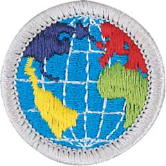

# Citizenship in the World Merit Badge

## Overview

**Eagle required**

Scouts who earn the Citizenship in the World merit badge will discover that they are already a citizen of the world. How good a citizen each person is depends on his willingness to understand and appreciate the values, traditions, and concerns of people in other countries.

## Requirements

- (1) Explain what citizenship in the world means to you and what you think it takes to be a good world citizen.

- (2) Explain how one becomes a citizen in the United States, and explain the rights, duties, and obligations of U.S. citizenship. Discuss the similarities and differences between the rights, duties, and obligations of U.S. citizens and the citizens of two other countries.

- (3) Do the following:
  - (a) Pick a current world event. In relation to this current event, discuss with your counselor how a country's national interest and its relationship with other countries might affect areas such as its security, its economy, its values, and the health of its citizens.
  - (b) Select a foreign country and discuss with your counselor how its geography, natural resources, and climate influence its economy and its global partnerships with other countries.

- (4) Do TWO of the following:
  - (a) Explain international law and how it differs from national law. Explain the role of international law and how international law can be used as a tool for conflict resolution.
  - (b) Using resources such as major daily newspapers, the internet (with your parent or guardian's permission), and news magazines, observe a current issue that involves international trade, foreign exchange, balance of payments, tariffs, and free trade. Explain what you have learned. Include in your discussion an explanation of why countries must cooperate in order for world trade and global competition to thrive.
  - (c) Select TWO of the following organizations and describe their role in the world.
  - (1) United Nations and United Nations Children's Fund (UNICEF)
  - (2) International Court of Justice (The World Court)
  - (3) International Criminal Police Organization (Interpol)
  - (4) World Organization of the Scout Movement
  - (5) World Health Organization (WHO)
  - (6) Amnesty International
  - (7) International Federation of Red Cross and Red Crescent Societies (IFRC)
  - (8) Cooperative for American Relief Everywhere (CARE)
  - (9) European Union

- (5) Do the following:
  - (a) Discuss the differences between constitutional and nonconstitutional governments.
  - (b) Name at least five different types of governments currently in power in the world.
  - (c) Show on a world map countries that use each of these five different forms of government.

- (6) Do the following:
  - (a) Explain how a government is represented abroad and how the United States government is accredited to international organizations.
  - (b) Describe the roles of the following in the conduct of foreign relations: ambassador, consul, Bureau of Global Public Affairs, United States and Foreign Commercial Service.
  - (c) Explain the purpose of a passport and visa for international travel.

- (7) Do TWO of the following (with your parent or guardian's permission) and share with your counselor what you have learned:
  - (a) Visit the website of the U.S. State Department. Learn more about an issue you find interesting that is discussed on this website.
  - (b) Visit the website of an international news organization or foreign government, OR examine a foreign newspaper available at your local library, bookstore, or newsstand. Find a news story about a human right realized in the United States that is not recognized in another country.
  - (c) Visit with a student or Scout from another country and discuss the typical values, holidays, ethnic foods, and traditions practiced or enjoyed there.
  - (d) Attend or participate in a World Organization of the Scouting Movement (WOSM) event such as the World Scout Jamboree, World Scout Moot, World Scout Congress, Jamboree Over The Air, or Jamboree Over The Internet. Attendance at a national or regional Jamboree sponsored by a WOSM-National Scout Organization is also allowed.
  - (e) Participate in or attend an international event in your area, such as an ethnic festival, concert, or play.

## Resources

- [Citizenship in the World merit badge page](https://www.scouting.org/merit-badges/citizenship-in-the-world/)
- [Citizenship in the World merit badge PDF](https://filestore.scouting.org/filestore/Merit_Badge_ReqandRes/Pamphlets/Citizenship%20in%20the%20World.pdf) ([local copy](files/citizenship-in-the-world-merit-badge.pdf))
- [Citizenship in the World merit badge pamphlet](https://www.scoutshop.org/citizenship-in-the-world-merit-badge-pamphlet-es-660395.html)
- [Citizenship in the World merit badge workbook PDF](http://usscouts.org/mb/worksheets/Citizenship-in-the-World.pdf)
- [Citizenship in the World merit badge workbook DOCX](http://usscouts.org/mb/worksheets/Citizenship-in-the-World.docx)

Note: This is an unofficial archive of Scouts BSA Merit Badges that was automatically extracted from the Scouting America website and may contain errors.