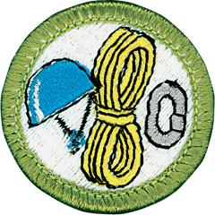

# Climbing Merit Badge

## Overview

Climbing is not a sport that requires tremendous muscular strength, it demands mental toughness and the willingness to practice hard to master a set of skills. The adventure of climbing can also provide a new way to enjoy the outdoors.

## Requirements

- (1) Do the following:
  - (a) Explain to your counselor the most likely hazards you may encounter while participating in climbing and rappelling activities and what you should do to anticipate, help prevent, mitigate, and respond to these hazards.
  - (b) Show that you know first aid for and how to prevent injuries or illnesses that could occur during climbing activities, including heat and cold reactions, dehydration, stopped breathing, sprains, abrasions, fractures, rope burns, blisters, snakebite, concussions, and insect bites or stings.
  - (c) Identify the conditions that must exist before performing CPR on a person.

- (2) Learn the Leave No Trace Seven Principles and the Outdoor Code and explain what they mean.

- (3) Present yourself properly dressed for belaying, climbing, and rappelling. Explain why you are wearing each piece of gear and discuss qualities of easy movement, entanglement free and good weather protection and comfort.

- (4) **Location.** Do the following:
  - (a) Explain how the difficulty of climbs is classified, and apply classifications to the rock faces or walls where you will demonstrate your climbing skills.
  - (b) Explain the following: top-rope climbing, lead climbing, and bouldering.
  - (c) Evaluate the safety of a particular climbing area. Consider weather, visibility, the condition of the climbing surface, and any other environmental hazards.
  - (d) Determine how to summon aid to the climbing area in case of an emergency. Discuss what medical training is needed for your group when climbing and rappelling in remote areas.

- (5) **Verbal signals.** Explain the importance of using verbal signals during every climb and rappel, and while bouldering. With the help of the counselor or another Scout, demonstrate the verbal signals used by each of the following:
  - (a) Climbers
  - (b) Rappellers
  - (c) Belayers
  - (d) Boulderers and their spotters.

- (6) **Rope.** Do the following:
  - (a) Describe the kinds of rope acceptable for use in climbing and rappelling.
  - (b) Show how to examine a rope for signs of wear or damage.
  - (c) Discuss ways to prevent a rope from being damaged.
  - (d) Explain when and how a rope should be retired.
  - (e) Properly coil a rope.

- (7) **Knots.** Demonstrate the ability to tie each of the following knots. Give at least one example of how each knot is used in belaying, climbing, or rappelling.
  - (a) Figure eight on a bight
  - (b) Figure eight follow-through
  - (c) Water knot
  - (d) Double fisherman's knot (grapevine knot)
  - (e) Prusik hitch applied to rope.

- (8) **Harness, Helmet & Gloves.** Explain the purpose of each of the following and demonstrate how to put them on correctly.
  - (a) Commercially made climbing harness
  - (b) Climbing helmet
  - (c) Climbing or rappelling gloves.

- (9) Identify the elements of the CHECK system and describe the meaning of each one to your counselor.

- (10) **Belaying.** Do the following:
  - (a) Explain the importance of belaying climbers and rappellers and when it is necessary.
  - (b) Belay three different climbers on three different routes.
  - (c) Serve as a backup belayer on three different climbs.
  - (d) Belay three different rappellers on three different routes.
  - (e) Serve as a backup belayer on three different rappels.

- (11) **Climbing.** Do the following:
  - (a) Show the correct way to directly tie a belay rope to your harness.
  - (b) Climb at least three different routes on a rock face or climbing wall, demonstrating good technique and using verbal signals with a belayer.

- (12) **Rappelling.** Do the following:
  - (a) Show the correct way to directly tie a belay rope to your harness.
  - (b) Using a carabiner and a rappel device, attach a rappel rope to your harness.
  - (c) Rappel down three different rock faces or three rappel routes on a climbing wall. Use verbal signals to communicate with a belayer, and demonstrate good rappelling technique.

- (13) Demonstrate ways to store rope, hardware, and other gear used for climbing, rappelling, and belaying.

## Resources

- [Climbing merit badge page](https://www.scouting.org/merit-badges/climbing/)
- [Climbing merit badge PDF](https://filestore.scouting.org/filestore/Merit_Badge_ReqandRes/Pamphlets/Climbing.pdf) ([local copy](files/climbing-merit-badge.pdf))
- [Climbing merit badge pamphlet](https://www.scoutshop.org/bsa-climbing-merit-badge-pamphlet-661043.html)
- [Climbing merit badge workbook PDF](http://usscouts.org/mb/worksheets/Climbing.pdf)
- [Climbing merit badge workbook DOCX](http://usscouts.org/mb/worksheets/Climbing.docx)

Note: This is an unofficial archive of Scouts BSA Merit Badges that was automatically extracted from the Scouting America website and may contain errors.