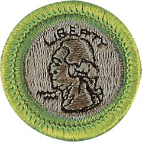

# Coin Collecting Merit Badge

## Overview

Coin collecting is one of the oldest of all hobbies. Hoards of ancient coins found in excavations indicate that coins were one of the first collectibles. From earliest times, people valued coins not only as a means of trading and storing wealth, but also as miniature works of art.

## Requirements

* NOTE:  The official merit badge pamphlets are now free and downloadable  [HERE](https://filestore.scouting.org/filestore/Merit_Badge_ReqandRes/Pamphlets/Coin%20Collecting.pdf) or can be purchased at the [Scout Shop.](https://www.scoutshop.org/)
* (1) Understand how coins are made and where the active U.S. Mint facilities  are located.
* (2) Explain the following terms: obverse, reverse, reeding, clad, type set, and date set.
* (3) Describe three different ways to store a collection, and the benefits, drawbacks, and cost of each method.
* (4) Do the following and explain to your counselor the design features, designer name, designer initials, and where to find them for each item:
    * (a) Collect a one-cent coin from the year group: 1959-2008 (that is, dated between 1959 and 2008) and a one-cent coin from the year group 2010-present. Explain how and why the one-cent coins issued in 2009 were different from either of the other two year groups.
    * (b) Collect two five-cent coins, one from each of these year groups: 1959-2003 and 2006-present. Explain how and why the five-cent coins issued in 2004-2005 were different from either of the other two year groups.
    * (c) Collect a ten-cent coin from 1965-present.
    * (d) Collect a twenty-five-cent coin from 1965-1998, two examples from the 50-State Quarter® /territories Program 1999-2009, two designs from the America the Beautiful® program 2012-2021 and two designs from the American Woman Quarter® program (2022-2024). Explain the purpose of each of those programs.
    * (e) Collect a half dollar coin from 1965-present.
    * (f) Collect a dollar coin from the following design groups: Susan B. Anthony 1979-81, Sacagawea 1990-2005, U.S. Presidents 2000-2014.

* (5) Describe and discuss with your counselor the special reverse designs of the quarters, half dollar and dollar coin struck in 1975-1976 to honor the U.S. Bicentennial.
* (6) Identify for your counselor the people depicted on current currency: $1, $2, $5, $10, $20, $50, and $100 notes. Explain where United States currency is printed.
* (7) Do ONE of the following:
    * (a) Collect and identify for your counselor 20 different world coins from at least seven different countries. Identify the country, major design elements, and denomination of each.
    * (b) Collect and identify for your counselor 20 different world paper money from at least 7 different countries. Identify the country, major design elements, and denomination of each.
    * (c) Collect and identify for your counselor 20 different tokens and/or medals. Identify the issuer and use of each.
    * (d) Complete one of the following and report to your counselor what you experienced:
        * (1) Attend a coin show.
        * (2) Attend a coin club meeting.
        * (3) Tour a U.S. Mint facility or museum.
        * (4) Tour a virtual exhibit (with your parent or guardian's permission) approved by your counselor.

## Resources

- [Coin Collecting merit badge page](https://www.scouting.org/merit-badges/coin-collecting/)
- [Coin Collecting merit badge PDF](https://filestore.scouting.org/filestore/Merit_Badge_ReqandRes/Pamphlets/Coin%20Collecting.pdf) ([local copy](files/coin-collecting-merit-badge.pdf))
- [Coin Collecting merit badge pamphlet](https://www.scoutshop.org/coin-collecting-merit-badge-pamphlet-661779.html)
- [Coin Collecting merit badge workbook PDF](http://usscouts.org/mb/worksheets/Coin-Collecting.pdf)
- [Coin Collecting merit badge workbook DOCX](http://usscouts.org/mb/worksheets/Coin-Collecting.docx)

Note: This is an unofficial archive of Scouts BSA Merit Badges that was automatically extracted from the Scouting America website and may contain errors.