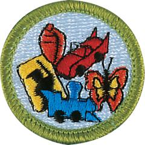

# Collections Merit Badge

## Overview

Discover how collecting can be an educational and financially rewarding pastime with the Collections Merit Badge. Scouts will prepare a brief written report, give a detailed description, and explain the development of their collection while demonstrating the knowledge of preserving and displaying their most prized possessions.

## Requirements

* NOTE Stamp and coin collecting are excluded from eligibility for this merit badge.
* NOTE:  The official merit badge pamphlets are now free and downloadable  [HERE](https://filestore.scouting.org/filestore/Merit_Badge_ReqandRes/Pamphlets/Collections.pdf) or can be purchased at the [Scout Shop.](https://www.scoutshop.org/)
* (1) Prepare a short written report or outline for your counselor, giving a detailed description of your collection, including a short history, why you enjoy your collection, and what you have learned from collecting. Be sure to include why you chose that particular type of collection/collecting method.
* (2) Explain the growth and development of your collection.
* (3) Demonstrate your knowledge of preserving and displaying your collection.
    * (a) Explain the precautions you need to take to preserve your collection, including:  - Handling - Cleaning - Storage.
    * (b) Explain how best to display your collection, keeping in mind preserving as discussed above.
    * (c) Explain to your counselor the events available for a hobbyist of this collection, including shows, seminars, conventions, contests, and museum programs and exhibits.
    * (d) Explain to your counselor how you keep track of your collection. Describe your cataloging method.

* (4) Demonstrate your knowledge of collecting and investing. Discuss with your counselor:
    * (a) How investing and speculation would apply to your collection
    * (b) What you would look for in purchasing other collections similar to yours
    * (c) What you would expect in return value if you decided to sell all or part of the collection.

* (5) Do the following:
    * (a) Discuss with your counselor at least 10 terms commonly used to describe your collection and be prepared to discuss the definition of each.
    * (b) Show your counselor any two groups from your collection. Explain how you organized your collection and why you chose that method. (Note: if your collection is too large to transport and your counselor is unable to view your collection directly, photographs should be available to share.)
    * (c) Explain the monetary value of your collection and where you learned about those values.
    * (d) Explain how your collection is graded for value, physical defects, size, and age. Show the various classifications or ratings used in your collection.
    * (e) List the national, state, or local association(s) related to or associated with your collection.
    * (f) Explain to your counselor the purpose of and reason for the identification number (if applicable), series, brand name (if any), and any other special identification marks.

* (6) Discuss with your counselor the plans you have to continue with the collection in the future.
* (7) Find out about career opportunities in collecting. Pick one and find out the education, training, and experience required for this profession. Discuss this with your counselor, and explain why this profession might interest you.

## Resources

- [Collections merit badge page](https://www.scouting.org/merit-badges/collections/)
- [Collections merit badge PDF](https://filestore.scouting.org/filestore/Merit_Badge_ReqandRes/Pamphlets/Collections.pdf) ([local copy](files/collections-merit-badge.pdf))
- [Collections merit badge pamphlet](https://www.scoutshop.org/collections-merit-badge-pamphlet-655186.html)

Note: This is an unofficial archive of Scouts BSA Merit Badges that was automatically extracted from the Scouting America website and may contain errors.