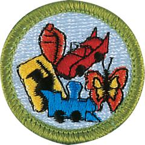

# Collections Merit Badge

## Overview

Discover how collecting can be an educational and financially rewarding pastime with the Collections Merit Badge. Scouts will prepare a brief written report, give a detailed description, and explain the development of their collection while demonstrating the knowledge of preserving and displaying their most prized possessions.

## Requirements

- **NOTE: Stamp and coin collecting are excluded from eligibility for this merit badge. Scouts must remember to follow the Leave No Trace Seven Principles and the Outdoor Code while on field trips and when collecting specimens. Make sure you have permission of the land manager prior to taking any samples for your collection. Collecting is prohibited in most National and State Parks. Pictures or sketches may suffice for a collection and limit impacted disturbances.**

- (1) Prepare a short written report or outline for your counselor, giving a detailed description of your collection, including a short history, why you enjoy your collection, and what you have learned from collecting. Be sure to include why you chose that particular type of collection/collecting method.

  **Resources:** [The Invention of Collecting (video)](https://youtu.be/G09aIKMBNhE?si=L6cgpArtfAHD3KjX), [246 Cool Things to Collect (Collection Ideas) (website)](https://icebreakerideas.com/things-to-collect/), [Meet Reece, King of the Fans | My Kid's Obsession (video)](https://youtu.be/FtaG6XgemUY)

- (2) Explain the growth and development of your collection.

  **Resources:** [Collecting Tips 101: Tip #4 Do Your Research (video)](https://youtu.be/dPnsVmEk3Y4?si=iNIEfkPYFgNyptS9), [Collecting Tips 101: Tip #86 Be Unique (video)](https://youtu.be/rGLfkhaTts4?si=Fo0axri8RXK2S4P8), [Collecting Tips 101: Tip #2 Budget Your Money (video)](https://youtu.be/cOleElanH6w?si=VHZW9zBn0hCuBhvj), [Collecting Tips 101: Tip #27 Leave Room to Grow (video)](https://youtu.be/fB7j8OZk4f0?si=Xot--xUEe_KhfoLT)

- (3) Demonstrate your knowledge of preserving and displaying your collection.
  - (a) Explain the precautions you need to take to preserve your collection, including handling, cleaning, and storage.

    **Resources:** [20 Best Ways to Store & Preserve Vintage Collectibles for Long-Term Value (website)](https://www.homeaswemakeit.com/20-best-ways-to-store-preserve-vintage-collectibles-for-long-term-value/), [Collecting Tips 101: Tip #61 You Shalt Dust? (General Cleaning) (video)](https://youtu.be/1_QFgGbywAc?si=w8wSCQq4ZRex1n0d), [Collecting Tips 101: Tip #25 Where to Keep a Collection (video)](https://youtu.be/e-5c_DcByWU?si=vKBIDpOrCG5_bkGZ), [Collecting Tips 101: Tip #20 Stay Away From Sunlight (video)](https://youtu.be/Ck5yO9gg1uc?si=eYQvVoeUNfuN26sE), [3 Ways to Store and Organize Your Squishmallows (video)](https://www.youtube.com/shorts/C2-ZPL3jRHU)
  - (b) Explain how best to display your collection, keeping in mind preserving as discussed above.

    **Resources:** [5 TIPS to Display your Collection LIKE A PRO --- Props, Statues, Star Wars & more (video)](https://youtu.be/VRehA_4XJcY?si=jt-ATiVtwR9iFq_I), [How To Display Your Collection Like a PRO (As a Broke College Student) (video)](https://youtu.be/vveS2xB97b8?si=VoqVo1IMUEBQTVlk), [How to Display Squishmellows (video)](https://youtu.be/xfFWEpkfTl8)
  - (c) Explain to your counselor the events available for a hobbyist of this collection, including shows, seminars, conventions, contests, and museum programs and exhibits.

    **Resources:** [Museums  (website)](https://whichmuseum.com/)
  - (d) Explain to your counselor how you keep track of your collection. Describe your cataloging method.

    **Resources:** [How I Keep Track of My 4000+ Dolls! (video)](https://www.youtube.com/shorts/YUn5su6RKDE), [Citizen Collector's Toolkit: How to document your collection (video)](https://youtu.be/wLAoVbLuur0?si=CTiia13VrYn3jCQA), [Collecting Tips 101: Tip #5 Database Your Collection (video)](https://youtu.be/zLT1aqMgJWs?si=gpAA8ofT-xRp61Ml), [How to Organize POKEMON Cards (video)](https://youtu.be/DKOFh-Kyhcs?si=1aXLSq3rDw4iGxVQ)

- (4) Demonstrate your knowledge of collecting and investing. Discuss with your counselor:

  **Resources:** [5 Smart Tips for Collecting Pokemon Cards on a Budget (video)](https://youtu.be/ZSZXXjrWMf0), [Contemplatiing Collectible Investments (website)](https://www.investopedia.com/articles/basics/06/contemplatingcollectibles.asp)

  - (a) How investing and speculation would apply to your collection

    **Resources:** [Find Investments to Meet Your Financial Goals (website)](https://www.forbes.com/advisor/investing/how-to-invest-in-collectibles/), [Collecting Tips 101: Tip #48 Predicting Rare Games (video)](https://youtu.be/j2YLShzE-PU?si=xpubBGs4hFKCMln0)
  - (b) What you would look for in purchasing other collections similar to yours
  - (c) What you would expect in return value if you decided to sell all or part of the collection

    **Resources:** [What's it Worth - Free Antiques & Collectables Price Guide (website)](https://www.worldcollectorsnet.com/category/whats-it-worth/)

- (5) Do the following:
  - (a) Discuss with your counselor at least 10 terms commonly used to describe your collection and be prepared to discuss the definition of each.

    **Resources:** [Nomenclature for Museum Cataloging (website)](https://page.nomenclature.info/apropos-about.app?lang=en)
  - (b) Show your counselor any two groups from your collection. Explain how you organized your collection and why you chose that method. (Note: if your collection is too large to transport and your counselor is unable to view your collection directly, photographs should be available to share.)
  - (c) Explain the monetary value of your collection and where you learned about those values.

    **Resources:** [How to Find Out What It's Worth (website)](https://www.liveabout.com/how-to-find-the-value-of-an-item-780265), [How Much Are My Collectibles Worth? Tips for Finding Values (website)](https://www.lovetoknow.com/home/antiques-collectibles/how-much-are-my-collectibles-worth)
  - (d) Explain how your collection is graded for value, physical defects, size, and age. Show the various classifications or ratings used in your collection.

    **Resources:** [Understanding Museum Quality in Collectibles and Artifacts (website)](https://stonehards.com/articles/understanding-museum-quality-in-collectibles/)
  - (e) List the national, state, or local association(s) related to or associated with your collection.

    **Resources:** [Antiques & Collectibles National Association Directory (website)](https://acna.us/national.html)
  - (f) Explain to your counselor the purpose of and reason for the identification number (if applicable), series, brand name (if any), and any other special identification marks.

- (6) Discuss with your counselor the plans you have to continue with the collection in the future.

- (7) Find out about career opportunities in collecting. Pick one and find out the education, training, and experience required for this profession. Discuss this with your counselor, and explain why this profession might interest you.

  **Resources:** [Curators, Conservators, and Museum Workers Career Video (video)](https://youtu.be/zLYjrT_jvY0?si=p78dVOqsf4ntE4yz), [Dream Jobs: Antiquer (video)](https://youtu.be/bvMjvg23mBk?si=zAYSwNmi7tMyZeqV)

## Resources

- [Collections merit badge page](https://www.scouting.org/merit-badges/collections/)
- [Collections merit badge PDF](https://filestore.scouting.org/filestore/Merit_Badge_ReqandRes/Pamphlets/Collections.pdf) ([local copy](files/collections-merit-badge.pdf))
- [Collections merit badge pamphlet](https://www.scoutshop.org/collections-merit-badge-pamphlet-655186.html)
- [Collections merit badge workbook PDF](http://usscouts.org/mb/worksheets/Collections.pdf)
- [Collections merit badge workbook DOCX](http://usscouts.org/mb/worksheets/Collections.docx)

Note: This is an unofficial archive of Scouts BSA Merit Badges that was automatically extracted from the Scouting America website and may contain errors.