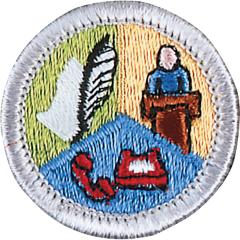

# Communication Merit Badge

## Overview

**Eagle required**

This clear and concise definition comes from the U.S. Department of Education: “Communication focuses on how people use messages to generate meanings within and across various contexts, cultures, channels, and media. The field of communication promotes the effective and ethical practice of human communication.”

## Requirements

- (1) Do ONE of the following:
  - (a) For one day, keep a log in which you describe your communication activities. Keep track of the time and different ways you spend communicating, such as talking person-to-person, listening to teachers, listening to the radio or podcasts, watching television, using social media, reading books and other print media, and using any electronic communication device. Discuss with your counselor what your log reveals about the importance of communication in your life. Think of ways to improve your communication skills.

    **Resources:** [Active Listening (video)](https://youtu.be/BW82k7lwI_U), [Download a Communication Log Template (PDF)](https://filestore.scouting.org/filestore/Merit_Badge_ReqandRes/Requirement%20Resources/Communications/Communication%20Log.docx)
  - (b) For three days, keep a journal of your listening experiences. Identify one example of each of the following, and discuss with your counselor when you have listened to each: obtain information, be persuaded, appreciate or enjoy something, and understand someone's feelings.

    **Resources:** [Informative Speech (video)](https://youtu.be/x2dxh8xc68E?si=-npAmT7dc7dImnU8), [What is Persuation (video)](https://youtu.be/lAxMdswA_-s?si=6bkXp98gVYING_RC), [Want to Add More Joy to Your Life? Here's How (video)](https://youtu.be/Ljlkvmn0RKk?si=OcaZ410bKns19a4r), [Listening Skills for Conflict Resolution (video)](https://youtu.be/_Of_YO0-B4k?si=UmVlPT5mxa25Ud-C), [How to Improve Your Listening Skills (video)](https://youtu.be/D6-MIeRr1e8?si=y9CaTS-PSqosBVdr)
  - (c) In a small-group setting, meet with other Scouts or with friends. Have them share personal stories about significant events in their lives that affected them in some way. Take note of how each Scout participates in the group discussion and how effectively each Scout communicates their story. Report what you have learned to your counselor about the differences you observed in effective communication.

    **Resources:** [How to Ask Good Questions (video)](https://youtu.be/XeJ03dDGlCk?si=RzPTkUkaqKtBDsqI)
  - (d) List as many ways as you can think of to communicate with others (face-to-face, by telephone, letter, email, text messages, social media, and so on). For each type of communication, discuss with your counselor an instance when that method might not be appropriate or effective.

    **Resources:** [Communication Skills (video)](https://youtu.be/2JG9AC0ZxuY?si=dDktq_g5tH8UjIHB), [Communicating While Scuba Diving (website)](https://scoutlife.org/outdoors/181688/how-to-communicate-underwater-when-scuba-diving/%20), [Communicating While Climbing (website)](https://scoutlife.org/outdoors/outdoorarticles/3591/calls-for-climbers-and-belayers/)

- (2) Do ONE of the following:
  - (a) Think of a creative way to describe yourself using, for example, a collage, short story or autobiography, drawing or series of photographs, or a song or skit. Using the aid you created, make a presentation to your counselor about yourself.

    **Resources:** [Using Emojis to Communicate the Scout Law (website)](https://scoutlife.org/the-emoji-scout-law/), [Writing With Your Audience in Mind (video)](https://youtu.be/xyH79KQET5E?si=VbVYLAd2mcSbj6OQ), [How to Use Visual Aids for Public Speaking (video)](https://youtu.be/KVbRQ0cE0Ok?si=dp8uheIh6njAbGy-%20%20)
  - (b) Choose a concept, product, or service in which you have great confidence. Build a sales plan based on its good points. Try to persuade the counselor to agree with, use, or buy your concept, product or service. After your sales talk, discuss with your counselor how persuasive you were.

    **Resources:** [Making a Speech Powerful & Persuasive (video)](https://youtu.be/FhWBABCpT9w)

- (3) Write a five-minute speech. Give it at a meeting of a group.

  **Resources:** [Types of Speeches (video)](https://youtu.be/ZFmBcag7G_w?si=GDZyb3cueus0SZ0S), [3 Steps to Write Your Speech (video)](https://youtu.be/u-_i7-kNwZI), [How to Overcome the Fear of Public Speaking: 3 Tips (video)](https://youtu.be/_3fz0eiBGvA)

- (4) Interview someone you know fairly well, like, or respect because of his or her position, talent, career, or life experiences. Listen actively to learn as much as you can about the person. Then prepare and deliver to your counselor an introduction of the person as though this person were to be a guest speaker, and include reasons why the audience would want to hear this person speak. Show how you would call to invite this person to speak.

  **Resources:** [How to Introduce Your Guest Speaker (website)](https://speechcoachforexecutives.com/how-to-introduce-your-guest-speaker/)

- (5) Attend a public meeting (city council, school board, debate) approved by your counselor where several points of view are given on a single issue. Practice active listening skills and take careful notes of each point of view. Prepare an objective report that includes all points of view that were expressed, and share this with your counselor.

  **Resources:** [3 Note-Taking Methods in 3 Minutes (video)](https://youtu.be/uy6Eu5l0yOk), [Note-Taking Assignment Tips (website)](https://sulky-answer-76a.notion.site/Note-taking-assignment-tips-52758bb0f5a3486181c4b60b813e0338)

- (6) With your counselor's approval, develop a plan to teach a skill or inform someone about something. Prepare teaching aids for your plan. Carry out your plan. With your counselor, determine whether the person has learned what you intended.

  **Resources:** [Scouting's Teaching EDGE (video)](https://youtu.be/WAAuRoz4pVc)

- (7) Do ONE of the following:
  - (a) Write to the editor of a magazine or your local newspaper to express your opinion or share information on any subject you choose. Send your message by fax, email, or regular mail.

    **Resources:** [Link to Write to the Editors of Scout Life (website)](https://scoutlife.org/contact-us/communications-mb/%20), [How to Write a Letter to the Editor (video)](https://youtu.be/yxflXSfOalk)
  - (b) Create a webpage or blog of special interest to you (for instance, your troop or crew, a hobby, or a sport). Include at least three articles or entries and one photograph or illustration, and one link to some other webpage or blog that would be helpful to someone who visits the webpage or blog you have created.**Note:** It is not necessary to post your webpage or blog to the internet, but if you decide to do so, you must first share it with your parent or guardian and counselor and get their permission.

    **Resources:** [How to Use Google Sites - Tutorial for Beginners (video)](https://youtu.be/0woNTtlcxgM), [Build a Website in Canva & Host it for FREE (video)](https://youtu.be/A2ky3irNAiw), [Get Your Paper Hand-In Ready (website)](https://www.easybib.com/), [How to Proofready Your Blog (video)](https://vimeo.com/1154745256/49c11cda51?fl=pl&fe=vl)
  - (c) Use desktop publishing to produce a newsletter, brochure, flyer, or other printed material for your troop or crew, class at school, or other group. Include at least one article and one photograph or illustration.

    **Resources:** [Canva Brochure Design Tutorial (video)](https://youtu.be/DWiM3GLw0Z8), [How to Make a FLYER in Google Docs (video)](https://youtu.be/7eeUsOQI5EA), [How to Use Lucidpress to Make a Pamphlet or Brochure (video)](https://youtu.be/pPYcPlTFbwU)

- (8) Plan a troop or crew court of honor, campfire program, or an interfaith worship service. Have the patrol leaders' council approve it, then write the script and prepare the program. Serve as master of ceremonies.

  **Resources:** [Troop Program Features (website)](https://troopleader.scouting.org/program-features/), [Program Feature: Communication (website)](https://troopleader.scouting.org/program-features/communication/), [Troop Courts of Honor (website)](https://troopleader.scouting.org/ceremonies/troop-courts-of-honor/), [Eagle Courts of Honor (website)](https://troopleader.scouting.org/ceremonies/eagle-courts-of-honor/), [Campfire Planning form (PDF)](https://filestore.scouting.org/filestore/pdf/33696.pdf), [Campfire Planning    (website)](https://dragon.sleepdeprived.ca/songbook/campfire_planning.htm), [Interfaith Worship Service (PDF)](https://filestore.scouting.org/filestore/pdf/Interfaithservice.pdf)

- (9) Find out about three career opportunities in communication. Pick one and find out the education, training, and experience required for this profession. Discuss this with your counselor, and explain why this profession might interest you.

## Resources

- [Communication merit badge page](https://www.scouting.org/merit-badges/communication/)
- [Communication merit badge PDF](https://filestore.scouting.org/filestore/Merit_Badge_ReqandRes/Pamphlets/Communication.pdf) ([local copy](files/communication-merit-badge.pdf))
- [Communication merit badge pamphlet](https://www.scoutshop.org/communication-merit-badge-pamphlet-662532.html)
- [Communication merit badge workbook PDF](http://usscouts.org/mb/worksheets/Communication.pdf)
- [Communication merit badge workbook DOCX](http://usscouts.org/mb/worksheets/Communication.docx)

Note: This is an unofficial archive of Scouts BSA Merit Badges that was automatically extracted from the Scouting America website and may contain errors.