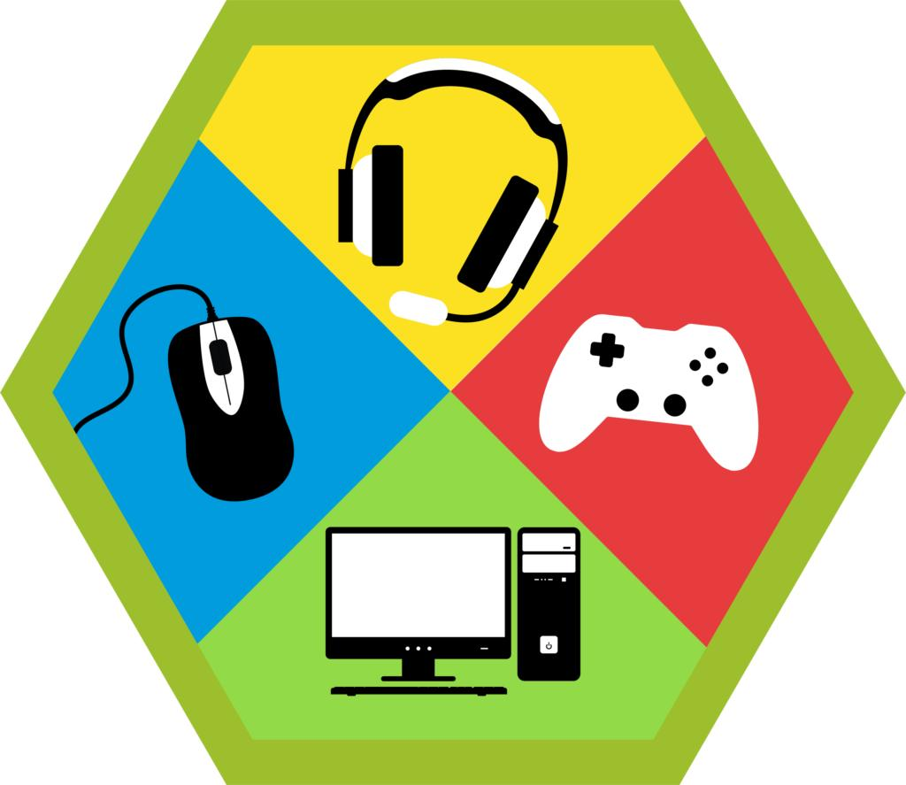

# Competitive Gaming Merit Badge

## Overview

**Test Lab Merit Badge**, Verify current status at [Scouts BSA Test Lab](https://www.scouting.org/skills/merit-badges/test-lab/).

## Requirements

- (1) **History of Gaming**. Do the following:
  - (a) Create a timeline showing how video gaming has evolved since 1958. Include at least one significant event from each decade.
    **[Video Game History Timeline](https://www.museumofplay.org/video-game-history-timeline/)**
    **[The Video Game Revolution](https://www.pbs.org/kcts/videogamerevolution/history/index.html)**
    **[The Worst Video Game Ever](https://www.si.edu/sidedoor/ep-15-worst-video-game-ever?page=1)** (b) Identify and define five major video game genres. Provide an example for each.
    **[Glitchwave Game Genres](https://glitchwave.com/games/genre/)**
    **[Esports Genres Explained: Everything You Need to Know](https://esportsinsider.com/esports-genres-explained)**
    **[Free Games](https://www.google.com/search?q=pac+man&rlz=1C1UEAD_enUS1110US1110&oq=pac+man&gs_lcrp=EgZjaHJvbWUqBwgAEAAYjwIyBwgAEAAYjwIyDQgBEC4YgwEYsQMYgAQyCggCEC4YsQMYgAQyDQgDEAAYgwEYsQMYgAQyDQgEEAAYgwEYsQMYgAQyCggFEC4YsQMYgAQyCggGEC4YsQMYgAQyCggHEC4YsQMYgAQyDQgIEC4YgwEYsQMYgAQyDQgJEC4YgwEYsQMYgATSAQgxMjgyajBqN6gCALACAA&sourceid=chrome&ie=UTF-8)** (c) Explain the difference between video gaming and esports. Include how esports incorporates elements of organized competition such as teams, tournaments, rules, coaching, and spectatorship. Provide two examples of games that are commonly played casually as video games but are also used in organized esports competition.
    **[Gaming vs. Esports](https://drive.google.com/file/d/12HVwGZbzfuvZNJ1fT7Htygk7BgyFnSXF/view?usp=sharing)**
    **[Video gaming and esports: the differences and distinctions in detail](https://hwb.gov.wales/keeping-safe-online/views-from-the-experts/video-gaming-and-esports-the-differences-and-distinctions-in-detail)**
    **[PlayVS Game Title Overview](https://help.playvs.com/en/articles/5915810-game-title-overview)** (d) Identify and define five major moments in the development of esports as an industry since 1990. Include key tournaments, technological advances, and organizations that helped shape competitive gaming globally. Discuss your findings with your merit badge counselor.
    **[Major Milestones in Esports History: A Timeline](https://whatisesports.xyz/major-milestones-esports-history-timeline/)**

- (2) **Living the Scout Oath and Law Online**. Do the following:
  - (a) Define the term “toxicity in gaming.” Describe a real or hypothetical example of toxic behavior in online play and outline how the situation could be prevented or resolved by applying the Scout Oath and Law.
    **[Good Game Playbook for Teens](https://staticctf.ubisoft.com/8aefmxkxpxwl/1wJowtd0nH3HS8gAANwF3i/0d0f9fe2d3f9ac6315e069b109aad640/Good_Game_Playbook_for_Teens_EN.pdf?_gl=1*vf4lep*_gcl_au*NjE3NjcyODU4LjE3NjQ2ODk1Mzg.*_ga*MTI4NzA5MzI1My4xNzY0Njg5NTM4*_ga_C4N5020N2R*czE3NjQ3MDM4NDYkbzIkZzAkdDE3NjQ3MDM4NDYkajYwJGwwJGgw)**
    **[Game Changer Resource Guide](https://alltogethernow.org.au/our-work/far-right-extremism/game-changers-resources-guide/)** (b) List five strategies for handling negative online gaming experiences. Describe how each strategy reflects a point of the Scout Oath or Law.
    **[How to Deal with Toxic Players: A Gamer’s Guide to Staying Sane Online](https://www.twoaveragegamers.com/how-to-deal-with-toxic-players-a-gamers-guide-to-staying-sane-online/)**
    **[Bullying and Cyberbullying](https://www.childline.org.uk/info-advice/bullying-abuse-safety/types-bullying/bullying-cyberbullying/)** (c) Research the Entertainment Software Rating Board (ESRB) rating system. Record the ratings of the video games you own and compare them to your age group. Explain to your counselor whether you agree with the ESRB descriptions.
    **[Video games age ratings explained](https://www.internetmatters.org/resources/video-games-age-ratings-explained/)**
    [**Search ESRB Game Ratings**](http://www.esrb.org/search/) (d) List five ways to create a positive online gaming environment for yourself and others. Demonstrate one of these methods with your troop, patrol, or family.
    **[The Ultimate Guide to Non-Toxic Gaming Communities](https://www.twoaveragegamers.com/the-ultimate-guide-to-non-toxic-gaming-communities/)**
    **[StopBullying.gov – What Kids Can Do](https://www.twoaveragegamers.com/the-ultimate-guide-to-non-toxic-gaming-communities/)**

- (3) **Gamer Health and Balance**. Do the following:
  - (a) Read two credible articles describing positive aspects of video gaming and two describing negative aspects. Create a chart showing where the articles agree or disagree. Positive aspects
    **[The surprising benefits of video games](https://www.popsci.com/health/video-game-benefits/)**
    **[Are Video Games Good for You? Your Brain Thinks So](https://health.clevelandclinic.org/are-video-games-good-for-you)**
    **[How Video Games Can Level Up the Way You Learn](https://www.ted.com/talks/kris_alexander_how_video_games_can_level_up_the_way_you_learn?referrer=playlist-talks_for_gamers&autoplay=true)**
    [**Welcome to Blink Land**](https://www.aoa.org/healthy-eyes/caring-for-your-eyes/welcome-to-blink-land) Negative aspects
    **[How Video Games Affect Kids’ Behavioral Health: The Hidden Risks](https://www.kidsvillepeds.com/blog/1290873-how-video-games-affect-kids-behavioral-health-the-hidden-risks/)**
    [**Effects Of Video Games On Teen Mental Health**](https://www.brightpathbh.com/effects-of-video-games-on-teen-mental-health/)
    **[What is the link between screen time and ADHD?](https://www.sciencejournalforkids.org/wp-content/uploads/2025/05/screentime-ADHD_Article.pdf)** (b) Track the amount of gaming you do each day for two weeks. Record and summarize your results.
    **[Screen Time Tracker](https://wordunited.com/free-resources/screen-time-tracker/)** (c) Track your daily physical activity for the same two weeks. Compare your results to the CDC recommendation of one hour of moderate-to-vigorous activity per day for youth ages 6–17.
    **[My Physical Activity Diary](https://www.cdc.gov/healthyweight/pdf/physical_activity_diary_cdc.pdf)** (d) Track your daily sleep for the same two weeks. Compare your results to the CDC recommendation of 9–12 hours for ages 6–12 and 8–10 hours for ages 13–18.
    **[Teen Sleep Diary](https://thesleepcharity.org.uk/wp-content/uploads/The-Sleep-Charity-Teens-Sleep-Diary.pdf)** (e) After completing 3b, 3c, and 3d, create a one-week balanced schedule that includes healthy sleep, physical activity, and agreed-upon gaming time. Follow this schedule and summarize your results.
    **[Weekly Activity Schedule](https://www.cci.health.wa.gov.au/~/media/CCI/Mental-Health-Professionals/Depression/Depression-Worksheets/Depression-Worksheet---03---Weekly-Activity-Schedule.pdf)**

- (4) **Gamer Safety and Community Connection**. Do the following:
  - (a) Explain the benefits and risks of gaming online.
    **[The Real Benefits of Video Games](https://builtin.com/articles/online-gaming-social-benefits)**
    **[Negative Effects of Video Games](https://www.smartsocial.com/post/negative-effects-video-games)** (b) Research and list ten ways to stay safe when playing video games online.
    **[Online safety issues](https://www.internetmatters.org/issues/)**
    **[Gaming Safety](https://www.dhs.gov/sites/default/files/2024-09/24_09_20_K2P_Gaming-Safety.pdf)** (c) Play one of your favorite games with your parent or guardian for at least 30 minutes. Demonstrate how to use privacy and safety settings, explain what you enjoy about the game, and let them play for part of the session.
    **[Online Gaming Safety Settings](https://internetsafety101.org/objects/Gaming-controls-quick-guide-03-24-2025.pdf)** (d) Play an online or local multiplayer game with another Scout, friend, or community member in a cooperative or team-based setting. The match may be casual or competitive. During play, demonstrate positive communication, teamwork, and sportsmanship. Afterward, review the experience with your counselor and describe how cooperation and communication influenced your team’s performance and overall enjoyment of the game.

- (5) **Technology in Competitive Gaming**. Do the following:
  - (a) Explain the difference between console gaming and PC gaming. List the advantages and disadvantages of each.
    **[Console vs. PC Gaming: Which Is Better?](https://www.seagate.com/blog/console-vs-pc-gaming/)** (b) Play the same game on at least two different platforms. Describe the similarities and differences in gameplay and performance. (c) Visit a PC builder website such as PCPartPicker or Micro Center. Design your ideal gaming PC and create a parts list that includes: central processing unit (CPU), motherboard, random access memory (RAM), hard drive, power supply, graphics card, fans, case. Discuss your selections with your counselor.
    **[PCPartPicker](https://pcpartpicker.com/)**
    **[Micro Center](https://www.microcenter.com/site/content/custom-pc-builder.aspx?k=1764714012175)**

- (6) **Leadership and Service in Competitive Gaming**. Do ONE of the following:
  - (a) Teach your troop, patrol, or a group of younger Scouts or family members about online gaming safety or digital citizenship. (b) Attend or view a live-streamed esports event online, such as a professional tournament, collegiate match, or school-level competition. Take notes on how the broadcast team presents the event, how players communicate, and how the audience interacts digitally. Share with your merit badge counselor what you learned about the structure and presentation of online esports competition. (c) Attend an esports tournament, convention, or community event that includes a competitive gaming activity or demonstration. Attend with another Scout, troop member, or family member. Afterward, share with your merit badge counselor what you learned about the atmosphere of live esports events and how the experience changed your understanding of playing games competitively in front of an audience.

- (7) **Exploring Professions in the Competitive Gaming Industry**. Do the following:
  - (a) Research two colleges that offer varsity esports programs. Record the following information for each: availability and amount of gaming scholarships, offered gaming or IT-related degrees, games played by the esports team, league or association in which the team competes.
    **[NACE School Directory](https://www.nacesports.org/school-directory)** (b) Research three gaming-adjacent careers that support or connect to the esports industry but are not esports athlete roles. Examples may include: game designer or developer, shoutcaster or broadcast producer, data analyst or statistician, marketing or event coordinator, IT or network support specialist. For each career, identify the main responsibilities, education or training requirements, and how the role contributes to the success of the gaming or esports ecosystem.
    **[100 Jobs in Esports](https://www.flipbookpdf.net/web/site/0f69cbe0b3ab4127778010bc84c0383f86c1f5a5FBP25582848.pdf.html#page/5)**
    **[Hitmarker](https://hitmarker.net/)**
    **[Careers in Esports](https://www.youtube.com/watch?v=dY42XJUcBME)** (c) Visit the “Careers” or “Jobs” page of a major game publisher (such as Blizzard, Riot, Epic or Nintendo). Choose three jobs that interest you. For each, identify the required education, skills, and experience.
    **[Careers at Blizzard Entertainment](https://careers.blizzard.com/global/en)**
    **[Riot Games – Work With Us](https://www.riotgames.com/en/work-with-us)**
    **[Epic Games Careers, Jobs and Employment Opportunity](https://www.epicgames.com/site/en-US/careers)**
    **[Careers at Nintendo of America](https://careers.nintendo.com/?gad_source=1&gad_campaignid=23316994690&gbraid=0AAAAADRjo1BdA9FCGJbrIDtNxQtsooPUJ&gclid=Cj0KCQiAubrJBhCbARIsAHIdxD_uX8GV_9oXW0Bo8pgw4K2Te4_KW0N734Bqtkbv1TKh1Khs3cmL8jEaAlXqEALw_wcB)**

- (8) **Complete the survey below to complete the test lab requirements**

## Resources

- [Competitive Gaming merit badge page](https://www.scouting.org/skills/merit-badges/test-lab/competitive-gaming/)

Note: This is an unofficial archive of Scouts BSA Merit Badges that was automatically extracted from the Scouting America website and may contain errors.