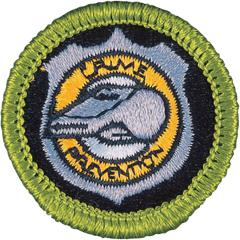

# Crime Prevention Merit Badge

## Overview

Preventing crime, which can be as simple as reducing the opportunities for crime to occur, is far less costly than apprehending and bringing legal action against those who break the law and it helps save people from the anguish of being victims.

## Requirements

- (1) **Laws and Society.** Discuss the following with your counselor:
  - (a) Why we have criminal laws.

    **Resources:** [The Purposes of Criminal Law (video)](https://youtu.be/j9IvbB50YB0)
  - (b) What are types of crimes, including property crimes, crimes against people, white collar crime, and environmental crime.

    **Resources:** [7 Types of Crime (video)](https://youtu.be/BSyY9RRR6ds)
  - (c) Why people commit crimes.

    **Resources:** [Why Do People Commit Crimes? (video)](https://youtu.be/1FD7aMivAek)
  - (d) Why everyone should follow the law even when no one is watching.

    **Resources:** [Why Do We Obey Laws? The Social Contract (video)](https://youtu.be/PgaLe64jUJk?si=X49W-2QPhOORpk9o), [Our Social Contract to Follow the Law (video)](https://youtu.be/Ax2Ig6Y9Ve4?si=BL7BGjL2Flj6DSyV)
  - (e) What is the meaning of crime prevention.

    **Resources:** [What is Crime Prevention? (video)](https://youtu.be/RbObl2KKU7A?si=03soZBeN05po0MOv), [Basic Crime Prevention (video)](https://youtu.be/PS1RmeyTSD0?si=OoWp68p1BqHgG9Hj)

- (2) **Groups Working to Prevent Crime.** Research how the following groups contribute to crime prevention and share your findings with your counselor:
  - (a) Citizens, including youth

    **Resources:** [Neighbors: The Key to Crime Prevention (video)](https://youtu.be/WxWrbx0dmzc), [How Sport Helps to Prevent Crime (video)](https://youtu.be/eVZ-NOoyIIE?si=h1_TsiWRVwr42Kg9)
  - (b) Schools

    **Resources:** [Education Efforts Could Prevent Crime (video)](https://youtu.be/qvjG3lmM3Gk), [Preventing Crime with Education (video)](https://youtu.be/RkMHmdFPkI0?si=kNVJpoq5KCe6R8EC)
  - (c) Neighborhood, social and civic groups, including youth groups

    **Resources:** [Youth Programs Teach Conflict Resolution Skills (video)](https://youtu.be/lx2wS94nk_Q), [Youth Programs Reduce Crime (video)](https://youtu.be/rhk1Yo_mCvA?si=BtB_95Orw4SFKUOq)
  - (d) Private security

    **Resources:** [Security Guards Reduce Crime in LA (video)](https://youtu.be/EGPbHVf-rXc?si=dPcuFJxAjOw8SxE2), [Private Security and Crime Prevention (video)](https://youtu.be/sWHSndoE1U0?si=oOYuRrMomUJShgYY)
  - (e) Law enforcement agencies

    **Resources:** [What is Community Policing? (video)](https://youtu.be/UCMgXMc-So8), [Community Policing (video)](https://youtu.be/TqWdlDABmvo)
  - (f) Courts

    **Resources:** [Problem-Solving Courts (video)](https://youtu.be/whgh6FD53wI), [Colorado's 1st JD Problem Solving Courts (video)](https://youtu.be/TYTiGwoQLKI?si=JA8KETAC8HTA8JXV)
  - (g) Corrections and rehabilitation programs

    **Resources:** [How Norway Reinvented Prison (video)](https://youtu.be/Fb-gOS3p44U), [Humane Incarceration (video)](https://youtu.be/Awgq2rQFm34?si=1_3-dFa9TWAL4stU)

- (3) **Crime in Your Community, State, and Nation.** Do the following:
  - (a) With your parent or guardian's permission and the approval of your counselor, research local, state, or national news coverage of three crimes of different types. Research how common these types of crimes are in your state or in the United States.

    **Resources:** [5 Incredible Prison Rehabilitation Programs (video)](https://www.youtube.com/watch?v=XmqL65ZBx44&t=23s), [What the Data Says About Crime in the U.S. and Substances (video)](https://www.pewresearch.org/short-reads/2024/04/24/what-the-data-says-about-crime-in-the-us/), [Top 5 Common Crimes in the USA (video)](https://www.youtube.com/shorts/_W__yWCaCW0)
  - (b) Record notes on which law enforcement agencies and courts were involved in the pursuit of justice for the victims and the accused person, why you think these crimes were committed, and what could be done to prevent similar crimes. Review your research with your counselor.

- (4) **Home and Neighborhood Crime Prevention.** Do the following:
  - (a) Discuss the following with your counselor:
  - (1) How participation in activities of families, churches, sports teams, and clubs prevents crime.

    **Resources:** [Church members Escape Crime-Ridden Lives (video)](https://youtu.be/GG5UkPNxBHU?si=4vsdLjvlfQEauAOD), [How Can Boxing Clubs Help Prevent Crime (video)](https://youtu.be/oEJoZnsgUZA?si=eaTS6FuXVW2mndEo)
  - (2) How designs of houses, neighborhoods, public buildings, stores, streets, and parks prevent crime.

    **Resources:** [What is CPTED? (video)](https://youtu.be/p3UY1w1O3PA), [Designing Out Crime: CPTED (video)](https://youtu.be/CZ5sVtt9-8I)
  - (b) Conduct a security survey of a home, a neighborhood, a park, or a camp building with adult supervision and following youth protection guidelines using a security checklist in the *Crime Prevention* merit badge pamphlet or one approved by your counselor.

    **Resources:** [Home Security Checklists # 1 and # 2 (PDF)](https://filestore.scouting.org/filestore/Merit_Badge_ReqandRes/Requirement%20Resources/Crime%20Prevention/Home%20Security%20Checklists%20%231%20%232.pdf), [Camp Security Checklists # 1 and # 2 (PDF)](https://filestore.scouting.org/filestore/Merit_Badge_ReqandRes/Requirement%20Resources/Crime%20Prevention/Camp%20Security%20Checklists%20%231%20%232%2001%202026.pdf)
  - (c) Use information from your survey for requirement 4(b) and the EDGE method to develop a lesson about how a family or Scouts can protect themselves from crime. Review your teaching plan with your counselor, then present your lesson to your family or to Scouts.

    **Resources:** [The EDGE Method of Teaching (PDF)](https://www.scouting.org/wp-content/uploads/2019/01/Teaching-Edge-Method.pdf)

- (5) **Retail Crime Prevention.** Research the following topics and review them with your counselor:
  - (a) The impact of shoplifting and employee theft (also known as shrinkage) and loss prevention on retail finances, customer service, and reputation.

    **Resources:** [The Impact of Shoplifting on the Retail Industry (video)](https://youtu.be/sQ3m5T4vk3E)
  - (b) Techniques used by retail stores to prevent shoplifting.

    **Resources:** [How to Prevent Shoplifting (video)](https://youtu.be/j4OJtL7Snko), [Retail Loss Prevention Techniques (video)](https://youtu.be/giFprF8nsKg)

- (6) **Reporting Crime.** Discuss the following with your counselor:
  - (a) When and how to report a crime or an impending crime.

    **Resources:** [How to Report a Crime (video)](https://youtu.be/uPWW3S_LLT4), [How to Report a Crime - Public Safety Minute (video)](https://youtu.be/aMT6wlCOvEM)
  - (b) The warning signs for child abuse and domestic violence and how to report these situations.
  - (c) The three R's of personal safety and protection and how to apply them.
  - (d) How reporting a crime can help law enforcement provide resources for crime victims.

    **Resources:** [Importance of Reporting Crime (video)](https://youtu.be/vZbarQJTs1c)

- (7) **Peers and Crime.** Discuss the following with your counselor:
  - (a) The role that peers play in crime, crime prevention, and experiencing crime.

    **Resources:** [Adolescent Risk-Takers: The Power of Peers (video)](https://youtu.be/2Q4tlPEihAM?si=Ov5f_cNp8hXWWKj3)
  - (b) How to resist peer influence.

    **Resources:** [Positive Peer Influences (video)](https://youtu.be/R3LV5oZPof4?si=OaDJ9tyF9HHGEgu6), [Managing Peer Pressure  (video)](https://youtu.be/SNZ9LHclUvA)
  - (c) Bullying and hazing behaviors and signs that a friend may be bullying you or someone else.

    **Resources:** [Protect Yourself Rules - Bullying (video)](https://youtu.be/4mrE5zgEvt4?si=_KsJzcDzgFI1sPZ3), [The Basics of Bullying (video)](https://youtu.be/eAj2kTQyEGw?si=L8hRIgQlj7BzD3Qc), [Bullying and How to Stop it (video)](https://youtu.be/ffzIhWoi5ac)
  - (d) Explain the impact of gangs on communities.

    **Resources:** [How Gangs Affect Communities (website)](https://youth.gov/youth-topics/preventing-gang-involvement/adverse-effects)

- (8) **Substance Use and Crime.** Discuss the following with your counselor:
  - (a) The legal and health consequences of using alcohol, tobacco and vaping products, illegal drugs, and diverted prescription drugs.

    **Resources:** [The Science of Addiction (video)](https://youtu.be/hBC7i-vHWsU?si=fJxR4B27CYpbWGcz), [Electronic Cigarettes and Vaping (video)](https://youtu.be/9dZS_Rniak0?si=V6A0VHuwIyUIe8ew), [Legal Consequences of Drugs (video)](https://youtu.be/Y4xITbvN7rk), [Drug Abuse, Causes, Signs and Symptoms, Diagnosis and Treatment (video)](https://youtu.be/b6Dte96WdqM?si=t3-nEWs-vlLETkqL)
  - (b) How substance use contributes to violence and property crime and increases a person's risk of becoming a victim of crime.

    **Resources:** [Drugs and Crime (website)](https://ncaddnational.org/addiction_articles/alcohol-drugs-and-crime/), [Crimes Related to Drugs (website)](https://drugabusestatistics.org/drug-related-crime-statistics/)
  - (c) How drug abuse awareness, prevention, and recovery programs help prevent crime.

    **Resources:** [Reduce Crime AND Save Money (video)](https://youtu.be/ATaSk7NzXLc)
  - (d) How to get help if you or someone you know needs help with drugs or alcohol.

    **Resources:** [Finding Help for Drug and Alcohol Disorders (website)](https://findtreatment.gov/), [Treatment Choices for Substance Use Disorders (video)](https://youtu.be/IcLtRTEP7eo)

- (9) **Online Crime and You.** Discuss the following with your counselor:
  - (a) How to avoid being the victim of online crimes.

    **Resources:** [Top 10 Cyber Crimes (video)](https://youtu.be/_IELMnzqVgQ?si=zQ2ST7Jk5EBcUpPo), [Protect Your Personal Information From Hackers and Scammers (website)](https://consumer.ftc.gov/protect-your-personal-information-hackers-scammers#keep)
  - (b) Common online financial scams.

    **Resources:** [Common Online Scams (video)](https://youtu.be/k8UVnkh8i0c)
  - (c) Effective online security.

    **Resources:** [Effective Online Security (video)](https://youtu.be/aO858HyFbKI?si=ynzNZIiw7gdY8d3r), [Digital Safety (video)](https://filestore.scouting.org/filestore/YPSAT/YT%20Mod1%20Final%20Master%20Small.mp4?_gl=1*1npxm9d*_ga*MTk1Mzg0NzM1OS4xNzU1NjM1NDc0*_ga_20G0JHESG4*czE3NTc2MjAyMjAkbzIxJGcxJHQxNzU3NjIwMjU2JGoyNCRsMCRoMA..*_gcl_au*MTU0OTgwNjcyLjE3NTU2MzU0NzQ.&_ga=2.243209291.839854577.1757346029-1953847359.1755635474)
  - (d) Identity theft and how to prevent it.

    **Resources:** [Preventing Identity Theft (video)](https://youtu.be/kDFeSUUwRnA), [How to Prevent Identity Theft (video)](https://youtu.be/zq8ErbZzcbI)
  - (e) How criminals use social media to target victims.

    **Resources:** [How Criminals Use Social Media (video)](https://youtu.be/5bdBvNCBeho?si=qbnnwkHshfttTu8f)
  - (f) How bullying, texting, and sharing photos can become crimes.

    **Resources:** [Bullying Awareness (website)](https://www.scouting.org/training/youth/bullying/), [Prevention: Learn How to Identify Bullying and Stand Up to It Safely (website)](https://www.stopbullying.gov/), [Top 10 Forms of Cyber Bullying (video)](https://youtu.be/0Xo8N9qlJtk?si=9EbwzuBmLSEyDL-c), [Bullying (video)](https://filestore.scouting.org/filestore/YPSAT/YT%20Mod2%20Final%20Master%20Small.mp4)

- (10) **Interview.** With your parent or guardian's permission and your counselor's approval, interview a law enforcement officer or a civil servant about their work in crime prevention. Learn about how they chose this career and about their duties. Discuss what you learned with your counselor.

- (11) **Careers.** Identify three career opportunities that would use skills and knowledge in the field of crime prevention. Pick one and research the training, education, certification requirements, experience, and expenses associated with entering the field. Research the prospects for employment, starting salary, advancement opportunities and career goals associated with this career. Discuss what you learned with your counselor and whether you might be interested in this career.

  **Resources:** [8 Careers in Criminal Justice (video)](https://youtu.be/eqTjWF4GRm0?si=rRKOb3rTcAHM4CpT), [How Law Enforcement Agencies Serve the Public (video)](https://youtu.be/kR-yLbFoR9A?si=gdzqOCdcfn32XOD_)

## Resources

- [Crime Prevention merit badge page](https://www.scouting.org/merit-badges/crime-prevention/)
- [Crime Prevention merit badge PDF](https://filestore.scouting.org/filestore/Merit_Badge_ReqandRes/Pamphlets/Crime%20Prevention.pdf) ([local copy](files/crime-prevention-merit-badge.pdf))
- [Crime Prevention merit badge pamphlet](https://www.scoutshop.org/mbp-4c-crime-prevention-641575.html)
- [Crime Prevention merit badge workbook PDF](http://usscouts.org/mb/worksheets/Crime-Prevention.pdf)
- [Crime Prevention merit badge workbook DOCX](http://usscouts.org/mb/worksheets/Crime-Prevention.docx)

Note: This is an unofficial archive of Scouts BSA Merit Badges that was automatically extracted from the Scouting America website and may contain errors.