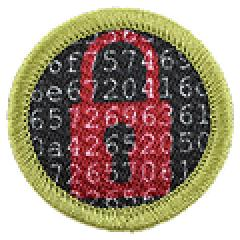

# Cybersecurity Merit Badge

## Overview

The Cybersecurity Merit Badge equips Scouts with essential knowledge and skills to navigate and protect the digital world. Scouts learn about online safety, ethical behavior, cyber threats, and how to defend against them using tools like firewalls, antivirus software, and strong passwords. They explore encryption, connected devices, and the risks of public Wi-Fi, while also practicing safe habits like updating software and backing up data. Through hands-on activities, Scouts investigate real-world cyber incidents, participate in cybersecurity challenges, and explore career opportunities in the field.

## Requirements

* (1) Safety. Do the following:
    * (a) View the Personal Safety Awareness "Digital Safety" video (with your parent or guardian's permission).Resources: [Personal Safety Awareness "Digital Safety" (video)](https://www.scouting.org/training/youth-protection/scouts-bsa/)
    * (b) Explain to your counselor how to protect your digital footprint, such as while using social media, mobile device apps, and online gaming. Show how to set privacy settings to protect your personal information, including photos of yourself or your location. Resources: [Protecting Your Digital Footprint - Keys to Cybersecurity (website)](https://cyber.org/find-curricula/protecting-your-digital-footprint-keys-cybersecurity) [Big Data Privacy, Security, & Liability Issues: CompTIA's Future of Tech (website)](https://www.futureoftech.org/big-data/5-privacy-security-liability/)
    * (c) Discuss first aid and prevention for potential injuries, such as eye strain, repetitive injuries, and handling electronics devices, that could occur during repeated use. Discuss how to keep yourself physically safe while using a mobile device (for example while walking or biking).Resources: [How to Avoid Strained Eyes From Staring at Digital Screens (video)](https://youtu.be/Vgrqa189Jy0) [Doctors Share How to Prevent Smartphone Related Injuries Like "Text Neck" and "Smartphone Pinky." (video)](https://youtu.be/FDpmRs0L_a8?si=PB1kWqGRScAO8mML) [Computer Ergonomics (website)](https://www.kidsplus.com/parent-resources/doctors-notes/computer-ergonomics/)

* (2) Ethics. Do the following:
    * (a) Relate three points of the Scout law to things people do on the internet or with computers, phones, and other connected electronic devices.Resources: [Code of Ethics (website)](https://www.eccouncil.org/code-of-ethics/) [The Ten Commandments of Computer Ethics (website)](http://cpsr.org/issues/ethics/cei/)
    * (b) Discuss with your counselor examples of ethical and unethical behavior in cyberspace. Include how to act responsibly when you encounter situations such as: coming across an unattended or unlocked computer or mobile device; observing someone type their password or seeing it written down near a computer; or discovering a website that is not properly secured. Explain why these situations require good judgement, and how the Scout Law and personal values should guide your actions. Resources: [Ethical Issues in Cybersecurity: CompTIA's Future of Tech (website)](https://www.futureoftech.org/cybersecurity/4-ethical-issues-in-cybersecurity/) [Understanding Cybersecurity Ethics: Navigating Privacy and Security Challenges (website)](https://onlinelaw.csuohio.edu/understanding-cybersecurity-ethics-and-navigating-moral-complexities/)

* (3) Fundamentals. Do the following and discuss each with your counselor:
    * (a) Describe three types of computer systems that need protecting and explain why. Resources: [Cybersecurity Explained | Future of Tech (video)](https://youtu.be/n_kKEimNhgY) [What Is Cybersecurity? Why Do We Need Cybersecurity? (website)](https://www.futureoftech.org/cybersecurity/1-what-is-cybersecurity/#section-1) [The Impact of Cybersecurity (website)](https://www.futureoftech.org/cybersecurity/5-impact-of-cybersecurity/) [Cybersecurity in Critical Infrastructure: Protecting Power Grids and Smart Grids (website)](https://www.cyberdefensemagazine.com/cybersecurity-in-critical-infrastructure-protecting-power-grids-and-smart-grids/)
    * (b) Explain the "C.I.A. Triad"—Confidentiality, Integrity, and Availability—and why these three principles are fundamental to cybersecurity. Resources: [What Is the CIA Triad (IBM Technology) (video)](https://youtu.be/kPPFNrlN3zo) [What Is the CIA Triad? | Coursera (website)](https://www.coursera.org/articles/cia-triad)

* (4) Cyber Threats, Vulnerabilities, and Attacks.  Do the following and discuss each with your counselor:
    * (a) Define the terms vulnerability, threat, and exploit, and give an example of each that might apply to a website or software product you use. Resources: [The Internet: Cybersecurity & Crime (video)](https://www.youtube.com/watch?v=AuYNXgO_f3Y) [Hackers & Cyber Attacks: Crash Course Computer Science #32 (video)](https://www.youtube.com/watch?v=_GzE99AmAQU&list=PL8dPuuaLjXtNlUrzyH5r6jN9ulIgZBpdo&index=33) [Protecting Your Digital Footprint - Keys to Cybersecurity (website)](https://cyber.org/find-curricula/protecting-your-digital-footprint-keys-cybersecurity)
    * (b) Pick one type of malware (such as virus, worm, Trojan, backdoor, spyware, or ransomware) and find out how it works. Explain what it does and the harm it can cause. Resources: [Computer Malware (Article) | Cyber Attacks | Khan Academy (website)](https://www.khanacademy.org/computing/computers-and-internet/xcae6f4a7ff015e7d:online-data-security/xcae6f4a7ff015e7d:cyber-attacks/a/computer-malware) [Every Type of Computer Virus Explained in 8 Minutes (video)](https://youtu.be/VJFaO2-zsCU?si=Osg7sPJeQxuEn_sq) [5 of the Worst Computer Viruses Ever (video)](https://youtu.be/DF8Ka8Jh0BQ?si=7_syjQas6G1D2Ozo)
    * (c) Identify two risks of using public Wi-Fi and describe how to reduce or avoid those risks. Resources: [Is Public Wi-Fi Safe? (video)](https://youtu.be/bdVkkRmJEeM) [Connected Devices - Keys to Cybersecurity (website)](https://cyber.org/find-curricula/connected-devices-keys-cybersecurity) [Hacker Demonstrates Security Risks Of Free Public Wi-Fi (video)](https://youtu.be/1OVTmrXGHyU)
    * (d) Describe what spoofing and phishing are, and how to recognize a message or website that might be trying to trick you. Explain what steps you should take to protect yourself and others if you come across one.Resources: [Online Threats and Vulnerabilities - Keys to Cybersecurity (website)](https://cyber.org/find-curricula/online-threats-and-vulnerabilities-keys-cybersecurity) [How Not to Get Hacked: Phishing (video)](https://youtu.be/YfiM8rXg3ug?si=rA27tZlUPj9wrVfS) [Be Internet Alert (website)](https://beinternetawesome.withgoogle.com/)
    * (e) Current Events. Do ONE of the following:
        * (1) Read an article or a news report about a recent cybersecurity incident, such as a data breach or malware infection. Explain how the incident happened (to the best of your ability based on the information available) and what the consequences are or might be to the victim. Resources: [Featured Conversation Starters - Savvy Cyber Kids (website)](https://savvycyberkids.org/tech-talk/featured-conversation-starters/) [Krebs on Security - In-Depth Security News and Investigation (website)](https://krebsonsecurity.com/) [Security News: Cybersecurity, Hacks, Privacy, National Security | WIRED (website)](https://www.wired.com/category/security/) [Cybersecurity News, Insights and Analysis | SecurityWeek (website)](https://www.securityweek.com/)
        * (2) With your parent or guardian's permission, watch a movie or read a book in which cybersecurity plays a significant role. Discuss how cybersecurity topics were depicted and how realistic you think it was. Resources: Suggested Movies: WarGames (1983, PG), Tron (1982, PG), Code 2600 (2011 Documentary, PG), Superman III (1983, PG), Scooby-Doo and the Cyber Chase (2001, Not Rated), Cyber War 2022 (2023 Documentary, G), Hackers (1995, PG-13), Terms and Conditions May Apply (2013 Documentary, Not Rated), Cyber War (2016 Documentary, Not Rated), and Zero Days (2016 Documentary, PG-13).  Suggested Books: The Cuckoo's Egg by Cliff Stoll, Tom Clancy's Net Force Explorers YA series, The Enigma Girls: How Ten Teenagers Broke Ciphers, Kept Secrets, and Helped Win World War II by Candace Fleming, Cyber-Thief Showdown (Geronimo Stilton #68) by Geronimo Stilton, Little Brother by Cory Doctorow (read for free online), Cyberama: A Children's Book on Internet Safety and Cybersecurity, The Renegade Reporters by Elissa Brent Weissman, The Oracle Code by Marieke Nijkamp, Hacker by Malorie Blackman, and City Spies series by James Ponti.

    * (f) Create a list of what is part of your cyber attack surface including all the ways someone could try to access your personal information or devices—such as online accounts, apps, or home networks. Resource: [What Is an Attack Surface? | Cybersecurity Explained in 60 Seconds (video)](https://youtu.be/70gFQXARYzA?si=wvC4SEU3IfYWuVgC)

* (5) Cyber Defenses. Do the following:
    * (a) Describe three technologies that are used to defend a computer or network, such as access controls, antivirus software, firewall, intrusion detection/prevention systems, and Virtual Private Network. Resources: [Cybersecurity: Crash Course Computer Science #31 (video)](https://youtu.be/bPVaOlJ6ln0) [Understanding Firewalls for Home and Small Office Use | CISA (website)](https://www.cisa.gov/news-events/news/understanding-firewalls-home-and-small-office-use) [Technologies in Cybersecurity: CompTIA's Future of Tech (website)](https://www.futureoftech.org/cybersecurity/3-technologies-in-cybersecurity/)
    * (b) Installing updates. Do the following:
        * (1) Explain to your counselor the importance of installing the latest updates on your computer, why they are needed, and what kinds of problems they can prevent. Resources: [How Not To Get Hacked: Install Updates (Code.org) (video)](https://youtu.be/goMnkhKBOHY?si=Kw59euFrK7E6ZGhk) [How Important Are Software Updates (website)](https://www.safesearchkids.com/how-important-are-software-updates-for-device-safety-and-your-protection/)
        * (2) Demonstrate to your counselor how to check for, download, and install the latest updates for your computer or mobile device, or another computer you have permission to use (if you are unable to do this on your computer, you may use an online guide with screenshots to demonstrate this). Show your counselor how to verify that your computer or mobile device is up-to-date. Resource: [Keep Your Device's Operating System and Applications Up to Date | CISA (website)](https://www.cisa.gov/resources-tools/training/keep-your-devices-operating-system-and-applications-date)

    * (c) System security. With your parent or guardian's permission, do THREE of the following using a computer or mobile device, and discuss with your counselor:
        * (1) Describe what makes a good password and why. Set or change an account password to one that is "strong." Resources: [How Not to Get Hacked: Passwords (video)](https://youtu.be/qLMIK5YVgfA?si=LPZXpV7kjyz8FXnS) [Defense in Depth - Keys to Cybersecurity | Cyber.org (website)](https://cyber.org/find-curricula/defense-depth-keys-cybersecurity) [Why Creating a Strong password Really Matters | Khan Academy (website)](https://www.khanacademy.org/college-careers-more/internet-safety/xef9bb6e081c9f4ff:online-data-security/xef9bb6e081c9f4ff:pii-personally-identifiable-information/v/why-creating-a-strong-password-really-matters) [Secure Your Secrets (website)](https://beinternetawesome.withgoogle.com/en_us)
        * (2) Describe multi-factor authentication (MFA) and how it can be used to improve security. Demonstrate how to use an authenticator app or other MFA function. Resources: [Defense in Depth - Keys to Cybersecurity | Cyber.org (website)](https://cyber.org/find-curricula/defense-depth-keys-cybersecurity) [Multi-factor Authentication | Khan Academy (website)](https://www.khanacademy.org/computing/computers-and-internet/xcae6f4a7ff015e7d:online-data-security/xcae6f4a7ff015e7d:user-authentication-methods/a/multi-factor-authentication) [Multi-factor Authentication Facts (website)](https://kids.kiddle.co/Multi-factor_authentication)
        * (3) Install and set up a password manager. Demonstrate how it works to your counselor. Resource: [Yes, You Need a Password Manager. Here's Why | Khan Academy (website)](https://www.khanacademy.org/college-careers-more/internet-safety/xef9bb6e081c9f4ff:online-data-security/xef9bb6e081c9f4ff:pii-personally-identifiable-information/v/yes-you-need-a-password-manager-heres-why)
        * (4) Run a virus scan. Show the results to your counselor. Resources: [Understanding Anti-Virus Software | CISA (website)](https://www.cisa.gov/news-events/news/understanding-anti-virus-software) [Ensure Your OS Antivirus and Anti-Malware Protections are Active | CISA (website)](https://www.cisa.gov/resources-tools/training/ensure-your-os-antivirus-and-anti-malware-protections-are-active) [How to Start a Scan for Viruses or Malware in Microsoft Defender - Microsoft Support (website)](https://support.microsoft.com/en-us/topic/how-to-start-a-scan-for-viruses-or-malware-in-microsoft-defender-e98663f1-8827-4abe-b9ce-fb2664201f29#id0edh=windows) [How to Run a Virus Scan on Windows 11: A Step-by-Step Guide - Solve Your Tech (website)](https://www.solveyourtech.com/how-to-run-a-virus-scan-on-windows-11-a-step-by-step-guide/) [How to Scan an Android Phone for Malware - Android Authority (website)](https://www.androidauthority.com/scan-android-viruses-3208378/) [MalwareBytes Free Virus Scanner (website)](https://www.malwarebytes.com/solutions/virus-scanner) [Free Online Virus Scan | Trend Micro HouseCall | Trend Micro (US) (website)](https://www.trendmicro.com/en_us/forHome/products/housecall.html)
        * (5) Using a command line or other built-in tool, see what programs or processes are running on your computer. Discuss with your counselor what you see and what surprises you. Resources: [How to View All Running Processes in Windows 10 & 11 (video)](https://youtu.be/s76tertusoU) [How to Tell What's Running in the Background on Your PC (video)](https://youtu.be/7pNwyPDHqmw) [View Information About Mac Processes in Activity Monitor - Apple Support (video)](https://support.apple.com/en-bw/guide/activity-monitor/actmntr1001/mac#) [Kill Apps and Processes on Chromebook Using the Task Manager (video)](https://youtu.be/Mg0vwI2ZmMA) [How to Access Your Chromebook's Task Manager (video)](https://helpdeskgeek.com/how-to-access-your-chromebooks-task-manager/)
        * (6) Use a command line interface to view your computer's open network connections. Discuss the results with your counselor. Resources: [How to Use the Netstat Command (video)](https://www.youtube.com/shorts/4WO5LFVNZrQ) [How to Use the Netstat Command on Mac (website)](https://www.lifewire.com/using-netstat-command-on-mac-4176069) [View Your Linux Server's Network Connections With Netstat | Opensource.com (website)](https://opensource.com/article/22/2/linux-network-security-netstat)
        * (7) Demonstrate how to back up your data from a mobile device to a local computer or the cloud. Resources: Apple: [How to Back Up With iCloud - Apple Support (website)](https://support.apple.com/en-us/108366)  [How to Back up Your iPhone, iPad, and iPod Touch - Apple Support (website)](https://support.apple.com/en-us/118426#) [iCloud Data Security Overview - Apple Support (website)](https://support.apple.com/en-us/102651)Android: [Back Up or Restore Data on Your Android Device - Android Help (google.com) (website)](https://support.google.com/android/answer/2819582) [Back Up Your Device - Android - Google One Help (website)](https://support.google.com/googleone/answer/9149304)
        * (8) Research best practices for protecting a home computer or network, and make a checklist of FIVE things you and your family can do to stay secure. Resources: [How to Secure My Home (website)](https://consumer.ftc.gov/articles/how-secure-your-home-wi-fi-network) [Home Network Security | CISA (website)](https://www.cisa.gov/news-events/news/home-network-security) [Best Practices for Securing Your Home Network | NSA (PDF)](https://media.defense.gov/2023/Feb/22/2003165170/-1/-1/0/CSI_BEST_PRACTICES_FOR_SECURING_YOUR_HOME_NETWORK.PDF)
        * (9) Identify one or more other vulnerabilities on your home computer or network or another computer or network you have permission to use and discuss with your counselor. With permission from the system owner, take the necessary actions to fix it.

* (6) Cryptography. Do the following:
    * (a) Research and explain to your counselor three situations where encryption is used in cybersecurity. For each situation, describe what kind of encryption is used and why it is important. Resources: [Cryptography: Crash Course Computer Science #33 (video)](https://youtu.be/jhXCTbFnK8o) [The Science of Codes: An Intro to Cryptography (video)](https://youtu.be/-yFZGF8FHSg) [The Need for Encryption | Khan Academy (website)](https://www.khanacademy.org/computing/computers-and-internet/xcae6f4a7ff015e7d:online-data-security/xcae6f4a7ff015e7d:data-encryption-technique) [The Internet: Encryption & Public Key (Code.org) (video)](https://youtu.be/ZghMPWGXexs?si=phsRddmgMqpOOC4T)
    * (b) Show how you can know if your connection to a website is encrypted.Resources: [How Not to Get Hacked: Websites and Wi-Fi (video)](https://www.youtube.com/watch?v=E3imvkP3IC0) [HTTP Secure (HTTPS) | Khan Academy (website)](https://www.youtube.com/watch?v=E3imvkP3IC0)
    * (c) Do ONE of the following:
        * (1) Create your own encryption code, such as a substitution cipher or code book, and demonstrate using it to encrypt and decrypt a message. Describe the strengths and weaknesses of your code. Resources: [Encryption, Decryption, and Cracking | Khan Academy (website)](https://www.khanacademy.org/computing/computers-and-internet/xcae6f4a7ff015e7d:online-data-security/xcae6f4a7ff015e7d:data-encryption-techniques/a/encryption-decryption-and-code-cracking) [Symmetric Encryption Techniques | Khan Academy (website)](https://www.khanacademy.org/computing/computers-and-internet/xcae6f4a7ff015e7d:online-data-security/xcae6f4a7ff015e7d:data-encryption-techniques/a/symmetric-encryption-techniques) [How to Create Substitution Ciphers: 9 Steps (With Pictures) (website)](https://www.wikihow.com/Create-Substitution-Ciphers)
        * (2) Download and set up an app (from an official app store) that uses end-to-end encryption. Explain to your counselor what this means, how it works, and why it is more secure than other forms of communication (e.g. SMS). Resources: [The Best Private Messaging Apps for 2025 | PCMag (website)](https://www.pcmag.com/picks/best-secure-messaging-apps) [The Best Encrypted Messaging Apps in 2025 | Tom's Guide (website)](https://www.tomsguide.com/reference/best-encrypted-messaging-apps) [The Seven Best Secure Messaging Apps With End-to-End Encryption | The Verge (website)](https://www.theverge.com/23186209/best-secure-messaging-apps-end-to-end-encryption-e2ee) [NSA Warning-Change Your iPhone and Android Message Settings (website)](https://www.forbes.com/sites/zakdoffman/2025/03/31/nsa-warns-iphone-android-users-change-message-settings/)
        * (3) Use a hashing tool (for example, using SHA or MD5) to create a checksum for a file, document, or piece of text. Have a fellow Scout or your counselor make a change to it, then recreate the checksum and compare the new checksum to the original as a demonstration of file integrity checking. Resources: [Hashing Algorithms and Security - Computerphile (video)](https://youtu.be/b4b8ktEV4Bg) [Online Hash Calculator - Online Tools (website)](https://www.tools4noobs.com/online_tools/hash/) [How to Quickly Verify MD5, SHA1, and SHA2 (256, 384, 512) Checksum in Windows Using Command Prompt (video)](https://youtu.be/YM2CE6zKvoo)
        * (4) Create your own PGP (pretty good privacy) email key. Share your public key with others (and your counselor). Also, get their public keys and add them to your computer's key ring. Send a message that has been digitally encrypted. Resources: [PGP Encryption With Kleopatra - Kevin's Guides (website)](https://kevinsguides.com/guides/security/software/pgp-encryption/) [How to Use PGP/GPG Encryption - in 2 Minutes - PGP /GPG Tutorial for Beginners (video)](https://www.youtube.com/watch?v=4PZb0tkxuUk)

* (7) Connected Devices and Internet of Things (IoT).  Describe to your counselor four electronic devices you encounter that could be connected to the internet, why this connectivity can be useful, what risks are posed by the connectivity, and how they could be protected.  Resources: [Connected Devices - Keys to Cybersecurity | Cyber.org (website)](https://cyber.org/find-curricula/connected-devices-keys-cybersecurity)  [Internet of Things | What is IoT ? | How IoT Works? | IoT Explained in 6 Minutes | Simplilearn (video)](https://youtu.be/6mBO2vqLv38?si=oL7nZ2GdFqQ7SVIA)  [What is the Internet of Things (IoT)? | IBM (website)](https://www.ibm.com/think/topics/internet-of-things)
* (8) Cybersecurity Activities. Do ONE of the following:
    * (a) Learn about a cybersecurity competition, camp, or other activity you could participate in (either now or in the future). Share what you learned with your counselor, including the type of activity, time commitment, and age of participants. Resources: [CyberPatriot: National Youth Cyber Defense Competition (website)](https://www.uscyberpatriot.org/) [picoCTF - CMU Cybersecurity Competition (website)](https://picoctf.org/) [AFA CyberCamps (website)](https://www.uscyberpatriot.org/afa-cybercamps/overview) [U.S. Cyber Camp (website)](https://www.rocketcenter.com/SpaceCamp) [National Cyber League (website)](https://nationalcyberleague.org/)
    * (b) Participate in a cybersecurity competition with members of your troop, school, or some other group approved by your counselor. Either design your own competition or use an existing platform. Resources: [Cyber Challenge: Online Cybersecurity Game | Cybermission (website)](https://www.cybermission.tech/game) [NCF Cybersecurity Computer Gaming Series (website)](https://cryptologicfoundation.org/students/games/cybersecurity-computer-gaming.html) [Cyber Threat Defender · The UTSA CIAS (website)](https://cias.utsa.edu/ctd/) [K-12 Cybersecurity Games · The UTSA CIAS (website)](https://cias.utsa.edu/k-12/cybersecurity-games/) [picoCTF - CMU Cybersecurity Competition (website)](https://picoctf.org/)
    * (c) Give a presentation to your patrol, troop, or another group approved by your counselor, on a cybersecurity topic of your choice. Your presentation must include at least one demonstration and/or hands-on activity.

* (9) Careers. Do ONE of the following:
    * (a) Identify three career opportunities that would use skills and knowledge in cybersecurity. Pick one and research the training, education, certification requirements, experience, and expenses associated with entering the field. Research the prospects for employment, starting salary, advancement opportunities and career goals associated with this career. Discuss what you learned with your counselor and whether you might be interested in this career. Resources: [Career Exploration Cards | Cyber.org (PDF)](https://cyber.org/sites/default/files/2025-04/) [Degrees & Certifications | Cyber.org (website)](https://cyber.org/career-exploration/degrees-certifications) [Information Security and Forensics Analyst | What I Do (video)](https://youtu.be/f_69UzSfBsA?si=yaS27J2ojq32wcj1) [Careers in Cybersecurity: CompTIA's Future of Tech (website)](https://www.futureoftech.org/cybersecurity/6-careers-in-cybersecurity/) [Military Cybersecurity Careers & Training | Cybermission (website)](https://www.cybermission.tech/careers-and-training) [NCF Panel Discussion about Cybersecurity Careers | #CyberChats (podcast)](https://cryptologicfoundation.org/students/cyberchats/archive.html/article/2022/02/16/careers-in-cybersecurity-an-ncf-panel-discussion)
    * (b) Visit a business or organization that does work in cybersecurity. Find out about different work roles, what they do, and how they acquired their knowledge through college degrees or certifications. Share what you learned with your counselor.

## Resources

- [Cybersecurity merit badge page](https://www.scouting.org/merit-badges/cybersecurity/)
- [Cybersecurity merit badge pamphlet](None)

Note: This is an unofficial archive of Scouts BSA Merit Badges that was automatically extracted from the Scouting America website and may contain errors.