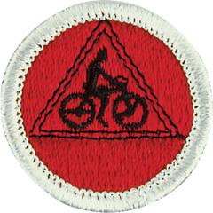

# Cycling Merit Badge

## Overview

**Eagle required**

Since 1911, hundreds of thousands of Scouts have made the most of their two-wheel adventures by earning the Cycling merit badge. Whether you just got your first bicycle or have been cycling for years, you will learn more about your bike and what it can do by working on the requirements for this badge.

## Requirements

* NOTE:  The official merit badge pamphlets are now free and downloadable  [HERE](https://filestore.scouting.org/filestore/Merit_Badge_ReqandRes/Pamphlets/Cycling.pdf) or can be purchased at the [Scout Shop.](https://www.scoutshop.org/)
* (1) Do the following: Resource: [Hazards, Prevention, and First Aid | Produced by Scouting America (video)](https://vimeo.com/1125028263)
    * (a) Explain to your counselor the most likely hazards you may encounter while participating in cycling activities and what you should do to anticipate, help prevent, mitigate, and respond to these hazards. Explain to your counselor how to ride predictably, be conspicuous, think ahead, and ride ready. Resource: [Avoiding Road Hazards (video)](https://www.youtube.com/watch?v=dcRpBP9WvKg%20)
    * (b) Show that you know first aid for injuries or illnesses that could occur while cycling, including cuts, scratches, concussions, blisters, sunburn, heat exhaustion, heatstroke, hypothermia, frostbite, dehydration, insect stings, tick bites, and snakebite. Explain to your counselor why you should be able to identify the poisonous plants and poisonous animals that are found in your area. Resource: [First Aid Guide for Mountain Bikers (video)](https://www.youtube.com/watch?v=oPCWzECMD_4%20)
    * (c) Explain the importance of wearing the right clothing and gear while cycling, including a properly sized and fitted helmet. Know the Scouting America Bike Safety Guidelines. Resources: [Bike Tips: Gear to Make Your Ride More Comfortable (video)](https://www.youtube.com/watch?v=2TYe3APtKtc&list=PLHGEvyG5wuthKCwDfpQIZfTfan4mI6XTe&index=5%20) [How to Wear a Helmet (video)](https://www.youtube.com/watch?v=T3u51W0LN2U%20)

* (2) Describe your state and local laws concerning bicycles. Discuss what is the  same and what is different from laws applying to motor vehicles. Explain  where and how you should ride on roads and streets to include lane position,  changing lanes, making left and right turns, and riding through intersections. Resources: [Bicycle Laws and Safe Road Riding | Produced by Scouting America (video)](https://vimeo.com/1125028107)  [Rules of the Road (video)](https://youtu.be/-Jp0SSAeCiY)
* (3) Explain the importance of wearing a properly sized and fitted helmet while cycling and of wearing the right clothing for the weather. Know the Scouting America Bike Safety Guidelines. Resource:  [Fitting a Bike Helmet (video)](https://www.youtube.com/watch?v=hLlXswx0VvQ )
* (4) Using a bicycle safety checklist, clean and adjust a bicycle and present it to  your counselor for inspection. Do the following: Resource: [Checklist, Maintenance, and Inspection | Produced by Scouting America (video)](https://vimeo.com/1125028194)
    * (a) Show points that should be checked regularly to make sure the bicycle is safe to ride. Resource: [5 Things to Check Before Every Bike Ride (website)](https://scoutlife.org/features/169458/5-things-to-check-before-every-bike-ride/)
    * (b) Show how to adjust the saddle and handlebars for a proper fit. Resources: [Bike Tips: Finding and Fitting the Right Bike (video)](https://www.youtube.com/watch?v=dsM9brngVmc&list=PLHGEvyG5wuthKCwDfpQIZfTfan4mI6XTe&index=6%20) [How to Set Your Bicycle Seat Height (video)](https://www.youtube.com/watch?v=jh5Zv6Dcn6k%20)
    * (c) Show how to adjust brakes and gear shifting (derailleurs). Resource: [Bike Tips: Proper Shifting Technique (video)](https://www.youtube.com/watch?v=7kc-CHtlQyM&list=PLHGEvyG5wuthKCwDfpQIZfTfan4mI6XTe&index=7%20)
    * (d) Show all points that need regular lubrication.
    * (e) Show how to repair a flat by removing the tire, replacing or patching the tube, and remounting the tire. Resources: [Changing a Tire with Disc Brakes | Produced by Scouting America (video)](https://vimeo.com/1125028160) [Changing a Tire with Caliper Brakes | Produced by Scouting America (video)](https://vimeo.com/1125028134)
    * (f) Show that the bicycle meets local laws. Resource: [Rules of the Road (video)](https://www.youtube.com/watch?v=-Jp0SSAeCiY%20)

* (5) Demonstrate basic bicycle handling skills to your counselor, to include how to  properly mount your bicycle, starting and stopping (to include emergency  stops), riding in a straight line, turning, shifting gears, scanning, and signaling. Resources: [Mastering Handling Basic Bicycle Handling Skills | Produced by Scouting America (video)](https://vimeo.com/1125028294)  [Bicycle Safer Journey (video)](https://youtu.be/XMj_95C5ihk)  [Bike Riding Safety (video)](https://youtu.be/nf5WQXFvrkk)
* (6) Using the Scouting America buddy system, complete all of the requirements for ONE of the following options: Road Biking OR Trail or Mixed Surface Biking. Resource:  [Barriers to Abuse (PDF)](https://www.scouting.org/wp-content/uploads/2024/09/Youth-Safety-Infographic-Barriers-to-Abuse-1536x1363.png )
    * A Option A—Road Biking. Do the following: Resource: [Advanced Techniques for Urban Riding | Produced by Scouting America (video)](https://vimeo.com/1125028086)
        * (a) Take a road safety test with your counselor and demonstrate the following:
            * (1) On an urban street with light traffic, properly execute a left turn from the center of the street; also demonstrate an alternate left-turn technique used during periods of heavy traffic. Resources: [Bike Safety | Hand Signals (video)](https://www.youtube.com/watch?v=v_hRsNHlq8M%20) [Bike Hand Signals (PDF)](https://static.nhtsa.gov/nhtsa/downloads/NTI/Responsible_Walk-Bike_Activities/ComboLessons/L3Handouts/8009_HandSignals_122811_v1a.pdf)
            * (2) Properly execute a right turn. Resource: [Bike Safety | Hand Signals (video)](https://www.youtube.com/watch?v=v_hRsNHlq8M)
            * (3) Demonstrate appropriate actions at a right-turn-only lane when you are continuing straight. Resource: [Bike Safety | Hand Signals (video)](https://www.youtube.com/watch?v=v_hRsNHlq8M)
            * (4) Show proper curbside and road-edge riding. Show how to ride safely along a row of parked cars. Resource: [Bike Safety | Hand Signals (video)](https://www.youtube.com/watch?v=v_hRsNHlq8M)
            * (5) Cross railroad tracks properly. Resource: [How to Cross Railroad Tracks (video)](https://www.youtube.com/watch?v=62jc3-6Jgdw%20)

        * (b) Avoiding main highways, take two rides of 10 miles each, two rides of 15 miles each, and two rides of 25 miles each. You must make a report of the rides taken. List dates for the routes traveled, and interesting things seen on the ride. Resources: [Bikeability Checklist (PDF)](https://www.nhtsa.gov/sites/nhtsa.gov/files/bikabilitychecklist1.pdf) [MapMyRide (website)](https://www.mapmyride.com/)
        * (c) After completing requirement b for the road biking option, do ONE of the following:
            * (1) Lay out on a road map a 50-mile trip. Stay away from main highways. Using your map, make this ride in eight hours or less. Resource: [MapMyRide (website)](https://www.mapmyride.com/)
            * (2) Participate in an organized bike tour of at least 50 miles. Make this ride in eight hours or less. Afterward, use the tour's cue sheet to make a map of the ride. Resource: [Cue Sheets (website)](https://lifeisabeautifuldetail.com/blog/cue-sheets)

    * B Option B—Trail or Mixed Surface Biking.  Do the following: Note: These requirements may be completed using a mountain bike or other properly equipped, manually-powered cycle such as a gravel bike, tandem bike, hand-powered bike, recumbent bike, adult tricycle, or adaptive cycle. If a tandem bike is used, the Scout must actively power the cycle in concert with the other rider.
        * (a) Demonstrate the following mountain bike handling skills to your counselor:
            * (1) Neutral position, ready position, bike body separation (side to side, and forward and back), and body positioning for cornering Resources: [The Basics of Cornering: Berms and Flat Corners (video)](https://youtu.be/UCWu6zXDjXM?si=akxjbkFYRrChevnX) [Advanced MTB Cornering Techniques: Body Position & Technical Terrain (video)](https://www.youtube.com/watch?v=Ammz64zxnhg%20)
            * (2) Show shifting skills as applicable to climbs and obstacles. Resource: [Bike Tips: Proper Shifting Technique (video)](https://www.youtube.com/watch?v=7kc-CHtlQyM&list=PLHGEvyG5wuthKCwDfpQIZfTfan4mI6XTe&index=7%20)
            * (3) Show proper technique for riding up (seated, crouched, and standing) and down hills. Resources: [Make Climbing Easier With Proper Body Position (video)](https://youtu.be/aDwqM_ZVSUg?si=5RolaSMGLshbWZzS) [Steep & Technical Climbs Made Easy With Proper Gearing & Choice of Line (video)](https://www.youtube.com/watch?v=Rd-wFxmXmsM%20) [How to Climb Any Hill on Your Mountain Bike (video)](https://www.youtube.com/watch?v=4knf7exmrAQ%20) [Don't Make These Common Climbing Mistakes (video)](https://www.youtube.com/watch?v=k6ewOO9rXXY%20)

        * (b) Take a trail safety test with your counselor and demonstrate the following:
            * (1) Show proper trail etiquette to hikers and other cyclists, including when to yield the right-of-way.
            * (2) Demonstrate how to correctly cross an obstacle by either going over the obstacle on your bike or dismounting your bike and crossing over or around the obstacle Resource: [How to Jump a Log on a Mountain Bike (video)](https://www.youtube.com/watch?v=Hp_jDNN6XfQ)
            * (3) Cross rocks, gravel, and roots properly Resource: [How to Jump a Log on a Mountain Bike (video)](https://www.youtube.com/watch?v=Hp_jDNN6XfQ)

        * (c) Describe the rules of trail riding, including how to know when a trail is unsuitable for riding.Resources: [Sharing Our Trails (website)](https://trailetiquette.org/) [Trail Manners (website)](https://www.tfnu.org/trail-etiquette/) [Tread Lightly (website)](https://treadlightly.org/learn/recreation-tips/sharing-our-trails/%20)
        * (d) On mountain biking or multi-use trails approved by your counselor, take two rides of 2 miles each, two rides of 5 miles each, and two rides of 8 miles each. You must make a report of the rides taken. List dates for the routes traveled, and interesting things seen. Resource: [MapMyRide (website)](https://www.mapmyride.com/)
        * (e) After fulfilling the previous requirement, lay out on a trail map a 22-mile trip. You may include multiple trail systems, if needed. Stay away from main highways. Using your map, complete this ride in one day. Resource: [MapMyRide (website)](https://www.mapmyride.com/)

## Resources

- [Cycling merit badge page](https://www.scouting.org/merit-badges/cycling/)
- [Cycling merit badge PDF](https://filestore.scouting.org/filestore/Merit_Badge_ReqandRes/Pamphlets/Cycling.pdf) ([local copy](files/cycling-merit-badge.pdf))
- [Cycling merit badge pamphlet](https://www.scoutshop.org/cycling-merit-badge-pamphlet-655187.html)
- [Cycling merit badge workbook PDF](http://usscouts.org/mb/worksheets/Cycling.pdf)
- [Cycling merit badge workbook DOCX](http://usscouts.org/mb/worksheets/Cycling.docx)

Note: This is an unofficial archive of Scouts BSA Merit Badges that was automatically extracted from the Scouting America website and may contain errors.