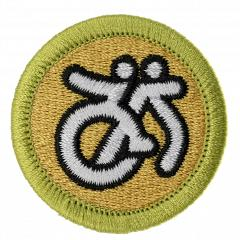

# Disabilities Awareness Merit Badge

## Overview

Understand various disabilities and how they affect your friends, family, and community members with the Disability Awareness Merit Badge. Scouts will learn about the experiences of someone with a disability, explain the significance of disability etiquette, and how it may differ depending on the specific disability.

## Requirements

- (1) Do the following:
  - (a) Explain and discuss with your counselor the following disabilities awareness terms: disability, accessibility, adaptation, accommodation, invisible disability, and person-first language.

    **Resources:** [We Need to Talk About Disability (video)](https://youtu.be/Z3faUGgMsNI), [Disability Isn't a Dirty Word (video)](https://youtube.com/shorts/X-OecmJeQJ4?si=13PL23LCz6Y0z-M9), [Words Matter! Disability Language Etiquette  (website)](https://www.nea.org/words-matter-disability-language-etiquette)
  - (b) Explain why proper disability etiquette is important, and how it may differ depending on the specific disability. Give three examples.

    **Resources:** [Disability Etiquette - Respectful Ways to Interact With People With Disabilities (video)](https://youtu.be/iG3pQp6HoQM?si=DqAx3LbrAqeH9mDm), [Sportable Disability Etiquette (video)](https://youtu.be/kLKObHtQmis), [Disability Sensitivity (video)](https://youtu.be/bb6uPDwclek), [Not Special Needs | March 21 - World Down Syndrome Day (video)](https://youtu.be/kNMJaXuFuWQ?si=568DA1j2_laLorG_)

- (2) Visit an agency that works with people with physical, mental, emotional, or educational disabilities. Collect and read information about the agency's activities. Learn about opportunities its members have for training, employment, and education. Discuss what you have learned with your counselor.

  **Resources:** [Mychal's Learning Place (video)](https://www.tiktok.com/@mychalslearningplace/video/7536333109688569118), [In Our Own Voice (video)](https://youtu.be/7h5oyiKc-B0?si=u__mpN2z99OqYsSf), [From Concept to Crag: Students Design Adaptive Sports Equipment to Help Classmate Climb (website)](https://ucp.org/from-concept-to-crag-students-design-adaptive-sports-equipment-to-help-classmate-climb/)

- (3) Do TWO of the following:
  - (a) Talk with a Scout who has a disability and learn about the Scout's experiences taking part in Scouting activities and earning different merit badges. Discuss what you have learned with your counselor.

    **Resources:** [12-Year-Old Boy Overcomes Disability to Pursue Sports, Adventures (video)](https://youtu.be/SvT9gWLe3ds), [Philmont Scout Ranch: Zia Adaptive Trek (video)](https://youtu.be/AQWBun-1KB0?si=5HpZF5OdComSENS1)
  - (b) Talk with an individual who has a disability and learn about this person's experiences and the activities in which this person likes to participate. Discuss what you have learned with your counselor.

    **Resources:** [We Asked 5 People With Disability Some Questions Before International Day of People With Disability (video)](https://youtu.be/Okb35sk4KEA?si=oe4DdnaglHhQ7kmr), [Kids Ask Questions About Disability (video)](https://youtu.be/hnKim3S_Pvo?si=fEke9WzADlSMiXo3)
  - (c) Learn how people with disabilities take part in a particular adaptive sport or recreational activity. Discuss what you have learned with your counselor.

    **Resources:** [Alison's Story (video)](https://youtu.be/TEC0iEMYs5M?si=pgLu9BDJvQKm9eWH), [International Day of Persons with Disabilities | Paralympic Games (video)](https://youtu.be/3inIaMOGoXQ?si=LuLQzj_tkQjdTyVz), [THIS is Special Olympics! (video)](https://youtu.be/L9m84Jc9GX0)
  - (d) Learn about independent living aids such as service animals, canes, and augmentative communication devices such as captioned telephones and videophones. Discuss with your counselor how people use such aids.

    **Resources:** [Walking a Route with my Guide Dog (video)](https://www.youtube.com/shorts/EnYivEfJZAg), [Disability Isn't One-Size-Fits-All: My Mobility Aid Toolkit (video)](https://youtube.com/shorts/JOyjBWizTU0?si=c7p4Rn5CnbSImBkz), [How I Navigate as a Blind Person - 5 Tools I Use to Travel Safely (video)](https://youtu.be/Lqsik6NM5HI), [Service Animals (website)](https://www.ada.gov/topics/service-animals/), [Bridging Apps (video)](https://youtu.be/ez0x66P97GU)
  - (e) Plan or participate in an activity that helps others understand what a person with a visible or invisible disability experiences. Discuss what you have learned with your counselor.

    **Resources:** [Vision Loss Simulation Instructions (PDF)](https://craft.nationaldb.org/OHOA/Module-5/SimulationInstructions_a.pdf), [Eye Disease Vision Simulator (video)](https://youtube.com/shorts/gjp90li7k50?si=tQBY4knOEV9yP5p-), [Amazing Things Happen! (video)](https://youtu.be/Ezv85LMFx2E?si=t22bJRSC4c_v4by9)

- (4) Do ONE of the following options:
  - **Option A—Access.**. Visit TWO of the following locations and take notes about the accessibility to people with disabilities. In your notes, give examples of five things that could be done to improve upon the site and five things about the site that make it friendly to people with disabilities. Discuss your observations with your counselor.

    **Resources:** [NYC Students With Disabilities Speaking About Accessible Schools (video)](https://youtu.be/Cok1f-_3ydE), [Special Needs Prepared Camps (website)](https://www.scouting.org/resources/disabilities-awareness/)
  - (1) Your school
  - (2) Your place of worship
  - (3) A Scouting event or campsite
  - (4) A public exhibit or attraction (such as a theater, museum, or park)
  - **Option B—Accommodation.** Visit TWO of the following locations and take notes while observing features and methods that are used to accommodate people with invisible disabilities. While there, ask staff members to explain any accommodation features that may not be obvious. Note anything you think could be done to better accommodate people who have invisible disabilities. Discuss your observations with your counselor.

    **Resources:** [Accommodations and Difficulties. (video)](https://youtu.be/qT9LE79Daps?si=cxIIetl8GFwwFC4h)
  - (1) Your school
  - (2) Your place of worship
  - (3) A Scouting event or campsite
  - (4) A public exhibit or attraction (such as a theater, museum, or park)

- (5) Explain what advocacy is. Do ONE of the following:
  - (a) Present a counselor-approved disabilities awareness program to a Cub Scout pack or other group. During your presentation, explain and use person-first language.

    **Resources:** [The View From Here: My Path to Disability Advocacy | Liam Doyle (video)](https://youtu.be/-uS56z1O46U)
  - (b) Find out about disabilities awareness education programs in your school or school system, or contact a disability advocacy agency. Volunteer with a program or agency for eight hours.

    **Resources:** [Here's How You Can Support People With Disabilities (video)](https://youtube.com/shorts/huwy396lx2c?si=Go8d4I0cZ-BeGmnO)
  - (c) Using resources such as disability advocacy agencies, government agencies, the internet (with your parent or guardian's permission), and news magazines, learn about myths and misconceptions that influence the general public's understanding of people with disabilities. List 10 myths and misconceptions about people with disabilities and learn the facts about each myth. Share your list with your counselor, then use it to make a presentation to a Cub Scout pack or other group.

    **Resources:** [Myths and Facts About People with Disabilities (website)](http://es.easterseals.com/site/PageServer/?pagename=ntl_myths_facts)

- (6) Make a commitment to your counselor describing what you will do to show a positive attitude about and toward people with disabilities and to encourage positive attitudes among others. Discuss how your awareness has changed as a result of what you have learned.

  **Resources:** [Changing Attitudes Towards Disability (website)](https://www.apa.org/ed/precollege/psychology-teacher-network/introductory-psychology/changing-attitudes-towards-disability), [Understanding Disabilities (video)](https://youtu.be/r9Y6XMko9Jc), [7 Ways to Actually Keep the Commitments You Make to Yourself (website)](https://www.silkandsonder.com/blogs/news/keeping-commitments?srsltid=AfmBOoqwXvDqEVi16dK1YUu1UnTilZpMSXAJ35STbVrLDyOcRzM7G5ib)

- (7) Name five professions that provide services to people with disabilities. Pick one that interests you and find out the education, training, and experience required for this profession. Discuss what you learn with your counselor, and tell why this profession interests you.

  **Resources:** [10 Rewarding Careers for Those Who Want to Work With Children With Special Needs (website)](https://bouve.northeastern.edu/news/10-rewarding-careers-for-those-who-want-to-work-with-children-with-special-needs/), [Discover the Best Careers for Helping People With Disabilities (website)](https://www.publicservicedegrees.org/careers/people-with-disabilities/)

## Resources

- [Disabilities Awareness merit badge page](https://www.scouting.org/merit-badges/disabilities-awareness/)
- [Disabilities Awareness merit badge PDF](https://filestore.scouting.org/filestore/Merit_Badge_ReqandRes/Pamphlets/Disabilities%20Awareness.pdf) ([local copy](files/disabilities-awareness-merit-badge.pdf))
- [Disabilities Awareness merit badge pamphlet](https://www.scoutshop.org/disabilities-awareness-merit-badge-pamphlet-655705.html)
- [Disabilities Awareness merit badge workbook PDF](http://usscouts.org/mb/worksheets/Disabilities-Awareness.pdf)
- [Disabilities Awareness merit badge workbook DOCX](http://usscouts.org/mb/worksheets/Disabilities-Awareness.docx)

Note: This is an unofficial archive of Scouts BSA Merit Badges that was automatically extracted from the Scouting America website and may contain errors.