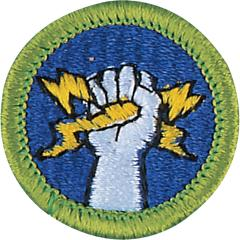

# Electricity Merit Badge

## Overview

Learn why electricity plays a significant role in the economy and how energy consumption impacts our daily lives with the Electricity Merit badge. Scouts will demonstrate how to respond to electrical emergencies, explain how a fuse blows or a circuit breaker trips, and complete an electrical home safety inspection. The Electricity Merit Badge is an excellent opportunity for Scouts to learn how to read an electric meter and determine their household’s energy cost from meter readings.

## Requirements

* (1) Demonstrate that you know how to respond to electrical emergencies by doing the following:
    * (a) Explain how to turn off power for a particular circuit and the whole house in the event of an emergency.
    * (b) Demonstrate how to rescue a person touching a live wire in the home.
    * (c) Describe how to safely get out of a car in an accident if you suspect a utility wire is on the car.
    * (d) Show how to render first aid to a person who is unconscious from an apparent electrical shock.
    * (e) Show how to treat an electrical burn.
    * (f) Explain what to do in the event of an electrical fire.
    * (g) Explain what to do if caught out in the open during an electrical storm.

* (2) Complete an electrical home safety inspection of your  home, using the checklist found in the Electricity merit badge pamphlet or one approved by your counselor. Discuss what you find with your counselor.
* (3) Make a simple electromagnet and use it to show magnetic attraction and repulsion.
* (4) Do the following:
    * (a) Explain the difference between direct current and alternating current, the advantages and disadvantages of each, and give a practical example of the use of each type.
    * (b) Explain three ways that electricity is produced.

* (5) Make a simple drawing to show how a battery and an electric bell work. Describe the purpose of each of the components.
* (6) Do the following:
    * (a) Define what overloading an electric circuit means. Tell what you have done to make sure your home circuits are not overloaded.
    * (b) Determine if there is an overload on a branch circuit by either getting the current draw from all the equipment plugged into the circuit or use the power equation to calculate the current draws.
    * (c) Explain why a fuse blows and a circuit breaker trips.
    * (d) Tell how to find a blown fuse and a tripped circuit breaker in your home. Show how to safely reset the circuit breaker.

* (7) Make a floor plan wiring diagram of the lights, switches, and outlets for a room in your home. Show which fuse or circuit breaker protects each one.
* (8) Do the following:
    * (a) Read a meter associated with an electric bill. Determine the total power used since the bill, and the cost of that power.
    * (b) Explain other charges on the bill that were taxes or fees.
    * (c) Discuss with your counselor five ways your family can conserve energy.

* (9) Explain the following:
    * (a) Electrical terms - Current, energy, power, resistance, and voltage
    * (b) Units of measure - Ampere (amps), ohms, volts, watts, and watt-hours
    * (c) Electrical conditions - Generating source with example, ground, open circuit, overvoltage, potential difference, and short circuit
    * (d) Equipment and their use - circuit, conductor, Ground Fault Circuit Interrupter (GFCI), insulator, inverter, rectifier, rheostat, substation, surge protection, solar panel, transformer, transmission and distribution systems, and wind turbine.

* (10) Do TWO of the following:
    * (a) Connect a buzzer, bell, or light with a battery. Have a key or switch in the line.
    * (b) Make and run a simple electric motor (from a kit is acceptable, if approved by your counselor ahead of time).
    * (c) Build a simple rheostat. Show that it works.
    * (d) Build a single-pole, double-throw switch. Show that it works.
    * (e) Explain how 3-way switch wiring works in a lighting circuit.
    * (f) Connect two lights together in a series circuit along with a battery and a switch. Then connect the same circuit in parallel. Discuss the differences in the two circuits.

* (11) Identify three career opportunities that would use skills and knowledge in electricity. Pick one and research the training, education, certification requirements, experience, and expenses associated with entering the field. Research the prospects for employment, starting salary, advancement opportunities and career goals associated with this career. Discuss what you learned with your counselor and whether you might be interested in this career.

## Resources

- [Electricity merit badge page](https://www.scouting.org/merit-badges/electricity/)
- [Electricity merit badge PDF](https://filestore.scouting.org/filestore/Merit_Badge_ReqandRes/Pamphlets/Electricity.pdf) ([local copy](files/electricity-merit-badge.pdf))
- [Electricity merit badge pamphlet](https://www.scoutshop.org/electricity-merit-badge-pamphlet-656202.html)

Note: This is an unofficial archive of Scouts BSA Merit Badges that was automatically extracted from the Scouting America website and may contain errors.