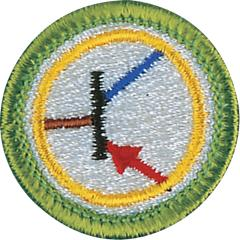

# Electronics Merit Badge

## Overview

The Electronics Merit Badge is a fun, STEM-based merit badge that will inspire Scouts to pursue a possible career in Electronics. Scouts will learn about capacitors, transistors, and resistors while grasping the basic principles of digital techniques and demonstrating how to build a control device circuit. Understand the behaviors of electrons and learn safety precautions when using, building, altering, or repairing electronic devices with the Electronics Merit Badge.

## Requirements

- (1) Describe the safety precautions you must exercise when using, building, altering, or repairing electronic devices.

  **Resources:** [Computer Safety Procedures (video)](https://youtu.be/aaE0ePh7zSo)

- (2) Do the following:
  - (a) Draw a simple schematic diagram. It must show resistors, capacitors, and transistors or integrated circuits. Use the correct symbols. Label all parts.

    **Resources:** [Schematics (video)](https://youtu.be/9cps7Q_IrX0), [How to Read a Schematic (video)](https://youtu.be/_HZ-EQ8Hc8E)
  - (b) Tell the purpose of each part.

    **Resources:** [Electronic Components Guide (video)](https://youtu.be/N8_1wb0r0DQ), [10 Common Electronic Components (video)](https://www.tiktok.com/@jyhhsuelectronics/video/7457467056598977838)

- (3) Do the following:
  - (a) Show the right way to solder and desolder.

    **Resources:** [Using Solder | Soldering Basics | Soldering for Beginners (video)](https://youtu.be/-qk-ulz05J8), [How to Desolder (video)](https://youtu.be/bG7yW9FigJA)
  - (b) Show how to avoid heat damage to electronic components.

    **Resources:** [Applying Heat to your Parts (video)](https://www.youtube.com/shorts/fYk07LcnkPA)
  - (c) Tell about the function of a printed circuit board. Tell what precautions should be observed when soldering printed circuit boards.

    **Resources:** [What Are Printed Circuit Boards (PCBs)? (video)](https://youtu.be/BJ3N8gURA1c?si=5Oew7Ys1qIhVBUlP)

- (4) Do the following:
  - (a) Discuss each of the following with your counselor:
    - (1) How to use electronics for a control purpose.

      **Resources:** [Inputs, Outputs and Controllers (video)](https://www.youtube.com/shorts/oxNmKS6etGM)
    - (2) Explain the basic principles of digital logic.

      **Resources:** [Understanding Logic Gates (video)](https://youtu.be/INEtYZqtjTo)
    - (3) How to use electronics for three different analog applications.
  - (b) Show how to change three decimal numbers into binary numbers and three binary numbers into decimal numbers.

    **Resources:** [How to Convert Binary to Decimal (video)](https://youtu.be/a2FpnU9Mm3E), [Convert Decimal to Binary (video)](https://www.youtube.com/shorts/OYP0pa50a0Q)
  - (c) Choose ONE of the following THREE projects. For your project, find or create a schematic diagram. To the best of your ability, explain to your counselor how the circuit you built operates.

    **Resources:** [How to Read an Electronic Schematic (video)](https://youtu.be/MxRGXIe1qPo)
  - (1) A control device
  - (2) A digital circuit
  - (3) An analog circuit

- (5) Do the following:
  - (a) Show how to solve a simple problem involving current, voltage, and resistance using Ohm's law.

    **Resources:** [Ohm's Law Formula (video)](https://youtu.be/KMaQYdTJul0), [What is OHM'S Law? (video)](https://youtu.be/uZ-m91IEkjQ)
  - (b) Tell about the need for and the use of test equipment in electronics. Name three types of test equipment. Tell how they operate.

    **Resources:** [Circuits & Electronics - Electronics Lab Introduction (video)](https://youtu.be/ZuFlJ1IZyPs)
  - (c) Demonstrate to your counselor how to read the colored bands of a resistor to determine its resistance value.

    **Resources:** [How to Read a Resistor (video)](https://youtu.be/GLD7AgAYqwA)
  - (d) Explain the differences between Through Hole and Surface Mount assembly technologies and give three advantages of each.

    **Resources:** [Through Hole vs Surface Mount Method? (video)](https://youtu.be/RW9NO6H62oY)

- (6) Identify three career opportunities that would use skills and knowledge in electronics. Pick one and research the training, education, certification requirements, experience, and expenses associated with entering the field. Research the prospects for employment, starting salary, advancement opportunities and career goals associated with this career. Discuss what you learned with your counselor and whether you might be interested in this career.

  **Resources:** [Careers in Electronics Engineering (video)](https://youtu.be/paEw8Y8WlNA)

## Resources

- [Electronics merit badge page](https://www.scouting.org/merit-badges/electronics/)
- [Electronics merit badge PDF](https://filestore.scouting.org/filestore/Merit_Badge_ReqandRes/Pamphlets/Electronics.pdf) ([local copy](files/electronics-merit-badge.pdf))
- [Electronics merit badge pamphlet](https://www.scoutshop.org/electronics-merit-badge-pamphlet-654565.html)
- [Electronics merit badge workbook PDF](http://usscouts.org/mb/worksheets/Electronics.pdf)
- [Electronics merit badge workbook DOCX](http://usscouts.org/mb/worksheets/Electronics.docx)

Note: This is an unofficial archive of Scouts BSA Merit Badges that was automatically extracted from the Scouting America website and may contain errors.